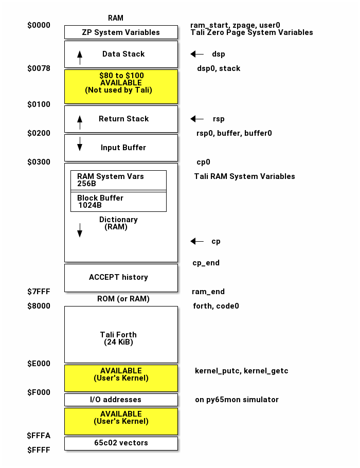

# Manual for Tali Forth 2 for the 65c02

Sam Colwell; Scot W. Stevenson
:doctype: book
:keywords: forth, 6502, assembler, programming, 8-bit, vintage, retro
:revnumber: 1.0
:revdate: 03. Jan 2019
:showtitle:
:icons: font
:toc: left

Tali Forth 2 is a bare-metal ANS(ish) Forth for the 65c02 8-bit MPU. It aims
to be, roughly in order of importance, easy to try out (just run the included
binary), simple (subroutine threading model), specific (for the 65c02 only), and
standardized (ANS Forth).

For the crew at 6502.org, who made this possible in more ways than one.

# Introduction

## But why?

> Forth is well suited to resource-constrained situations. It doesn’t need lots
> of memory and doesn’t have much overhead. [\[CHM1\]](#CHM1)
>
> — 
> Charles H. Moore
> redgate Hub 2009

### The Big Picture

This section provides background information on Forth, the 6502 processor, and
why anybody would want to combine the two. It can be skipped if you already know
all those things.

#### The 6502 CPU

It is a well-established fact that humanity reached the apex of processor design
with the 6502<span class="indexterm" primary="6502"></span> in 1976.

<figure id="img_65c02">

<figcaption>by Anthony King, public domain</figcaption>
</figure>

Created by a team including Chuck Peddle<span class="indexterm" primary="Peddle, Chuck"></span> and Bill
Mensch<span class="indexterm" primary="Mensch, Bill"></span>, it was the engine that powered the 8-bit home
computer revolution of the 1980s.[^1] The
VIC-20<span class="indexterm" primary="VIC-20"></span>, Commodore PET<span class="indexterm" primary="Commodore PET"></span>, Apple II<span class="indexterm" primary="Apple II"></span>,
and Atari 800<span class="indexterm" primary="Atari 800"></span> all used the 6502, among others.

More than 40 years later, the processor is still in production by the
[Western Design
Center](http://www.westerndesigncenter.com/wdc/w65c02s-chip.cfm)<span class="indexterm" primary="WDC"></span>. Apart from commercial uses, there is an active hobbyist scene
centered on the website [6502.org](http://6502.org/).<span class="indexterm" primary="6502.org"></span> A
number of people have built their own 8-bit computers based on this chip and
the instructions there, including a
[primer](http://wilsonminesco.com/6502primer/) by Garth Wilson<span class="indexterm" primary="Wilson, Garth"></span>. It is for these systems that Tali Forth 2 was created.

The most important variant of the 6502 produced today is the
[65c02](https://en.wikipedia.org/wiki/WDC\_65C02)<span class="indexterm" primary="65c02"></span>, a CMOS chip with
some additional instructions. It is for this chip that Tali Forth 2 was written.

But why program in 8-bit assembler at all? The 65c02 is fun to work with
because of its clean instruction set architecture (ISA)<span class="indexterm" primary="instruction set architecture (ISA)"></span> This is not the place to explain the joys of assembler.
The official handbook for the 65c02 is *Programming the 65816* [\[EnL\]](#EnL).

> [!TIP]
> Garth Wilson<span class="indexterm" primary="Wilson, Garth"></span> answers this question in greater
> detail as part of his 6502 primer at <http://wilsonminesco.com/6502primer/> .

### Forth

> If C gives you enough rope to hang yourself, Forth is a flamethrower crawling with
> cobras. [\[EW\]](#EW)
>
> — 
> Elliot Williams
> Forth: The Hacker's language

Forth<span class="indexterm" primary="Forth"></span> is the *enfant terrible* of programming languages. It was
invented by Charles "Chuck" H. Moore<span class="indexterm" primary="Moore, Charles"></span> in the 1960s to do
work with radio astronomy, way before there were modern operating systems or
programming languages.

> [!TIP]
> A brief history of Forth can be found at
> <https://www.forth.com/resources/forth-programming-language>

As a language for people who actually need to get things done, it lets you run
with scissors, play with fire, and cut corners until you’ve turned a square
into a circle. Forth is not for the faint-hearted: It is trivial, for
instance, to redefine `1` as `2` and `true` as `false`. Though you can do really,
really clever things with few lines of code, the result can be hard for other
people to understand, leading to the reputation of Forth begin a "write-only
language". However, Forth excels when you positively, absolutely have to get
something done with hardware that is really too weak for the job.

It should be no surprise that NASA<span class="indexterm" primary="NASA"></span> is one of the organizations that
uses Forth. The *Cassini* mission<span class="indexterm" primary="Cassini"></span> to Saturn used a
[Forth
CPU](http://www.cpushack.com/2013/02/21/charles-moore-forth-stack-processors/), for instance. It is also perfect for small computers like the 8-bit
65c02. After a small boom in the 1980s, more powerful computers led to a
decline of the language. The "Internet of Things" (IOT) <span class="indexterm" primary="Internet of Things"></span> with embedded small processors has led to a certain amount of
[renewed
interest](https://www.embedded.com/design/programming-languages-and-tools/4431133/Go-Forth-) in the language. It helps that Forth is easy to implement: It is
stack-based, uses Reverse Polish Notation (RPN)<span class="indexterm" primary="Reverse Polish Notation"></span>
and a simple threaded<span class="indexterm" primary="threading"></span> interpreter model.

There is no way this document can provide an adequate introduction to Forth.
There are quite a number of tutorials, however, such as *A Beginner’s Guide to
Forth* by J.V. Nobel <span class="indexterm" primary="Nobel, J.V."></span>[???](#JVN) or the classic (but slightly
dated) *Starting Forth* by Leo Brodie.<span class="indexterm" primary="Brodie, Leo"></span>[\[LB1\]](#LB1)
Gforth,<span class="indexterm" primary="Gforth"></span> one of the more powerful free Forths, comes with its own
[tutorial](http://www.complang.tuwien.ac.at/forth/gforth/Docs-html/Tutorial.html).

> [!TIP]
> Once you have understood the basics of the language, do yourself a favor
> and read *Thinking Forth* by Brodie<span class="indexterm" primary="Brodie, Leo"></span>[\[LB2\]](#LB2) which deals with
> the philosophy of the language. Even if you never code a line of Forth in your
> life, exposure to Forth will change the way you think about programming, much
> like Lisp<span class="indexterm" primary="Lisp"></span>.

### Writing Your Own Forth

Even if the 65c02 is great and Forth is brilliant, why go to the effort of
writing a new, bare-metal version of the languages? After almost 50 years,
shouldn’t there be a bunch of Forths around already?

#### FIG Forth

In fact, the classic Forth available for the whole group of 8-bit MPUs is FIG
Forth<span class="indexterm" primary="FIG Forth"></span>. "FIG" stands for "Forth Interest Group". Ported to various
architectures, it was original based on an incarnation for the 6502 written by
Bill Ragsdale<span class="indexterm" primary="Ragsdale, Bill"></span> and Robert Selzer<span class="indexterm" primary="Selzer, Robert"></span>.
There are PDFs of the [6502
version](http://www.forth.org/fig-forth/fig-forth\_6502.pdf) from September 1980 freely available — there is a tradition of placing
Forth in the public domain — and more than one hobbyist has revised it to his
machine.

However, Forth has changed a lot in the past three decades. There is now a
standardized version called [ANS Forth](https://forth-standard.org/), which
includes very basic changes such as how the `do` loop works. Learning the
language with FIG Forth is like learning English with *The Canterbury
Tales*.<span class="indexterm" primary="Canterbury Tales, The"></span>

#### A Modern Forth for the 65c02

Tali Forth was created to provide an easy to understand modern Forth written
especially for the 65c02 that anybody can understand, adapt to their own use,
and maybe actually work with. As part of that effort, the source code is heavily
commented and this document tries to explain the internals in more detail.

## Overview of Tali Forth

### Design Considerations

When creating a new Forth, there are a bunch of design decisions to be
made.

> [!NOTE]
> Probably the best introduction to these questions is found in "Design
> Decisions in the Forth Kernel" at
> <http://www.bradrodriguez.com/papers/moving1.htm> by Brad Rodriguez.

Spoiler alert: Tali Forth is a subroutine-threaded (STC) variant with a 16-bit
cell size and a dictionary that keeps headers and code separate. If you don’t
care and just want to use the program, skip ahead.

#### Characteristics of the 65c02

Since this is a bare-metal Forth, the most important consideration is the target
processor. The 65c02 only has one full register, the accumulator A, as well as
two secondary registers X and Y. All are 8-bit wide. There are 256 bytes that
are more easily addressable on the Zero Page. A single hardware stack is used
for subroutine jumps. The address bus is 16 bits wide for a maximum of 64 KiB of
RAM and ROM.

For the default setup, we assume 32 KiB of each, but allow this to be changed so
people can adapt Tali to their own hardware.

#### Cell Size

The 16-bit address bus suggests the cell size should be 16 bits as well. This is
still easy enough to realize on a 8-bit MPU.

#### Threading Technique

A "thread" in Forth is simply a list of addresses of words to be executed.
There are four basic threading techniques: [\[GK\]](#GK)

Indirect threading (ITC)  
The oldest, original variant, used by FIG Forth. All
other versions are modifications of this model.

Direct threading (DTC)  
Includes more assembler code to speed things up, but
slightly larger than ITC.

Token threading (TTC)  
The reverse of DTC in that it is slower, but uses less
space than the other Forths. Words are created as a table of tokens.

Subroutine threading (STC)  
Converts the words to a simple
series of `jsr` combinations. Easy to understand and less complex than the other
variants, but uses more space and is slower.

Our lack of registers and the goal of creating a simple and easy to understand
Forth makes subroutine threading the most attractive solution, so Tali 2 is an
STC Forth. We try to mitigate the pain caused by the 12 cycle cost of each and
every `jsr`-`rts` combination by including a relatively high number of native
words.

#### Register Use

The lack of registers — and any registers larger than 8 bit at that — becomes
apparent when you realize that Forth classically uses at least four virtual
registers:

| Register | Name                 |
|----------|----------------------|
| W        | Working Register     |
| IP       | Interpreter Pointer  |
| DSP      | Data Stack Pointer   |
| RSP      | Return Stack Pointer |

The classic Forth registers

On a modern processor like a RISC-V RV32I with 32 registers of 32 bit each, none
of this would be a problem (in fact, we’d probably run out of ways to use the
registers). On the 65c02, at least we get the RSP for free with the built-in
stack pointer. This still leaves three registers. We cut that number down by one
through subroutine threading, which gets rid of the IP. For the DSP, we use the
65c02’s Zero Page indirect addressing mode with the X register. This leaves W,
which we put on the Zero Page as well.

#### Data Stack Design

We’ll go into greater detail on how the Data Stack works in a later chapter
when we look at the internals. Briefly, the stack is realized on the Zero Page
for speed. For stability, we provide underflow checks in the relevant words, but
give the user the option of stripping it out for native compilation. There are
no checks for overflow because those cases tend to be rare.

#### Dictionary Structure

Each Forth word consists of the actual code and the header that holds the
meta-data. The headers are arranged as a simple single-linked list.

In contrast to Tali Forth 1, which kept the header and body of the words
together, Tali Forth 2 keeps them separate. This lets us play various tricks
with the code to make it more effective.

### Deeper down the rabbit hole

This concludes our overview of the basic Tali Forth 2 structure. For those
interested, a later chapter will provide far more detail.

# User Guide

## Installing Tali Forth

### Downloading

Tali Forth 2 lives on GitHub<span class="indexterm" primary="GitHub"></span> at
<https://github.com/SamCoVT/TaliForth2>. This is where you will always find the
current version. You can either clone the code with git<span class="indexterm" primary="git"></span> or simply
download it. To just test Tali Forth, all you need is the binary file
`taliforth-py65mon.bin`.

### Running

#### Downloading the py65mon Simulator

Tali was written to run out of the box on the py65mon simulator from
<https://github.com/mnaberez/py65>.<span class="indexterm" primary="py65mon"></span> This is a Python<span class="indexterm" primary="Python"></span>
program that should run on various operating systems. Py65mon is also required
for the test suite.

To install py65mon on Linux<span class="indexterm" primary="Linux"></span>, use one of the following commands

``` bash
# Install for only your user:
pip install -U py65 --user

# Install for all users:
sudo pip install -U py65
```

If you don’t have `pip`<span class="indexterm" primary="pip"></span> installed, you will have to add it first with
something like `sudo apt-get install python-pip` (Ubuntu Linux). Some systems
use pip3 and you can run the above commands with pip3 instead of pip.

If you are on windows, you will need to download and install Python 3
first. Once Python is installed, the above commands should work from
a Windows command prompt.

#### Running the Binary

To start the emulator, run:

``` bash
py65mon -m 65c02 -r taliforth-py65mon.bin
```

Note that the option `-m 65c02` is required, because Tali Forth makes extensive
use of the additional commands of the CMOS version and will not run on a stock
6502 MPU.

### Installing on Your Own Hardware

The Tali Forth project started out as a way to run Forth on my own 65c02
computer, the Übersquirrel<span class="indexterm" primary="Übersquirrel"></span>. Though it soon developed a life of
its own, a central aim of the project is to provide a working, modern Forth that
people can install on their projects.

<figure id="img_uebersquirrel">

<figcaption>The functioning Übersquirrel Mark Zero prototype, August 2013. Photo by Scot W. Stevenson</figcaption>
</figure>

#### The Platform Files

For this to work, you need to go to the `platform` folder and create your own
kernel<span class="indexterm" primary="kernel"></span> code to replace `platform-py65mon.asm`, the default kernel
for use with the py65mon<span class="indexterm" primary="py65mon"></span> kernel. By convention, the name should
start with `platform-`. See the `README.md` file in the the `platform` folder
for details.

Once you have configured your platform file in the plaform folder, you
can build a binary (typically programmed into an EEPROM) for your
hardware with make. If you made a platform file named
`platform-mycomp.asm`, then you should `cd` to the main Tali folder
and run

``` bash
make taliforth-mycomp.bin
```

The bin file will be created in the main folder. You should, of
course, replace the "mycomp" portion of that command with whatever you
named your platform.

### Hardware Projects with Tali Forth 2

This is a list of projects known to run Tali Forth 2. Please let me know if you
want to have your project added to the list.

- **Steckschwein** (<https://steckschwein.de/>) by Thomas Woinke and Marko
  Lauke. A multi-board 8 MHz 65c02 system. Platform file:
  `platform-steckschwein.asm` (26. Oct 2018)

- **SamCo’s SBC** (<https://github.com/SamCoVT/SBC>) by Sam Colwell. A
  single-board computer running at 4MHz. Platform file:
  `platform-sbc.asm` (29. Oct 2018)

There are various benchmarks of Tali Forth 2 running different hardware at *The
Ultimate Forth Benchmark* (<https://theultimatebenchmark.org/#sec-7>).

## Running Tali Forth

> One doesn’t write programs in Forth. Forth is the program.
>
> — 
> Charles Moore
> Masterminds of Programming

### Recommended Reading

If you are not familiar with Forth, now would be an excellent time to
go and read Leo Brodie’s excellent "Starting Forth", available for
free online, before continuing through this manual. You can use Tali
Forth 2 to run the examples given in the book.

### Booting

Out of the box, Tali Forth boots a minimal kernel<span class="indexterm" primary="kernel"></span> to connect to the
`py65mon` <span class="indexterm" primary="py65mon"></span> simulator. By default, this stage ends with a line such
as

    Tali Forth 2 default kernel for py65mon (18. Feb 2018)

When you port Tali Forth to your own hardware, you’ll have to include your own
kernel (and probably should print out a different line).

Tali Forth itself boots next, and after setting up various internal
things, compiles the high level words. This causes a slight delay, depending on
the number and length of these words. As the last step, Forth should spit out a
boot string like

    Tali Forth 2 for the 65c02
    Version ALPHA 24. December 2018
    Copyright 2014-2018 Scot W. Stevenson
    Tali Forth 2 comes with absolutely NO WARRANTY
    Type 'bye' to exit

Because these are the last high-level commands Tali Forth executes, this
functions as a primitive self-test. If you have modified the high level Forth
words in either `forth_words.fs` or `user_words.fs`, the boot process might
fail with a variant of the error message "unknown word". The built-in, native
words should always work. For this `dump` <span class="indexterm" primary="dump"></span> is a built-in word — it is very
useful for testing.

### Command-Line History

Tali’s command line includes a simple, eight-element history function. To
access the previous entries, press `CONTROL-p`, to go forward to the next
entry, press `CONTROL-n`.

### Words

Tali Forth comes with the following Forth words out of the
box:

    drop dup swap ! @ over >r r> r@ nip rot -rot tuck , c@ c! +! execute emit
    type . u. u.r .r d. d.r ud. ud.r ? false true space 0 1 2 2dup ?dup + - 1- 1+
    2* 2/ abs dabs and or xor rshift lshift pick char [char] char+ chars cells
    cell+ here = <> < u< u> > 0= 0<> 0> 0< min max 2drop 2swap 2over 2! 2@
    2variable 2constant 2literal 2r@ 2r> 2>r invert negate dnegate c, bounds
    spaces bl -trailing -leading /string refill accept input>r r>input unused
    depth key allot create does> variable constant value to s>d d>s d- d+ erase
    blank fill find-name ' ['] name>int int>name name>string >body defer latestxt
    latestnt parse-name parse execute-parsing source source-id : ; :noname
    compile, [ ] literal sliteral ." s" s\" postpone immediate compile-only
    never-native always-native allow-native nc-limit strip-underflow abort abort"
    do ?do i j loop +loop exit unloop leave recurse quit begin again state
    evaluate base digit? number >number hex decimal count m* um* * um/mod sm/rem
    fm/mod / /mod mod */mod */ \ move cmove> cmove pad cleave hexstore within >in
    <# # #s #> hold sign output input cr page at-xy marker words wordsize aligned
    align bell dump .s disasm compare search environment? find word ( .( if then
    else repeat until while case of endof endcase defer@ defer! is action-of
    useraddr buffer: buffstatus buffblocknum blkbuffer scr blk block-write
    block-write-vector block-read block-read-vector save-buffers block update
    buffer empty-buffers flush load thru list block-ramdrive-init definitions
    wordlist search-wordlist set-current get-current set-order get-order
    root-wordlist assembler-wordlist editor-wordlist forth-wordlist only also
    previous >order order forth see ed: cold bye

> [!NOTE]
> This list might be outdated. To get the current list, run `words` from
> inside Tali Forth.

Though the list might look unsorted, it actually reflects the priority in the
dictionary<span class="indexterm" primary="dictionary"></span>, that is, which words are found first. For instance,
the native words <span class="indexterm" primary="native words"></span> — those coded in assembler — always start
with `drop` and end with `bye`. `bye` is the last word that Tali will find in
the dictionary. [^2] The words before `drop` are those that are defined in high-level
Forth. For more information on individual the words, use the `see` command.

> [!TIP]
> To find out if a given word is available, you can use the sequence
> `s" myword" find-name 0<>` which will return a `true` or `false` flag.

Note that the built-in words are lower case. While Tali is not case sensitive — `KASUMI` is the same word as `Kasumi` <span class="indexterm" primary="Kasumi"></span> — newly defined words will be
lowercased as they are created and entered into the dictionary. There is a
slight speed advantage during lookup to using lowercase words (because Tali
doesn’t have to lowercase the entered text), so all of the tests for Tali are
in lowercase.

#### Numbers

If a word is not found in the dictionary, Tali Forth tries to turn it into a
number using the current `base`. Only if it can’t be turned into a number will
Tali report an error. Tali supports the ANS standard prefix characters for
specifying binary, decimal, and hex shown below. It is recommended to enter
your numbers using these prefix characters when writing code that will be run
later, as it makes the code insensitive to the current `base`.

    %100 \ A binary number (decimal value 4)
    #100 \ A decimal number (decimal value 100)
    $100 \ A hexadecimal number (decimal value 256)

#### The ANS Standard

Tali Forth is orientated on ANS Forth, the standard defined by the American
National Standards Institute (ANSI). See
<https://forth-standard.org/standard/alpha> for the complete list of ANS Forth
words.

#### Gforth

Tali also adopted some words from Gforth such as `bounds` or `execute-parsing`.
In practical terms, Tali aims to be a subset of Gforth: If a program runs on
Tali, it should run on Gforth the same way or have a very good reason not to.
See <https://www.complang.tuwien.ac.at/forth/gforth/Docs-html/Word-Index.html> for
a complete list of Gforth words.

#### Tali-Specific Words

In addition, there are words that are specific to Tali Forth.

**0 ( -- 0 )** - Push the number 0 on the Data Stack. Having this as an actual
word speeds up processing because the interpreter doesn’t have to convert the
character "0" into the number `0`.

**1 ( -- 1 )** - Push the number 1 on the Data Stack.

**2 ( -- 2 )** - Push the number 2 on the Data Stack.

**allow-native ( -- )** - Mark last word in dictionary to that it can be natively
compiled if it is less than or equal to nc-limit in size.

**always-native ( -- )** - Mark last word in dictionary so that it is always natively compiled.

**bell ( -- )** - Ring the terminal bell (ASCII 07).

**block-read ( addr blk# -- )** - This is a vectored word the user can change to point
to their own routine for reading 1K blocks into memory from storage.

**block-read-vector ( -- addr )** - This is the address of the vector
for block-read. Save the xt of your word here.

**block-write ( addr blk# -- )** - This is a vectored word the user can change to point
to their own routine for writing 1K blocks from memory to storage.

**block-write-vector ( -- addr )** - This is the address of the vector
for block-write. Save the xt of your word here.

**block-ramdrive-init ( u -- )** - Create a RAM drive with the given number of
blocks (numbered 0 to (u-1)) to allow use of the block words with no additional
hardware. Because the blocks are only held in RAM, they will be lost when the
hardware is powered down or the simulator is stopped.

**cleave ( addr u -- addr2 u2 addr1 u1 )** - Given a block of character memory
with words separated by whitespace, split off the first sub-block and put it in
TOS and NOS. Leave the rest lower down on the stack. This allows breaking off
single words (or zero-terminated strings in memory, with a different delimiter)
for further processing. Use with loops:

            : tokenize ( addr u -- )
                begin
                    cleave
                    cr type  \ <-- processing of single word
                dup 0= until
                2drop ;

For a string such as `s" emergency induction port"`, this gives us:

            emergency
            induction
            port

The payload of such a loop can be modified to process any `( addr u )`. For
example, using the `execute-parsing` word, we can define a series of variables
at run time:

            : make-variables ( addr u -- )
                begin
                    cleave
                    ['] variable execute-parsing  \ <-- new function
                dup 0= until
                2drop ;

Running `s" tali garrus joker shepard" make-variables` will define those four
words as variables, as `words` will show. More generally, we can use `cleave` to
create a version of the `map` higher-order function in Forth.

            : map ( addr u xt -- )
                >r
                begin
                    cleave
                    r@ execute  \ <-- must consume ( addr u )
                dup 0= until
                2drop  r> drop ;

**compile-only ( -- )** - Mark last word in dictionary as compile-only.

**digit? ( char -- u true \| char false )** - If character is a digit, convert
and set flag to `true`, otherwise return the offending character and a `false`
flag.

**ed ( -- )** - Start the command-line editor. There is a whole chapter on this father
down.

**hexstore ( addr u addr1 -- u2 )** - Store string of numbers in memory. Given a
string with numbers of the current base seperated by spaces, store the numbers
at the address `addr1`, returning the number of elements. Non-number elements
are skipped, an zero-length string produces a zero output. Use as a poor man’s
assembler:

            hex  s" ca ca 95 00 74 01" myprog hexstore
            myprog swap execute

With this behavior, `hexstore` functions as a reverse `dump`. The names "store"
or "numberstore" might have been more appropriate, but "hexstore" has the
association of the Unix command `hexdump` and should be easier to understand.

**input ( -- )** - Return the address where the vector for the input routine is
stored (not the vector itself). Used for input redirection for
`emit` and others.

**input\>r ( -- ) ( R: -- n n n n )** - Saves the current input state to the
Return Stack. This is used for `evaluate`. ANS Forth does provide the word
`save-input` (see <https://forth-standard.org/standard/core/SAVE-INPUT>), but it
pushes the state to the Data Stack, not the Return Stack. The reverse operation
is `r>input`.

**int\>name ( xt -- nt )** - Given the execution execution token (xt)\* -, return the
name token (nt)\* -.

**latestnt ( -- nt )** - Return the last used name token. The Gforth version of this
word is called `latest`.

**nc-limit ( -- addr )** - Return the address where the threshold value for native
compiling native compiling is kept. To check the value of this parameter, use `nc-limit ?`.
The default value is 20.

**never-native ( -- )** - Mark most recent word so it is never natively compiled.

**number ( addr u -- u \| d )** - Convert a string to a number. Gforth uses
`s>number?` and returns a success flag as well.

**output ( -- addr )** - Return the address where the vector for the output routine is
stored (not the vector itself)\* -. Used for output redirection for `emit` and
others.

**r\>input ( --) ( R: n n n n -- )** - Restore input state from Return Stack.
See `input>r` for details.

**strip-underflow ( -- addr )** - Return the address where the flag is kept that decides
if the underflow checks are removed during native compiling. To check the value
of this flag, use `strip-underflow ?`.

**useraddr ( -- addr )** - Return the base address of the block of memory holding the
user variables.

**wordsize ( nt -- u )** - Given the name token (`nt`) of a Forth word, return
its size in bytes. Used to help tune native compiling. Note that `wordsize`
expects the name token (`nt`) of a word, not the execution token (`xt`). This
might be changed in future versions.

**-leading ( addr u -- addr1 u1 )** - Strip any leading whitespace. This is the
other side of the ANS Forth string word `-trailing`.

### Wordlists and Search Order

Tali Forth implements the optional Search-Order words, including the extended
words. These words can be used to hide certain words or to rearrange the order
the words are searched in, allowing configurable substitution in the case of
words that have the same name but live in different wordlists.

On startup, only the FORTH-WORDLIST is in the search order, so only those words
will be found. Tali also comes with an EDITOR-WORDLIST and an
ASSEMBLER-WORDLIST, Room for 8 user wordlists is available, and the search order
can also hold 8 wordlist identifiers. See
<https://forth-standard.org/standard/search> for more information on wordlists and
the search order.

The WORDLIST word will create a new wordlist (or print an error message if all 8
user wordlists have already been created). It puts the wordlist identifer (wid)
on the stack. This is simply a number that uniquely identifes the wordlist, and
it’s common practice to give it a name rather than use the number directly. An
example might look like:

    wordlist constant MY-WORDLIST

While this creates a new wordlist and gives it a name, the wordlist isn’t
currently set up to be used. When Tali starts, only the FORTH-WORDLIST is set
up in the search order and all compilation of new words goes into the
FORTH-WORDLIST. After creating a new wordlist, you need to set it up for new
words to be compiled to it using SET-CURRENT and you need to add it to the
search order using SET-ORDER if you want the new words to be found.

    \ Set up the new wordlist as the current (compilation) wordlist
    \ New words are always put in the current wordlist.
    MY-WORDLIST set-current

    \ Put this wordlist in the search order so it will be searched
    \ before the FORTH-WORDLIST.  To set the search order, put the
    \ wids on the stack in reverse order (last one listed is seached
    \ first), then the number of wids, and then SET-ORDER.
    FORTH-WORDLIST MY-WORDLIST 2 set-order

    : new-word s" This word is in MY-WORDLIST"

    \ Go back to compiling into the FORTH-WORDLIST.
    FORTH-WORDLIST set-current

### Native Compiling

As the name says, subroutine threaded code encodes the words as a series of
subroutine jumps. Because of the overhead caused by these jumps, this can make
the code slow. Therefore, Tali Forth enables native compiling, where the
machine code from the word itself is included instead of a subroutine jump. This
is also called "inlining".

The parameter `nc-limit` sets the limit of how small words have to be to be
natively compiled. To get the current value (usually 20), check the value of
the system variable:

    nc-limit ?

To set a new limit, save the maximal allowed number of bytes in the machine
code like any other Forth variable:

    40 nc-limit !

To completely turn off native compiling, set this value to zero.

### Underflow Detection

When a word tries to access more words on the stack than it is holding, an
"underflow" error occurs. Whereas Tali Forth 1 didn’t check
for these errors, this version does.

However, this slows the program down. Because of this, the user can turn off
underflow detection for words that are natively compiled into new words. To do
this, set the system variable `strip-underflow` to `true`. Note this does not
turn off underflow detection in the built-in words. Also, words with underflow
detection that are not included in new words through native compiling will also
retain their tests.

### Restarting

Tali Forth has a non-standard word `cold` that resets the system. This doesn’t
erase any data in memory, but just moves the pointers back. When in doubt, you
might be better off quitting and restarting completely.

### Gotchas

Some things to look out for when using Tali Forth.

#### Cell Size

Tali has a 16-bit cell size.

> [!NOTE]
> Use `1 cells 8 * .` to get the cell size in bits with any Forth.

This can trip up calculations when compared to the *de facto* standard Gforth
with 64 bits. Take this example:

    ( Gforth )      decimal 1000 100 um* hex swap u. u.  ( returns 186a0 0  ok )
    ( Tali Forth)   decimal 1000 100 um* hex swap u. u.  ( returns 86a0 1  ok )

Tali has to use the upper cell of a double-celled number to correctly report
the result, while Gforth doesn’t. If the conversion from double to single is
only via a `drop` instruction, this will produce different results.

There is a similar effect with the Gforth word `bounds`: Because of Tali’s 16
bit address space, it wraps the upper address if we go beyond \$FFFF:

    ( Gforth )      hex FFFF 2 bounds  swap u. u.  ( returns 10001 ffff  ok  )
    ( Tali )        hex FFFF 2 bounds  swap u. u.  ( returns     1 ffff  ok )

#### Delimiters During Parsing

Both `parse-name` and `parse` skip white space - defined as ASCII characters
from 00 to 32 (SPACE) inclusive - when the standard talks about "spaces".
Otherwise, Tali would choke on TABs during compiling, and the `ed` editor
couldn’t be used to edit programs because of the Line Feed characters. This is
covered in the standard, see the footnote at
<https://forth-standard.org/standard/core/PARSE-NAME> by Anton Ertl, referencing
<http://forth-standard.org/standard/usage#subsubsection.3.4.1.1> and
<http://forth-standard.org/standard/file#subsection.11.3.5> .

#### Negative `allot`

The ANSI standard does not define what happens if there is an attempt to free
more memory with `allot` by passing a negative value than is available. Tali
will let the user free memory up the beginning of RAM assigned to the Dictionary
(marked with `cp0` in the code), even though this can mean that the Dictionary
itself is compromised. This is Forth, you’re the boss.

However, any attempt to free more memory than that will set the beginning of RAM
to `cp0`. Also, the Dictionary Pointer `dp` will point to the *last native word*
of the Dictionary, which is usually `drop`. Because of this, the high level
words defined during boot will *not* be available. There will be an error
message to document this. Realistically, you’ll probably want to restart with
`cold` if any of this happens.

## Major Components

### Blocks

Tali supports the optional BLOCK word set. The 2012 Forth standard
defines a block as 1024 bytes, and the buffers for them are the same
size (as opposed to some older forths that had smaller buffers). Tali
currently comes with one buffer.

Before these words can be used, the user needs to write two routines: one for
reading blocks into RAM and one for writing blocks out from RAM. Both of these
should have the signature ( addr blk# — ). Once these have been written, they
can be incorporated into the BLOCK word set by changing the vectors for words
`block-read` and `block-write`. That might look like:

    ' myblockreader BLOCK-READ-VECTOR !
    ' myblockwriter BLOCK-WRITE-VECTOR !

These vectors determine what runs when the words `block-read` and
`block-write` are used. Both of these words start with an error
message asking you to update the vectors. Once these two vectors have
been updated, you can use the block words.

If you would like to play with some blocks, but don’t have any
hardware or are running Tali in a simulator, fear not! Tali has a
built-in RAM drive that can be accessed by running:

    4 block-ramdrive-init

This reserves a chunk of ram with four blocks in it (numbered 0-3) which is
enough to play around with. It also sets up the routines for reading and writing
blocks in this ramdrive for you. If you want more blocks, you can change the
number. Because they start at zero, the last valid block will always be one less
than the number you provide.

Be careful about creating too many blocks as they are 1K each. It’s also worth
noting that running `block-ramdrive-init` again will create another ramdrive and
the existing one will be inaccessible while still taking up space in
RAM.

See the tutorials on working with blocks for more information on how to use them.

### The Block Editor

If you are using blocks (see the block chapter), you can use the following words
to enter text or Forth code. The built-in editor allows you to replace a
single line or an entire screen. Screens are 16 lines (numbered 0-15) of 64
characters each, for a total of 1K characters. Because newlines are not stored
in the blocks (the remainder of each line is filled with spaces,) you should
leave a space in the very last character of each line to separate the words in
that line from the words in the next line.

To get started, the editor words need to be added to the search order. To do
that, you can just run:

    editor-wordlist >order

To use the editor, first select a screen to work with by running `list` on it. If
you are planning on using `load` to run some code later, it’s worth noting that
only screens above 0 can be LOADed. Screen 0 is reserved for comments describing
what is on the other screens. It can be LISTed and edited, but cannot be
LOADed.

    1 list

Tali will show you the current (blank) contents of that screen.

    Screen #   1
     0
     1
     2
     3
     4
     5
     6
     7
     8
     9
    10
    11
    12
    13
    14
    15
     ok

To add some text to line 3, you might say

    3 o

This will give you a prompt to enter the text to overwrite line 3.
You can enter up to 64 characters. Once you have selected a screen
with `list`, you can use just `L` to list it again.

To replace the contents of an entire screen, you can say something
like:

    2 enter-screen

This will prompt you, line by line, for the new contents to screen 2.

Once you have your screens the way you want them, you can type

    flush

to flush your changes out to storage.

You can enter Forth code on these screens. At the moment, Tali only
supports comments in parentheses inside of blocks, so make sure you
put your comments ( like this ) rather than using \\ when entering
Forth code. To load the Forth code on a screen, just type something
like:

    2 load

Because a screen only holds 16 lines, you may need to split your code
across multiple screens. You can load a series of screens (in order)
using the `thru` command like so:

    1 3 thru

For more examples of the block editor being used, see the tutorials on working
with blocks.

### The Line-Based Editor `ed`

> Ed makes no response to most commands – there is no prompting or typing of
> messages like "ready". (This silence is preferred by experienced users, but
> sometimes a hangup for beginners.) [\[BWK\]](#BWK)
>
> — 
> B. W. Kernighan
> A Tutorial Introduction to the UNIX Text Editor

Tali Forth 2 currently ships with a clone of the `ed` line-based editor of Unix
fame. It is envoked with `ed:`, though the formal name is `ed6502`.

> [!TIP]
> `ed:` uses about 2 KB of ROM in the default setup. If you know for certain
> you are not going to be using it, you can reclaim that space by removing "ed"
> from the TALI_OPTIONAL_WORDS list in your platform file.

For those not familiar with UNIX `ed`, there is [a tutorial](#ed-tutorial) included
in this manual. This section is a brief overview of the currently available
functions.

#### Supported Commands

`ed:` currently supports only a small number of the commands of the Unix version:

|     |                                                                    |
|-----|--------------------------------------------------------------------|
| a   | Add new lines below given line                                     |
| d   | Delete line                                                        |
| f   | Show current target address for writes (`w`)                       |
| i   | Add new lines above given line                                     |
| p   | Print lines                                                        |
| n   | Print lines with line numbers                                      |
| q   | Quit if no unsaved work                                            |
| Q   | Unconditional quit, unsaved work is lost                           |
| w   | Write text to given memory location (eg `7000w`)                   |
| =   | Print value of given parameter (eg `$=` gives number of last line) |

The following parameters are currently available:

|     |                                                 |
|-----|-------------------------------------------------|
| .   | Current line number                             |
| ,   | When alone: All lines, the same as `1,$` or `%` |
| ;   | Range from current line to end, same as `.,$`   |
| \$  | Last line                                       |
| %   | All lines, the same as `1,$` or `,` alone       |

An empty line (pressing the ENTER key) will advance by one line and print it. A
simple number will print that line without the line number and make that line
the new current line.

#### Future planned commands

These are subject to available memory. There is also no time frame for these
additions.

|     |                                                                |
|-----|----------------------------------------------------------------|
| \+  | Advance by one line, print it and make it the new current line |
| \-  | Go back by one line, print it and make it the new current line |
| c   | Change a line, possibly adding new lines                       |
| e   | Edit lines given as `addr,u` in text buffer                    |
| j   | Join two lines to a new line                                   |
| m   | Move block of text to new line                                 |
| r   | Append text from a block to end of text buffer                 |
| s   | Substitute one string on line with another                     |
| !   | Execute a shell command (Forth command in our case)            |
| \#  | Comment, ignore rest of the line                               |

#### Differences to Unix ed

Apart from missing about 90 percent of the features:

- The `w` (write) command takes its parameter before and not after the word.
  Where Unix ed uses the format `w <FILENAME>`, ed6502 takes the address
  to write the text to as `7000w`.

> [!WARNING]
> `ed:` currently only works with decimal numbers. It saves and
> restores BASE, but all numbers inside ed: will be decimal. This includes
> the address used with `w`.

#### Using `ed` for programming

`Ed:` can be used to write programs and then execute them with `evaluate`. For
instance, a session to add a small string could look something like this:

            ed:
            a
            .( Shepard, is that ... You're alive?)
            .
            7000w 
            22    
            q

- Address we save the command to

- Number of characters saved including final line feed

It is a common mistake to forget the `.` (dot) to end the input, and try to
go immediately to saving the text. Then, we can run the program:

            evaluate

Note that `evaluate` will handle line feeds, carriage returns and other white
space apart from simple spaces without problems.

#### Known Issues

##### Memory use

`Ed:` currently uses memory without releasing it when done. For small, quick
edits, this probably is not a problem. However, if you known you are going to be
using more memory, you probably will want to set a marker first.

            marker pre-edit 
            ed:             
            pre-edit        

- Set marker at current value of `here`

- Edit normally

- Call marker, releasing memory

This issue might be taken care of in a future release.

##### Address of Saved Text

`Ed:` returns the address of the saved text on the stack as `( — addr u )`. If
nothing is saved, the program would return a zero length as TOS.

#### Developer Information

The "buffer" of `ed:` is a simple single-linked list of nodes, consisting of a pointer
to the next entry, a pointer to the string address, and the length of that
string.

<figure>

</figure>

Each entry is two bytes, making six bytes in total for each node. A
value of 0000 in the pointer to the next address signals the end of the list.
The buffer starts at the point of the `cp` (accessed with the Forth word `here`)
and is only saved to the given location when the `w` command is given.

### The Assembler

Tali Forth is shipped with a built-in assembler that uses the Simpler Assembler
Format (SAN). See the Appendix for an introduction to SAN.

> [!NOTE]
> The code was originally part of a stand-alone 65c02 assembler in Forth
> named tasm65c02. See <https://github.com/scotws/tasm65c02> for details. Tasm65c02
> is in the public domain.

#### Adding assembler code at the command line

Because Tali Forth is a Subroutine Threaded (STC) Forth, inserting assembler
instructions is easy. In fact, the only real problem is accessing the assembler
wordlist, which is normally not in the search tree because of its length. This,
then, is one way to add assembler code:

            assembler-wordlist >order
            here            \ Remember where we are
            1 lda.#         \ LDA #1 in Simpler Assembler Notation (SAN)
            push-a          \ Pseudo-instruction, pushes A on the Forth data stack
            rts             \ End subroutine. Don't use BRK!
            execute         \ Run our code using value from HERE
            .s              \ Will show 1 as TOS
            previous

The first line is required to give the user access to the list of assembler
mnemonics. They are not in the default wordlist path because of their sheer
number:

            adc.# adc.x adc.y adc.z adc.zi adc.ziy adc.zx adc.zxi and. and.# and.x
            and.y and.z and.zi and.ziy and.zx and.zxi asl asl.a asl.x asl.z asl.zx
            bcc bcs beq bit bit.# bit.x bit.z bit.zx bmi bne bpl bra brk bvc bvs clc
            cld cli clv cmp cmp.# cmp.x cmp.y cmp.z cmp.zi cmp.ziy cmp.zx cmp.zxi
            cpx cpx.# cpx.z cpy cpy.# cpy.z dec dec.a dec.x dec.z dec.zx dex dey eor
            eor.# eor.x eor.y eor.z eor.zi eor.ziy eor.zx eor.zxi inc inc.a inc.x
            inc.z inc.zx inx iny jmp jmp.i jmp.xi jsr lda lda.# lda.x lda.y lda.z
            lda.zi lda.ziy lda.zx lda.zxi ldx ldx.# ldx.y ldx.z ldx.zy ldy ldy.#
            ldy.x ldy.z ldy.zx lsr lsr.a lsr.x lsr.z lsr.zx nop ora ora.# ora.x
            ora.y ora.z ora.zi ora.ziy ora.zx ora.zxi pha php phx phy pla plp plx
            ply rol rol.a rol.x rol.z rol.zx ror ror.a ror.x ror.z ror.zx rti rts
            sbc sbc.# sbc.x sbc.y sbc.z sbc.zi sbc.ziy sbc.zx sbc.zxi sec sed sei
            sta sta.x sta.y sta.z sta.zi sta.ziy sta.zx sta.zxi stx stx.z stx.zy sty
            sty.z sty.zx stz stz.x stz.z stz.zx tax tay trb trb.z tsb tsb.z tsx txa
            txs tya

The last line in our code, `previous`, removes the assembler wordlist again.

In the example above, it is important to use `rts` and not `brk` as the last
instruction to return to the command line.

> [!WARNING]
> Seriously. Never use `brk` inside Tali Forth assembler code!

Note you can freely mix Forth high-level words and assembler instructions. For
example, this will work:

            hex
            10 lda.#        \ LDA #$10
            decimal
            10 ldx.#        \ LDA #10

Running the disassembler gives us (actual addresses may vary):

            12BF    10 lda.#
            12C1     A ldx.#

This also allows the use various different formatting tricks like putting more
than one assembler instruction in a line or including in-line comments:

            dec.a dec.a     \ DEC twice
            nop ( just chilling ) nop ( still don't want to work )
            nop ( not going to happen ) nop ( just go away already! )

#### Adding assembler code to new words

The assembler words are immediate, that is, they are executed even during
compilation. Simply adding them to a word doesn’t work. For example, if we want
a word that pushes 1 on the Forth data stack and prints it, we might be tempted
to do this (assuming `assembler-wordlist >order` first):

            : print-a-one  compiled
            1 lda.#                 \ fails with "Stack underflow"

The problem is that the number `1` is compiled, and then the immediate word
`lda.#` is executed, but it can’t find its operand on the stack. To avoid this
problem, we can use the `[` and `]` words:

            : print-a-one  compiled
            [ 1 lda.# ]  compiled
            [ push-a ]  compiled
            u. ;  ok

> [!NOTE]
> We do not need to add an explicit `rts` instruction when compiling new
> words with assembler because the `;` does it automatically. This is because Tali
> Forth uses Subroutine Threaded Code (STC).

Running `print-a-one` prints the number `1`. We can use a slightly simpler variant:

            : print-a-one  compiled
            [ 1 lda.#  ok
            push-a ]  compiled
            u. ;  ok

This time, we’ve only used one left square bracket to start the assembler code
and one right bracket to end it. Because of this, we get `ok` instead of
`compiled` because we are technically not in compile-mode anymore. `1 lda.#` can
write the machine code right away.

Looking at our new word with `see` gives us (addresses may vary):

            nt: A2A  xt: A3C
            flags (CO AN IM NN UF HC): 0 0 0 1 0 1
            size (decimal): 19

            0A3C  A9 01 CA CA 95 00 74 01  20 3D D6 20 89 D6 A9 20  ......t.  =. ...
            0A4C  20 30 8E   0.

            A3C      1 lda.#   
            A3E        dex     
            A3F        dex
            A40      0 sta.zx
            A42      1 stz.zx
            A44   D63D jsr     
            A47   D689 jsr
            A4A     20 lda.#
            A4C   8E30 jsr

- The `1 lda.#` as a single line;

- Four lines of code for `push-a`;

- Four lines from `u.`

Some Forths add the words `code` and `end-code` to mark the beginning and end of
an assembler blocks. In our case, these would just be simple synonyms for `[`
and `]`, so we don’t bother.

#### Accessing Forth words from assembler

To execute Forth words when then assembler code is run, we need to store a
subroutine jump to the word’s execution token (xt). This we can get with `'`
("tick"). For instance, to print the byte in the accumulator:

            here
            10 lda.#
            push-a          
            ' u. jsr        
            rts
            execute

- Push the value from A to TOS

- Code a subroutine jump to `u.`

This will print `10`.

#### Labels, jumps, and branches

The support for labels is currently very limited. An anonymous label can be
marked with `-->` (the "arrow") as a target for a backwards jump with `<j`
(the "back jump". A primitive example (that produces an endless loop):

            : .nums
            [ 0 lda.#
            -->                     ; anonymous label
            inc.a push-a pha ]      ; PHA required because u. will overwrite A
            u.
            [ pla <j jmp ]          ; endless loop
            ;

Executing the word `.nums` will print numbers starting with 1 till 255 and then
wrap.

The directive `<j` is actually a dummy, or to put a bit more politely, syntactic
sugar: The `jmp` instruction itself takes the value from the stack. `-->`
itself is nothing more than an immediate version of `here` and in fact shares
the same assembler code.

Disassembling `.nums` shows how this code works (addresses may vary):

            99D      0 lda.#
            99F        inc.a   
            9A0        dex
            9A1        dex
            9A2      0 sta.zx
            9A4      1 stz.zx
            9A6        pha
            9A7   D676 jsr
            9AA   D6C2 jsr
            9AD     20 lda.#
            9AF   8E18 jsr
            9B2        pla
            9B3    99F jmp     

- Address specified by label `->` is `$099F`

- Address was picked up by `jmp` instruction

Branches work similar. Instead of `<j` as a "back jump", we use `<b` as a "back
branch". For example, this word takes a number of "a" to print (in slightly
different notation):

            : .na ( n -- )
            [
                  0 lda.zx  
                    tay
            -->
                 97 lda.#
                    push-a
                    phy
            ]
            emit
            [
                    ply
                    dey
                 <b bne
                    inx  
                    inx
            ]
            ;

- `LDA 0,X` in traditional notation

- Assembler version of `drop`

Looking at the assembler code with `see`, we can see that the branch instruction
takes \$F2 as an operand.

Currently, there is no mechanism that checks to see if the operand is in the
correct range for a branch. It is assumed that the assembler will be used only
for small code snippets where this will not be a problem.

#### Pseudo-instructions and macros

**push-a** takes the byte in the Accumulator A and pushes it to the top of the
Forth Data Stack. This is a convenience macro for

            dex
            dex
            sta.zx 0        ; STA 0,X
            stz.zx 1        ; STZ 1,X

#### Under the hood

The assembler instructions are in fact just normal, very simple Forth words that
send the opcode and the length of the instruction in bytes to common routines
for processing.

The assembler instructions will trigger an underflow error if there is no
operand on the stack when required.

            lda.#   \ requires operand first on the stack -> triggers error

#### Gotchas and known issues

Working with assembler requires an intimate knowledge of Tali Forth’s internals.
Some of the things that range from just very dangerous to downright suicidal
are:

**Using the X register.** Tali Forth uses X to hold the Data Stack pointer.
Manipulating it risks crashing the whole system beyond any hope of recovery. If
for some reason you feel you must use X, be careful to save and restore the
original value, such as:

            phx
            ( do something with X )
            plx

**There are currently no forward branches.** The words `b>` and `j>` will be used
once they are added. Forward branches are more complex because they require
backtracking to fill in the address that is not known when the jump or branch
instruction is coded.

**The assembler instruction `and`** receives a dot for absolute addressing to avoid
conflict with the Forth word of the same name: `1000 and.` is the correct form.

**`brk` is a two-byte instruction** because the assembler enforces the signature
byte. You shouldn’t use `brk` anyway.

#### Other ways to insert assembler code

Sometimes the assembler can be overkill, or we are given a dump of hex values
from a different assembler to store. Probably the very simplest way is to add
the opcodes and operands directly with the `c,` instruction to store the machine
code byte by byte. Our very first example of pushing the number 1 to the Data
Stack in assembler becomes:

            hex  here a9 c, 01 c, ca c, ca c, 95 c, 00 c, 74 c, 01 c, 60 c,

This leaves the address of this routine on the stack through the `here`. We run
this fragment with `execute` and find the number 1 on the stack.

This, however, is error-prone to type. Tali Forth provides a special word
called `hexstore ( addr u addr1 — u )` for those occasions. It stores the
string provided by `( addr u )` at the location `addr1` and returns the number of
bytes stored.

           hex
           s" a9 01 ca ca 95 00 74 01 60" 6000 hexstore
           drop     
           6000 execute

- Get rid of return value bytes stored

This word can be tricky to use with `here` because the string storage command
`s"` uses memory. The current address must be chosen *before* the string is
stored:

            hex
            here dup  s" a9 01 ca ca 95 00 74 01 60" rot hexstore
            drop execute

Instead of `drop execute` in the last line, a `dump` will show that the correct
bytes were stored (address may vary):

            0990  A9 01 CA CA 95 00 74 01  60  ......t. `

Disassembly gives us the fragment we were expecting:

            9AD      1 lda.#
            9AF        dex
            9B0        dex
            9B1      0 sta.zx
            9B3      1 stz.zx
            9B5        rts

Note here again the `rts` as last instruction.

We can also use the line-editor `ed` to add hex values for `hexstore`, which
makes it easier to correct typing errors. Adding our code:

            ed
            a
            a9 01 ca ca 95 00 74 01 60
            .
            5000w  
            27     
            q

- Save string at address 5000

- Shows us length of number string saved

Unless we ran `hex` before adding the word, the string is now stored at the
decimal addresss 5000. However, we’ve added the words as hexadecimal code. To
call `hexstore`, we must switch at the right time:

            5000 27 6000 hex hexstore  ok
            drop
            decimal
            6000 execute

You can get around this by either using all-hex numbers or enter the number
string in decimal.

### The Disassembler

Tali Forth is currently shipped with a very primitive disassembler, which is
started with `disasm ( addr u — )`.

#### Format

The output format is in Simpler Assembler Notation (SAN). Briefly, the
instruction’s mode is added to the mnemonic, leaving the operand a pure number.
For use in a postfix environment like Tali Forth, the operand is listed *before*
the mnemonic. This way, traditional assembly code such as

    LDA #1
    DEC
    STA $1000
    STA $80
    NOP
    LDA ($80)

becomes (assuming `hex` for hexadecimal numbers):

            1 lda.#
              dec.a
         1000 sta
           80 sta.z
              nop
           80 lda.zi

See the Appendix for a more detailed discussion of the format.

#### Output

The disassembler prints the address of the instruction, followed by any operand
and the mnemonic. To get the code of `drop`, for instance, we can use
`' drop 6 disasm`:

    36142  55337 jsr     STACK DEPTH CHECK
    36145        inx
    36146        inx
    36147        rts

The Forth word `see` calls the disassembler while using a hexadecimal number
base. So `see drop` produces:

    nt: BC3E  xt: 8D2E
    flags (CO AN IM NN UF HC): 0 0 0 0 1 0
    size (decimal): 5

    8D2E  20 29 D8 E8 E8   )...

    8D2E   D829 jsr     STACK DEPTH CHECK
    8D31        inx
    8D32        inx

Note that `see` does not print the final `rts` instruction.

#### Determining address labels

When disassembling, using either `disasm` or `see`, the dictionary is searched
anytime a `jsr` is encountered and the name of the word will be printed if a
word with that address is found. Some interal routines in Tali are not in the
Forth dictionary and so no name will be printed. Here is an example when running
`see order`

    nt: C9FF  xt: 9845
    flags (CO AN IM NN UF HC): 0 0 0 0 0 0
    size (decimal): 42

    9845  20 63 89 20 34 91 B5 00  F0 1E A8 E8 E8 B5 00 5A   c. 4... .......Z
    9855  20 70 98 7A 88 D0 F4 20  1E A1 20 1E A1 20 29 91   p.z...  .. .. ).
    9865  B5 00 20 70 98 20 63 89  E8 E8  .. p. c. ..

    9845   8963 jsr     cr
    9848   9134 jsr     get-order
    984B      0 lda.zx
    984D     1E beq
    984F        tay
    9850        inx
    9851        inx
    9852      0 lda.zx
    9854        phy
    9855   9870 jsr
    9858        ply
    9859        dey
    985A     F4 bne
    985C   A11E jsr     space
    985F   A11E jsr     space
    9862   9129 jsr     get-current
    9865      0 lda.zx
    9867   9870 jsr
    986A   8963 jsr     cr
    986D        inx
    986E        inx

This word is a mixture of assembly and other forth words. Note that the second
to last jsr shows a destination address of 9870 (in hex). To trace this
further, consult the labelmap for your platform in the /docs folder. In this
case, searching for 9870 in the labelmap finds the following label and the
assembly files can be searched to locate this routine if you need to see its
source.

    order_print_wid_string= $9870

#### Literals and Strings

Tali compiles literals into words by saving a jsr to a helper
routine followed immediately by the data for the literal. During
disassembly, the literal value will be printed and the disassembler will resume
disassembling from just after the literal value. Doubles are saved in memory as
two single cell literal values.

Strings are similar, however they are saved in memory as a jmp over the string
data, then the string data, then a jsr to the string handling routine, and
finally the address and length of the string (similar to how literals are
handled). When the disassembler encounters a string, it will print SLITERAL
followed by the address and length of the string.

    : example s" This is a string" ;  ok
    see example
    nt: 800  xt: 80F
    flags (CO AN IM NN UF HC): 0 0 0 1 0 1
    size (decimal): 26

    080F  4C 22 08 54 68 69 73 20  69 73 20 61 20 73 74 72  L".This  is a str
    081F  69 6E 67 20 A9 A0 12 08  10 00  ing .... ..

    80F    822 jmp
    822   A0A9 jsr     SLITERAL 812 10
     ok

To see the value of the string, you can either look at the memory dump above the
disassembly or you can `type` the string yourself (note that `see` will always
give the values in hex while `disasm` will use the current `base`):

    hex 812 10 type

#### Gotchas and known issues

Tali Forth enforces the **signature byte** of the `brk` assembler instruction.
That is, it is treated like a two-byte instruction. Since you probably shouldn’t be
using `brk` anyway, this behavior is usually only interesting when examing the
code, where a block of zeros will produce something like the following with the
disassembler:

    124B      0 brk
    124D      0 brk
    124F      0 brk
    1251      0 brk

Because of the stack structure of Forth, the disassembler will not catch
assembler instructions that were **assigned an operand by mistake**. Take this
(broken) code:

    nop
    10 dex  
    nop
    rts

- Error: DEX does not take an operand!

The disassembler will output this code (addresses might vary):

    4661        nop
    4662        dex  
    4663        nop
    4664        rts

- Incorrect operand for DEX was silently ignored

The 10 we had passed as an operand are still on the stack, as `.s` will show. A
`dump` of the code will show that the number was ignored, leading to code that
will actually run correctly (again, addresses will vary):

    1235  EA CA EA 60

These mistakes can surface further downstream when the incorrect value on the
Data Stack causes problems.

# Developer Guide

## How Tali Forth Works

> Our intent was to create a pleasant computing environment
> for ourselves, and our hope was that others liked it. [\[DMR\]](#DMR)
>
> — 
> Dennis M. Ritchie
> Reflections on Software Research

### Memory Map

Tali Forth can be configured to work with various memory layouts and amounts of
RAM and ROM. Out of the box, the version that runs with the py65 emulator looks
like this:

<figure>

</figure>

Note that some of these values are hard-coded into the test suite; see the file
`definitions.asm` for details.

### The Data Stack

Tali Forth uses half of Zero Page<span class="indexterm" primary="Zero Page"></span> for the system variables and
Data Stack (DS). In the default py65mon platform, this is the address range
\$00-\$7F (it can be adjusted by changing `zpage` and `zpage_end` in the platform
file). This leaves the other half of the Zero Page for any kernel stuff the
user might require. The DS grows from the end of Tali’s space down towards the
initial system variables. See the file `definitions.asm` for details. Because of
the danger of underflow,<span class="indexterm" primary="underflow"></span> it is recommended that the user kernel’s
variables are kept closer to \$0100 than to \$007F.

The X register<span class="indexterm" primary="X register"></span> is used as the Data Stack Pointer (DSP). It
points to the least significant byte of the current top element of the stack
("Top of the Stack", TOS).

> [!NOTE]
> In the first versions of Tali Forth 1, the DSP pointed to the next *free*
> element of the stack. The new system makes detecting underflow easier and
> follows the convention in Liara Forth.<span class="indexterm" primary="Liara"></span>

Initially, the DSP points to \$78, not \$7F as might be expected. This provides a
few bytes as a "floodplain" for underflow.<span class="indexterm" primary="underflow"></span> The initial value of
the DSP is defined as `dsp0` in the code.

#### Single Cell Values

Since the cell size is 16 bits, each stack entry consists of two bytes. They are
stored little endian (least significant byte first). Therefore, the DSP points
to the LSB of the current TOS. [^3]

Because the DSP points to the current top of the stack, the byte it points to
after boot — `dsp0` — will never be accessed: The DSP is decremented first
with two `dex` instructions, and then the new value is placed on the stack.
This means that the initial byte is garbage and can be considered part of the
floodplain.

<figure>

<figcaption>Snapshot of the Data Stack with one entry as TOS. The DSP has been increased by one and the value written.</figcaption>
</figure>

Note that the 65c02 system stack — used as the Return Stack (RS) by Tali — pushes the MSB on first and then the LSB (preserving little endian), so the
basic structure is the same for both stacks.

Because of this stack design, the second entry ("next on stack", NOS) starts at
`02,X` and the third entry ("third on stack", 3OS) at `04,X`.

#### Underflow Detection

Most native words come with built-in underflow detection. This is realized with
a subroutine jump to specialized routines for the number of cells (not: bytes)
that are expected on the Data Stack. For example, a word such as `drop` starts
with the test:

                    jsr underflow_1

Underflow detection adds three bytes and 16 cycles to the words that have it.
However, it increases the stability of the program. There is an option for
stripping it out when compiling user-defined words (see below).

Tali Forth does not check for overflow, which in normal operation is too rare
to justify the computing expense.

#### Double Cell Values

The double cell is stored on top of the single cell.

<figure>

</figure>

Note this places the sign bit of the double cell number (**S**) at the beginning
of the byte below the DSP.

### Dictionary

Tali Forth follows the traditional model of a Forth dictionary — a linked list
of words terminated with a zero pointer. The headers and code are kept separate
to allow various tricks in the code.

#### Elements of the Header

Each header is at least eight bytes long:

<figure>

</figure>

Each word has a `name token` (nt, `nt_word` in the code) that points to the
first byte of the header. This is the length of the word’s name string, which
is limited to 255 characters.

The second byte in the header (index 1) is the status byte. It is created by
the flags defined in the file `definitions.asm`:

|     |                                                                                      |
|-----|--------------------------------------------------------------------------------------|
| CO  | **Compile Only.** This word may only be used inside definitions of new words.        |
| IM  | **Immediate.** This Word is executed immediately during definitions of new words.    |
| NN  | **Never Native.** This Word is never inlined. Usually means that the return address  
       from a subroutine jump is required for processing. Any words containing flow control  
       should have this flag set and it is set by default for new words.                     |
| AN  | **Always Native.** This word must always be inlined.                                 |
| UF  | **Undeflow Detection.** This word checks for Data Stack underflow before it is       
       executed.                                                                             |
| HC  | **Has CFA.** Consider first three bytes of the word’s code the Code Field            
       Area (CFA) of the word. Used by words defined with `create` so `>body` returns        
       the correct value.                                                                    |

Note there are currently two bits unused.

The status byte is followed by the **pointer to the next header** in the linked
list, which makes it the name token of the next word. A 0000 in this position
signals the end of the linked list, which by convention is the word `bye` for
the native code words.

This is followed by the current word’s **execution token** (xt, `xt_word`) that
points to the start of the actual code. Some words that have the same
functionality point to the same code block.

> [!NOTE]
> Because Tali uses a subroutine threaded model (STC), the classic Forth
> distinction between the Code Field Area (CFA) and the Parameter Field Area
> (PFA, also Data Field Area) is meaningless — it’s all "payload".

The next pointer is for the **end of the code** (`z_word`) to enable native
compilation of the word (if allowed and requested).

The **name string** starts at the eighth byte. The string is *not*
zero-terminated. Tali Forth lowercases names as they are copied into the
dictionary and also lowercases during lookup, so `quarian` is the same word as
`QUARIAN`. If the name in the dictionary is directly modified, it is important
to ensure that only lowercase letters are used, or else Tali will not be able
to find that word.

#### Structure of the Header List

Tali Forth distinguishes between three different word sources: The **native
words** that are hard-coded in the file `native_words.asm`, the **Forth words**
from `forth_words.asm` which are defined as high-level words and then generated
at run-time when Tali Forth starts up, and **user words** in the file
`user_words.asm`.

Tali has an unusually high number of native words in an attempt to make the
Forth as fast as possible on the 65c02 and compensate for the disadvantages of
the subroutine threading model (STC). The first word on that list — the one
that is checked first — is always `drop`, the last one — the one checked for
last — is always `bye`. The words which are (or are assumed to be) used more
than others come first. Since humans are slow, words that are used more
interactively like `words` always come later.

The list of Forth words ends with the intro strings. This functions as a
primitive form of a self-test: If you see the welcome message, compilation of
the Forth words worked.

### Input

Tali Forth follows the ANS Forth input model with `refill` instead of older
forms. There are four possible input sources:

- The keyboard ("user input device", can be redirected)

- A character string in memory

- A block

- A text file

To check which one is being used, we first check `blk` which gives us the number
of a mass storage block being used, or 0 for the one of the other input sources.
In the second case, we use `source-id` to find out where input is coming from:

| Value | Source                       |
|-------|------------------------------|
| 0     | keyboard (can be redirected) |
| -1    | string in memory             |
| `n`   | file-id                      |

Non-block input sources

The input can be redirected by storing the address of your routine in
the memory location given by the word `input`. Tali expects this
routine to wait until a character is available and to return the
character in A, rather than on the stack.

The output can similarly be redirected by storing the address of your
routine in the memory location given by the word `output`. Tali
expects this routine to accept the character to output in A, rather than
on the stack.

Both the input routine and output routine may use the tmp1, tmp2, and tmp3
memory locations (defined in assembly.asm), but they need to push/pop them so
they can restore the original values before returning. The X and Y registers
also need to be preserved. If the input or output routines are written in
Forth, extra care needs to be taken because many of the Forth words use these
tmp variables and it’s not immediately obvious without checking the assembly for
each word.

#### Booting

The initial commands after reboot flow into each other: `cold` to `abort` to
`quit`. This is the same as with pre-ANS Forths. However, `quit` now calls
`refill` to get the input. `refill` does different things based on which of the
four input sources (see above) is active:

|                    |                                                                       |
|--------------------|-----------------------------------------------------------------------|
| Keyboard entry     | This is the default. Get line of input via `accept` and return `true` 
                      even if the input string was empty.                                    |
| `evaluate` string  | Return a `false` flag                                                 |
| Input from a block | Blocks are evaluated as a 1024 byte string.                           |
| Input from a file  | *Not implemented at this time*                                        |

#### The Command Line Interface (CLI)

Tali Forth accepts input lines of up to 256 characters. The address of the
current input buffer is stored in `cib`. The length of the current buffer is
stored in `ciblen` — this is the address that `>in` returns. `source` by
default returns `cib` and `ciblen` as the address and length of the input
buffer.

#### The Word `evaluate`

The word \`evaluate\`is used to execute commands that are in a string. A simple example:

    s" 1 2 + ." evaluate

Tali Forth uses `evaluate` to load high-level Forth words from the file
`forth_words.fs` and, if present, any extra, user-defined words from
`user_words.fs`. The code in these files has all comments removed and all
whitespace replaced with a single splace between words. This minimized version
is assembled directly into the ROM image as a string that will be evaluated at
startup.

### The Words `create` and `does>`

The tandem of words `create` and `does>` is the most complex, but also most
powerful part of Forth. Understanding how it works in Tali Forth is important
if you want to be able to modify the code. In this text, we walk through the
generation process for a subroutine threaded code (STC) such as Tali Forth.

> [!NOTE]
> For a more general explanation, see Brad Rodriguez' series of articles at
> <http://www.bradrodriguez.com/papers/moving3.htm> There is a discussion of this
> walkthrough at <http://forum.6502.org/viewtopic.php?f=9&t=3153>

We start with the following standard example, a high-level Forth version of the
word `constant`.

    : constant  ( "name" -- )  create , does> @ ;

We examine this in three phases or "sequences", following Rodriguez (based on
[\[DB\]](#DB)).

#### Sequence 1: Compiling the Word `constant`

`constant` is a defining word, one that makes new words. In pseudocode,
ignoring any compilation to native 65c02 assembler, the above compiles to:

            jsr CREATE
            jsr COMMA
            jsr (DOES>)         ; from DOES>
       a:   jsr DODOES          ; from DOES>
       b:   jsr FETCH
            rts

To make things easier to explain later, we’ve added the labels `a` and
`b` in the listing.

> [!NOTE]
> This example uses the traditional word `(does>)`, which in Tali Forth 2
> is actually an internal routine that does not appear as a separate word. This
> version is easier to explain.

`does>` is an immediate word that adds not one, but two subroutine jumps, one
to `(does>)` and one to `dodoes`, which is a pre-defined system routine like
`dovar`. We’ll discuss those later.

In Tali Forth, a number of words such as `defer` are "hand-compiled", that is,
instead of using forth such as

    : defer create ['] abort , does> @ execute ;

we write an optimized assembler version ourselves (see the actual `defer` code).
In these cases, we need to use `(does>)` and `dodoes` instead of `does>` as
well.

#### Sequence 2: Executing the Word `constant`

Now when we execute

    42 constant life

This pushes the `rts` of the calling routine — call it "main" — to the
65c02’s stack (the Return Stack, as Forth calls it), which now looks like this:

            (1) rts                 ; to main routine

Without going into detail, the first two subroutine jumps of `constant` give us
this word:

            (Header "LIFE")
            jsr DOVAR               ; in CFA, from LIFE's CREATE
            4200                    ; in PFA (little-endian)

Next, we `jsr` to `(does>)`. The address that this pushes on the Return Stack
is the instruction of `constant` we had labeled `a`.

            (2) rts to CONSTANT ("a")
            (1) rts to main routine

Now the tricks start. `(does>)` takes this address off the stack and uses it to
replace the `dovar jsr` target in the CFA of our freshly created `life` word.
We now have this:

            (Header "LIFE")
            jsr a                   ; in CFA, modified by (DOES>)
       c:   4200                    ; in PFA (little-endian)

Note we added a label `c`. Now, when `(does>)` reaches its own `rts`, it finds
the `rts` to the main routine on its stack. This is a Good Thing™, because it
aborts the execution of the rest of `constant`, and we don’t want to do
`dodoes` or `fetch` now. We’re back at the main routine.

#### Sequence 3: Executing `life`

Now we execute the word `life` from our "main" program. In a STC Forth
such as Tali Forth, this executes a subroutine jump.

            jsr LIFE

The first thing this call does is push the return address to the main routine
on the 65c02’s stack:

            (1) rts to main

The CFA of `life` executes a subroutine jump to label `a` in `constant`. This
pushes the `rts` of `life` on the 65c02’s stack:

            (2) rts to LIFE ("c")
            (1) rts to main

This `jsr` to a lands us at the subroutine jump to `dodoes`, so the return
address to `constant` gets pushed on the stack as well. We had given this
instruction the label `b`. After all of this, we have three addresses on the
65c02’s stack:

            (3) RTS to CONSTANT ("b")
            (2) RTS to LIFE ("c")
            (1) RTS to main

`dodoes` pops address `b` off the 65c02’s stack and puts it in a nice safe place
on Zero Page, which we’ll call `z`. More on that in a moment. First, `dodoes`
pops the `rts` to `life`. This is `c`, the address of the PFA or `life`, where
we stored the payload of this constant. Basically, `dodoes` performs a `dovar`
here, and pushes `c` on the Data Stack. Now all we have left on the 65c02’s
stack is the `rts` to the main routine.

            [1] RTS to main

This is where `z` comes in, the location in Zero Page where we stored address
`b` of `constant`. Remember, this is where the PFA of `constant` begins, the
`fetch` command we had originally codes after `does>` in the very first
definition. The really clever part: We perform an indirect `jmp` — not a
`jsr`! — to this address.

            jmp (z)

Now the little payload program of `constant` is executed, the subroutine jump
to `fetch`. Since we just put the PFA (`c`) on the Data Stack, `fetch` replaces
this by 42, which is what we were aiming for all along. And since `constant`
ends with a `rts`, we pull the last remaining address off the 65c02’s stack,
which is the return address to the main routine where we started. And that’s
all.

Put together, this is what we have to code:

`does>`  
Compiles a subroutine jump to `(does>)`, then compiles a subroutine
jump to `dodoes`.

`(does>)`  
Pops the stack (address of subroutine jump to `dodoes` in
`constant`, increase this by one, replace the original `dovar` jump target in
`life`.

`dodoes`  
Pop stack (PFA of `constant`), increase address by one, store on
Zero Page; pop stack (PFA of `life`), increase by one, store on Data Stack;
`jmp` to address we stored in Zero Page.

Remember we have to increase the addresses by one because of the way `jsr`
stores the return address for `rts` on the stack on the 65c02: It points to the
third byte of the `jsr` instruction itself, not the actual return address. This
can be annoying, because it requires a sequence like:

            inc z
            bne +
            inc z+1
    *
            (...)

Note that with most words in Tali Forth, as any STC Forth, the distinction
between PFA and CFA is meaningless or at least blurred, because we go native
anyway. It is only with words generated by `create` and `does>` where this
really makes sense.

### Control Flow

#### Branches

For `if` and `then`, we need to compile something called a "conditional forward
branch", traditionally called `0branch`. In Tali Forth, this is not visible to
the user as an actual, separate word anymore, but we can explain things better
if we assume it is still around.

At run-time, if the value on the Data Stack is false (flag is zero), the branch
is taken ("branch on zero", therefore the name). Except that we don’t have the
target of that branch yet — it will later be added by `then`. For this to work,
we remember the address after the `0branch` instruction during the compilation
of `if`. This is put on the Data Stack, so that `then` knows where to compile
it’s address in the second step. Until then, a dummy value is compiled after
`0branch` to reserve the space we need.

> [!NOTE]
> This section and the next one are based on a discussion at
> [http://forum.6502.org/viewtopic.php?f=9\\t=3176](http://forum.6502.org/viewtopic.php?f=9\&t=3176) see there for more details.
> Another take on this subject that handles things a bit differently is at
> <http://blogs.msdn.com/b/ashleyf/archive/2011/02/06/loopty-do-i-loop.aspx>

In Forth, this can be realized by

    : if  postpone 0branch here 0 , ; immediate

and

    : then  here swap ! ; immediate

Note `then` doesn’t actually compile anything at the location in memory where
it is at. It’s job is simply to help `if` out of the mess it has created. If we
have an `else`, we have to add an unconditional `branch` and manipulate the
address that `if` left on the Data Stack. The Forth for this is:

    : else  postpone branch here 0 , here rot ! ; immediate

Note that `then` has no idea what has just happened, and just like before
compiles its address where the value on the top of the Data Stack told it to — except that this value now comes from `else`, not `if`.

#### Loops

Loops are more complicated, because we have `do`, `?do`, `loop`, `+loop`,
`unloop`, and `leave` to think about. These can involve up to three branches: One
for the normal looping action (`loop` and `+loop`), one to skip over the loop at
the beginning (`?do`) and one to skip out of the loop (`leave`).

Like many other forth implementations,
Tali Forth 2 originally used the return stack to manage loop control,
including the loop exit address and the loop step and limit values.
However this required extensive stack juggling which slowed loop performance.
After [investigating several alternatives](https://github.com/SamCoVT/TaliForth2/issues/53)
we switched to a separate loop control stack.
Each loop uses a four byte (double word) loop control block (LCB) to store
the current loop limits.
All branch addresses including the loop exit are now directly compiled into code
rather than stored on the stack.

> [!NOTE]
> In order to simplify the loop completion check after each iteration,
> we don’t store the actual loop index and limit values in the LCB.
> Instead we calculate a fudge factor (sometimes referred to as 'fufa' in the code)
> that makes every loop appear to finish at exactly \$8000, and use this to adjust the loop index.
> This lets us use a simple 16 bit overflow test to see if we’re done.
> One side effect is that the `i` and `j` words get a little more complicated.
> For more details see <http://forum.6502.org/viewtopic.php?f=9&t=2026>
> and the `do_runtime` implementation.

Remembering state across nested loops means a stack of LCBs.
Whereas the return stack grows downward from \$1ff, our current loop control stack
grows upward from \$100.
The zero-page `loopctrl` byte forms our loop stack pointer,
limiting us to at most 64 nested loops if the return stack is empty.
We also cache the least significant byte of the active loop index
in the zero-page `loopidx0` which often lets us avoid indexed access to the LCB.

The key to staying sane while designing these constructs is to make
a list of what we should happen at compile time and what at run time.
Let’s start with a high-level view of what happens at run time to manage a `do` loop:

- `do` adds four to the loop control stack pointer in `loopctrl` to assign a new LCB.
  It writes the initial loop index and offset to the LCB and
  updates the cached `loopidx0`. `?do` is very similar.

- most of the time `loop` just increments the cached `loopidx0`. It only touches
  the LCB when the low byte overflows.

- `+loop` updates `loopidx0` and (if needed) the high byte in the LCB.
  It only touches the LCB when we have a step size larger than 255 or an overflow
  on the low index byte.

- `unloop` subtracts four from `loopctrl` to drop the current LCB.
  It caches the low byte of the now current loop index in `loopidx0`
  so that any enclosing loop sees the correct value.

- the `i` and `j` words use 16-bit math to calculate the actual loop index from the LCB
  offset and fudge factor values. Although it’s certainly not portable forth,
  our LCB approach means that `i` and `j` can be safely referenced by words called within a loop.
  (This isn’t the case in Forths that use the return stack for loop control.)

- `leave` simply jumps out of the loop to an address hard-coded at compile time.

And what about compile time?

- `do` emits the runtime code to set up the loop from the limit values.
  The `?do` variant includes a conditional jump that skips the loop entirely, dropping the limits.
  Since we won’t know the exit address until we’re finished compiling
  the loop body, we emit placeholder bytes and save the placeholder’s address on the stack
  so `loop` can update it later.
  We also stash the current `loopleave` variable so that we
  can handle `leave` in nested loops (see below).

- `loop` and `+loop` generate the runtime code that increment the loop offset
  with an efficient check for whether we’ve crossed the completion limit.
  Now that we’ve finished compiling the loop contents we can
  also patch up the exit addresses needed for `?do` and `leave`.

- `unloop`, `i`, and `j` don’t have any compile-time behavior.

- `leave` also needs to jump to the end of the loop but we don’t yet
  know where that is.
  Because `leave` can appear multiple times in a loop,
  we need some trickery to keep a list of all `leave` placeholders to update.
  The address of the first `leave` placholder is stored in a variable called `loopleave`.
  Then the next `leave` placeholder address is stored **as** the placeholde value of the previous `leave`!
  This can be repeated indefinitely and forms a linked list.
  Once we’ve finished compiling `loop` can walk the list and write the exit address into each placeholder.
  (To safely handle nested loops we also need to push and pop `loopleave` whenever we start or finish
  compiling a new loop.)

It’s clear that all the complicated stuff happens at compile-time.
This is good, because we only have to do that once for each loop.
In Tali Forth all of loop control is coded in assembler.
You can see all of the gory details of the loop word implementations in `words/core.asm`.

### Native Compiling

In a pure subroutine threaded code, higher-level words are merely a series of
subroutine jumps. For instance, the Forth word `[char]`, formally defined in
high-level Forth as

    : [char] char postpone literal ; immediate

in assembler is simply

                    jsr xt_char
                    jsr xt_literal

as an immediate, compile-only word. There are two problems with this method:
First, it is slow, because each `jsr`-`rts` pair consumes four bytes and 12
cycles as overhead. Second, for smaller words, the jumps use far more bytes than
the actual code. Take for instance `drop`, which in its naive form is simply

                    inx
                    inx

for two bytes and four cycles. If we jump to this word as is assumed with pure
subroutine threaded Forth, we add four bytes and 12 cycles — double the space
and three times the time required by the actual working code.

(In practice, it’s even worse, because `drop` checks for underflow. The actual
assembler code is

                    jsr underflow_1

                    inx
                    inx

for five bytes and 20 cycles. We’ll discuss the underflow checks further below.)

To get rid of this problem, Tali Forth supports **native compiling** (also known
as inlining). The system variable `nc-limit` sets the threshold up to which a
word will be included not as a subroutine jump, but in machine language. Let’s
start with an example where `nc-limit` is set to zero, that is, all words are
compiled as subroutine jumps. Take a simple word such as

    : aaa 0 drop ;

when compiled with an `nc-limit` of 0 and check the actual code with `see`

    see aaa
    nt: 800  xt: 80B
    flags (CO AN IM NN UF HC): 0 0 0 1 0 1
    size (decimal): 6

    080B  20 A2 A7 20 2E 8D   .. ..

    80B   A7A2 jsr     0
    80E   8D2E jsr     drop

(The actual addresses might vary). Our word `aaa` consists of two subroutine
jumps, one to zero and one to `drop`. Now, if we increase the threshold to 20
and define a new word with the same instructions with

    20 nc-limit !
    : bbb 0 drop ;

we get different code:

    see bbb
    nt: 812  xt: 81D
    flags (CO AN IM NN UF HC): 0 0 0 1 0 1
    size (decimal): 11

    081D  CA CA 74 00 74 01 20 29  D8 E8 E8  ..t.t. ) ...

    81D        dex
    81E        dex
    81F      0 stz.zx
    821      1 stz.zx
    823   D829 jsr     STACK DEPTH CHECK
    826        inx
    827        inx

Even though the definition of `bbb` is the same as `aaa`, we have totally
different code: The number 0000 is pushed to the Data Stack (the first six
bytes), then we check for underflow (the next three), and finally we
`drop` by moving X register, the Data Stack Pointer. Our word is definitely
longer, but have just saved 12 cycles.

To experiment with various parameters for native compiling, the Forth word
`words&sizes` is included in `user_words.fs` (but commented out by default).
The Forth is:

    : words&sizes ( -- )
            latestnt
            begin
                    dup
            0<> while
                    dup name>string type space
                    dup wordsize u. cr
                    2 + @
            repeat
            drop ;

An alternative is `see` which also displays the length of a word. One way or
another, changing `nc-limit` should show differences in the Forth
words.

While a new word may have built-in words natively compiled into it, all new
words are flagged Never-Native by default because a word needs to meet some
special criteria to be safe to native compile. In particular, the word cannot
have any control structures (if, loop, begin, again, etc) and, if written in
assembly, cannot have any JMP instructions in it (except for error handling,
such as underflow detection).

If you are certain your new word meets these criteria, then you can enable
native compilation of this word into other words by invoking the word
`allow-native` or the word `always-native` immediately after the definition of
your new word. The `allow-native` will use the `nc-limit` value to determine
when to natively compiled just like it does for the built-in words, and
`always-native` will always natively compile regardless of the setting of
`nc-limit`.

#### Return Stack Special Cases

There are a few words that cause problems with subroutine threaded code (STC):
Those that access the Return Stack such as `r>`, `>r`, `r@`, `2r>`, and `2>r`.
We first have to remove the return address on the top of the stack, only to
replace it again before we return to the caller. This mechanism would normally
prevent the word from being natively compiled at all, because we’d try to remove
a return address that doesn’t exit.

This becomes clearer when we examine the code for `>r` (comments
removed):

    xt_r_from:
                    pla
                    sta tmptos
                    ply

                    ; --- CUT FOR NATIVE CODING ---

                    dex
                    dex
                    pla
                    sta 0,x
                    pla
                    sta 1,x

                    ; --- CUT FOR NATIVE CODING ---

                    phy
                    lda tmptos
                    pha

    z_r_from:       rts

The first three and last three instructions are purely for housekeeping with
subroutine threaded code. To enable this routine to be included as native code,
they are removed when native compiling is enabled by the word `compile,` This
leaves us with just the six actual instructions in the center of the routine to
be compiled into the new word.

#### Underflow Stripping

As described above, every underflow check adds three bytes to the word being
coded. Stripping this check by setting the `strip-underflow` system variable
(named `uf-strip` in the source code) to `true` simply removes these three bytes
from new natively compiled words.

It is possible, of course, to have lice and fleas at the same time. For
instance, this is the code for `>r`:

    xt_to_r:
                    pla
                    sta tmptos
                    ply

                    ; --- CUT HERE FOR NATIVE CODING ---

                    jsr underflow_1

                    lda 1,x
                    pha
                    lda 0,x
                    pha

                    inx
                    inx

                    ; --- CUT HERE FOR NATIVE CODING ---

                    phy
                    lda tmptos
                    pha

    z_to_r:         rts

This word has *both* native compile stripping and underflow detection. However,
both can be removed from newly native code words, leaving only the eight byte
core of the word to be compiled.

#### Enabling Native Compiling on New Words

By default, user-defined words are flagged with the Never-Native (NN)
flag. While the words used in the definition of the new word might
have been natively compiled into the new word, this new word will
always be compiled with a JSR when used in future new words. To
override this behavior and allow a user-defined word to be natively
compiled, the user can use `allow-native` word to remove the NN flag
and allow native compiling if the word is smaller than
`nc-limit`. Alternatively, the `always-native` word will set the
Always-Native (AN) flag and force native compilation, regardless of
`nc-limit`. These modifiers go just after the definition has been
completed (with a semicolon). An example of doing this might be:

    : double dup + ; always-native

Please note that adding the always-native flag to a word overrides the
never-native flag.

> [!WARNING]
> Do not apply `allow-native` or `always-native` to a word that
> has any kind of control structures in it, such as `if`, `case` or any
> kind of loop. If these words ever get native compiled, the JMP
> instructions used in the control structures are copied verbatim,
> causing them to jump back into the original words.

> [!WARNING]
> When adding your own words in assembly, if a word has a `jmp`
> instruction in it, it should have the NN (Never Native) flag set in
> the headers.asm file and should never have the AN (Always Native) flag
> set.

### `cmove`, `cmove>` and `move`

The three moving words `cmove`, `cmove>` and `move` show subtle differences
that can trip up new users and are reflected by different code under the hood.
`cmove` and `cmove>` are the traditional Forth words that work on characters
(which in the case of Tali Forth are bytes), whereas `move` is a more modern
word that works on address units (which in our case is also bytes).

If the source and destination regions show no overlap, all three words work the
same. However, if there is overlap, `cmove` and `cmove>` demonstrate a behavior
called "propagation" or "clobbering" : Some of the characters are overwritten.
`move` does not show this behavior. This example shows the difference:

    create testbuf  char a c,  char b c,  char c c,  char d c,  ( ok )
    testbuf 4 type  ( abcd ok )
    testbuf dup char+ 3  cmove  ( ok )
    testbuf 4 type ( aaaa ok )

Note the propagation in the result. `move`, however, doesn’t propagate.
The last two lines would be:

    testbuf dup char+ 3  move  ( ok )
    testbuf 4 type  ( aabc ok )

In practice, `move` is usually what you want to use.

## Developing

> After spending an entire weekend wrestling with blocks files, stacks, and
> the like, I was horrified and convinced that I had made a mistake. Who
> in their right mind would want to program in this godforsaken language! [\[DH\]](#DH)
>
> — 
> Doug Hoffman
> Some notes on Forth from a novice user

### Required Tools

To run Tali Forth 2 in a simulator, you will need `python3` and `py65` installed to be
able to run `py65mon`.
Tali Forth 2 also ships with the bare-bones `c65` simulator.
This is much faster than `py65mon` but lacks the debugging and monitor capabilities.

To assemble Tali Forth 2, you will need `64tass` (version 1.56.2625 or later) and `make`.

To compile the documentation for Tali Forth 2, you will need the following tools:

`Ditaa` is used to generate the diagrams from text file descriptions and is
available at <https://ditaa.sourceforge.net/> Ditaa is not required if you are not
going to change any of the diagrams.

Ditaa is a java program, so I made a helper script (named just `ditaa`) to help
run it. You’ll need to replace the path to the jar file for your system.

    #!/bin/sh
    java -jar /path/to/jarfile/ditaa0_9.jar $@

`asciidoctor` and `asciidoctor-pdf` are used to generate the html and PDF versions
of this manual. These are rubygems are are installed by first installing ruby
and then running the following commands:

    sudo gem install asciidoctor
    sudo gem install asciidoctor-pdf

These tools have an annoying "feature" of having their version number in the
executable name. To work around this, I created symbolic links in my personal
bin folder (eg. a folder in my path) as shown below. You will need to adjust
with the name of these utilities on your system.

    ln -s /usr/bin/asciidoctor.ruby3.2 asciidoctor
    ln -s /usr/bin/asciidoctor-pdf.ruby3.2 asciidoctor-pdf

### Optional Tools

Generating the MarkDown and PDF versions of the manual is optional. You will
need `pandoc` (package was named `pandoc-cli` on my system) and `texlive`
installed. These versions of the manual are not compiled by default (only the
HTML version is compiled by default). If you would like the manual in these
formats, you can use the following commands:

    make docsmd
    make docspdf

### Adding New Words

The simplest way to add new words to Tali Forth is to include them in the file
`forth_code/user_words.fs`. This is the suggested place to put them for personal
use.

To add words to the permanent set, it is best to start a pull request on the
GitHub page of Tali Forth. How to setup and use `git` and GitHub is beyond the
scope of this document — we’ll just point out that they are not as complicated as
they look, and they make experimenting a lot easier.

During development, Tali Forth tends to follow a sequence of steps for new words:

- If it is an ANS Forth word, first review the standard online. In some cases,
  there is a reference implementation that can be used.

- Otherwise, check other sources for a high-level realization of the word, for
  instance Jonesforth or Gforth. A direct copy is usually not possible (or legally
  allowed, given different licenses), but studying the code provides hints for
  a Tali Forth version.

- Write the word in Forth in the interpreter. After it has been tested
  interactively, add a high-level version to the file `forth_code/forth_words.fs`.

- Add automatic tests for the new word to the test suite. Ideally, there will
  be test code included in the ANS Forth specification. If not, document what
  the test does.

- In a further step, if appropriate, convert the word to
  assembler. This requires adding an entry to `headers.asm` and the
  code itself to `native_words.asm`. In this first step, it will
  usually be a simple 1:1 sequence of `jsr` subroutine jumps to the
  existing native Forth words. Some special consideration is needed
  for immediate words, postponed words and the word `does>` (see the
  section on Converting Forth to Assembly for help with these
  situations).

- If appropriate, rewrite all or some of the subroutine jumps in direct
  assembler. Because we have the automatic tests in place, we can be confident
  that the assembly version is correct as well.

However, if you are contributing code, feel free to happily ignore this sequence
and just submit whatever you have.

### Deeper Changes

Tali Forth was not only placed in the public domain to honor the tradition of
giving the code away freely. It is also to let people play around with it and
adapt it to their own machines. This is also the reason it is (perversely)
over-commented.

To work on the internals of Tali Forth, you will need the 64tass assembler.

#### The 64tass Assembler

While Tali Forth 2 was originally developed with the Ophis assember, it was
ported to the 64tass assembler because this assembler allows conditional
compilation.

For Linux users, your operating system may have a pre-built 64tass package you
can install. For everyone else, you can head over to:
<https://sourceforge.net/projects/tass64/>
Windows users will probably want to just grab a binary (just put the executable
in a convenient folder and make sure that folder is in the path). Users of
other OSes will probably need to compile from source (which is super easy as the
code has almost no dependancies).

Once you have 64tass installed, switch to the folder where the Tali code lives
and run the Makefile with a simple `make` command (assumes you have GNU make
installed). This also updates the file listings in the `docs` folder.

#### General Notes

- The X register is used as the Data Stack Pointer (DSP) and should only be used
  if there is no other alternative.

- The Y register, however, is free to be changed by subroutines. This also means
  it should not be expected to survive subroutines unchanged.

- Natively coded words generally should have exactly one point of entry — the
  `xt_word` link — and exactly one point of exit at `z_word`. In may cases,
  this requires a branch to an internal label `_done` right before `z_word`.

- Because of the way native compiling works, the trick of combining
  `jsr`-`rts` pairs to a single `jmp` instruction (usually) doesn’t work.

- In broad terms Tali Forth 2 should be easy to understand and use.
  When adding new code you should prefer simplicity over complexity,
  particularly for compile-time words.
  Speed is a virtue for core run-time words and reducing code size is always a virtue.

#### Coding Style

Until there is a tool for 64tass assembly code that formats the source file the
way gofmt does for Go (golang), the following format is suggested.

- Tabs are **eight characters long** and converted to spaces.

- Opcodes are indented by **two tabs**.

- Function-like routines are followed by a one-tab indented "function doc string"
  based on the Python 3 format: Three quotation marks at the start, three at the
  end in their own line, unless it is a one-liner. This should make it easier to
  automatically extract the docs for them at some point.

- The native words have a special comment format with lines that start with `##`
  that allows the automatic generation of word lists by a tool in the tools
  folder, see there for details.

- Assembler mnemonics are lower case. I get enough uppercase insanity writing German,
  thank you very much.

- Hex numbers are, however, upper case, such as `$FFFE`.

- Numbers in mnemonics are a stripped-down as possible to reduce
  visual clutter: use `lda 0,x` instead of `lda $00,x`.

- Comments are included like popcorn to help readers who are new both to Forth
  and 6502 assembler.

### Converting Forth to Assembly

When converting a Forth word to assembly, you will need to take the Forth
definition and process it word by word, in order, into assembly. All of the
words used in the definition need to already be in assembly.

The processing is different for regular, immediate, and postponed words, with
special handling required for the word `does>`. These are all covered below,
with examples. Take each word in the definition, determine which type of word
it is, and then follow the steps outlined below for that word type.

Once the word has been converted, a dictionary header needs to be added for it
in headers.asm. This process is covered in detail at the end of this section.

#### Processing Regular (Non-Immediate) Words

If the definition word you are processing is not immediate (you can check this
with `see`, eg. `see dup` and make sure the IM flag is 0) then it just
translates into a JSR to the xt (execution token) of that word. The xt is just
a label that begins with `xt_` followed by the name (spelled out, in the case of
numbers and symbols) of the word.

As an example, let’s turn the following definition into assembly:

    : getstate state @ ;

Translates into:

    ; ## GETSTATE ( -- n ) "Get the current state"
    ; ## "getstate" coded Custom
    xt_getstate:
                    jsr xt_state
                    jsr xt_fetch ; @ is pronounced "fetch" in Forth.
    z_getstate:
                    rts

The above code would be added to native_words.asm, probably right after
get-order. native_words.asm is roughly in alphabetical order with a few odd
words that need to be close to each other.

The header above the code is in a special format used to track where words come
from and their current status. It is parsed by a tool that helps to track
information about the words, so the format (including the \##s) is important.
The first line has the name (which is uppercase, but needs to match whatever
comes after the xt\_ and z\_ in the labels below it), the input and output stack
parameters in standard Forth format, and a string that has a short description
of what the word does. The second line has a string showing the name as it
would be typed in Forth (useful for words with symbols in them), the current
testing status (coded, tested, auto), and where the word comes from (ANS,
Gforth, etc.) See the top of native_words.asm for more information on the
status field, but "coded" is likely to be the right choice until you’ve
thoroughly tested your new word.

Local labels begin with an underscore "\_" and are only visible within the same
scope (between two regular labels). This allows multiple words to all have a
`_done:` label, for example, and each word will only branch to its own local
version of `_done:` found within its scope. Any branching within the word
(eg. for ifs and loops) should be done with local labels. Labels without an
underscore at the beginning are globally available.

The labels xt_xxxx and z_xxxx need to be the entry and exit point, respectively,
of your word. The xxxx portion should be your word spelled out (eg. numbers and
symbols spelled out with underscores between them). Although allowed in the
Forth word, the dash "-" symbol is not allowed in the label (the assembler will
try to do subtraction), so it is replaced with an underscore anywhere it is
used. The one and only RTS should be right after the z_xxxx label. If you need
to return early in your word, put a `_done:` label just before the z_xxxx label
and branch to that.

You can see that the body is just a sequence of JSRs calling each existing word
in turn. If you aren’t sure of the xt_xxxx name of a forth word, you can search
native_words.asm for the Forth word (in lowercase) in double quotes and you will
find it in the header for that word. `xt_fetch`, above, could be found by
searching for "@" (including the quotes) if you didn’t know its name.

#### Processing Immediate Words

To determine if a word is immediate, use the word `see` on it (eg. `see [char]`
for the example below). Processing an immediate word takes a little more
detective work. You’ll need to determine what these words do to the word being
compiled and then do it yourself in assembly, so that only what is actually
compiled into the word (in forth) shows up in your assembly. Some immediate
words, such as `.(` don’t have any affect on the word being compiled and will
not have any assembly generated.

Let’s start with the simple example:

    : star [char] * emit ;

The fact that \[char\] is a square-bracketed word is a strong hint that it’s an
immediate word, but you can verify this by looking at the IM flag using `see [char]`. This word takes the next character (after a single space) and compiles
instructions to put it on the stack. It also uses up the \* in the input. It
will need to be replaced with the final result, which is code to put a \* on the
stack. Checking emit shows that it’s a normal (non-immediate) word and will be
translated into assembly as a JSR.

When we go to add our word to native_words.asm, we discover that the name
xt_star is already in use (for the multiplication word `*`), so this will show how
to deal with that complication as well.

    ; ## STAR_WORD ( -- ) "Print a * on the screen"
    ; ## "star" coded Custom
    xt_star_word:
                    ; Put a * character on the stack.
                    dex             ; Make room on the data stack.
                    dex
                    lda #42         ; * is ASCII character 42.
                    sta 0,x         ; Store in low byte of stack cell.
                    stz 1,x         ; high byte is zeroed for characters.
                    jsr xt_emit     ; Print the character to the screen.
    z_star_word:
                    rts

We chose the labels xt_star_word and z_star_word for this word, but it will be
named "star" in the dictionary and Tali won’t confuse it with `*` for
multiplication. The `[char] *` portion of the definition has the behavior of
compiling the instructions to put the character "\*" on the stack. We translate
that into the assembly that does that directly. The word `emit` is a normal
word, and is just translated into a JSR.

#### Processing Postponed Words

Postponed words in a definition are very easy to spot because they will have the
word `POSTPONE` in front of them. You will still need to determine if the word
being postponed is immediate or not, as that will affect how you translate it
into assembly.

If the word being postponed is an immediate word, then it is very simple and
translates to just a JSR to the word being postponed. In this case, the word
POSTPONE is being used to instruct Forth to compile the next word rather than
running it (immediately) when it is seen in the forth definition. Because your
assembly is the "compiled" version, you just have to include a call to the word
being postponed.

If the word being postponed is a regular word, then you need to include assembly
to cause that word to be compiled when your word is run. There is a helper
function `cmpl_subroutine` that takes the high byte of the address in Y and the
low byte in A to help you out with this.

We’ll take a look at the Forth word `IS` (used with deferred words) because it
has a mix of regular, postponed immediate, and postponed regular words without
being too long. The definition in Forth looks like:

    : is state @ if postpone ['] postpone defer! else ' defer! then ; immediate

This has an `IF` in it, which we will need to translate into branches and will
be a good demonstration of using local labels. This word has stateful behavior
(eg. it acts differently in INTERPRET mode than it does in COMPILE mode). While
we could translate the "state @" portion at the beginning into JSRs to xt_state
and xt_fetch, it will be much faster to look in the state variable directly in
assembly. You can find all of the names of internal Tali variables in
definitions.asm.

The assembly version of this (which you can find in native_words.asm as this is
the actual assembly definition of this word) is:

    ; ## IS ( xt "name" -- ) "Set named word to execute xt"
    ; ## "is"  auto  ANS core ext
            ; """http://forth-standard.org/standard/core/IS"""
    xt_is:
                    ; This is a state aware word with different behavior
                    ; when used while compiling vs interpreting.
                    ; Check STATE
                    lda state
                    ora state+1
                    beq _interpreting
    _compiling:
                    ; Run ['] to compile the xt of the next word
                    ; as a literal.
                    jsr xt_bracket_tick

                    ; Postpone DEFER! by compiling a JSR to it.
                    ldy #>xt_defer_store
                    lda #<xt_defer_store
                    jsr cmpl_subroutine
                    bra _done
    _interpreting:
                    jsr xt_tick
                    jsr xt_defer_store
    _done:
    z_is:           rts

In the header, you can see this word is part of the ANS standard in the extended
core word set. The "auto" means that there are automated tests (in the tests
subdirectory) that automatically test this word. There is also a link in the
comments (not technically part of the header) to the ANS standard for this word.

The `STATE @ IF` portion of the definition is replaced by checking the state
directly. The state variable is 0 for interpreting and -1 (\$FFFF) for
compiling. This assembly looks directly in the state variable (it’s a 16-bit
variable, so both halves are used to check for 0). In order to keep the
assembly in the same order as the Forth code, we branch on zero (the `if` would
have been compiled into the runtime code for this branch) to the `else` section
of the code.

The true section of the `if` has two postponed words. Conveniently (for
demonstration purposes), the first one is an immediate word and the second is
not. You can see that the first postponed word is translated into a JSR and the
second is translated into a call to cmpl_subroutine with Y and A filled in with
the address of the word being postponed. Because the true section should not
run the code for the `else` section, we use a BRA to a \_done label.

The `else` section of the `if` just has two regular words, so they are just
translated into JSRs.

The `immediate` on the end is handled in the header in headers.asm by adding IM
to the status flags. See the top of headers.asm for a description of all of the
header fields.

#### Processing DOES\>

The word `does>` is an immediate word. It is commonly used, along with `create`
(which is not immediate and can be processed normally), in defining words.
Defining words in Forth are words that can be used to declare new words.
Because it is likely to be seen in Forth code, its particular assembly behavior
is covered here.

To see how `does>` is translated, we will consider the word `2CONSTANT`:

    : 2constant ( d -- ) create swap , , does> dup @ swap cell+ @ ;

This word is from the ANS double set of words and it creates a new named
constant that puts its value on the stack when it is run. It’s commonly used
like this:

    12345678. 2constant bignum
    bignum d.

The . at the end of the number makes it a double-cell (32-bit on Tali) number.

The assembly code for `2CONSTANT` (taken from native_words.asm) looks like:

    ; ## TWO_CONSTANT (C: d "name" -- ) ( -- d) "Create a constant for a double word"
    ; ## "2constant"  auto  ANS double
            ; """https://forth-standard.org/standard/double/TwoCONSTANT
            ; Based on the Forth code
            ; : 2CONSTANT ( D -- )  CREATE SWAP , , DOES> DUP @ SWAP CELL+ @ ;
            ; """
    xt_two_constant:
                    jsr underflow_2

                    jsr xt_create
                    jsr xt_swap
                    jsr xt_comma
                    jsr xt_comma

                    jsr does_runtime    ; does> turns into these two routines.
                    jsr dodoes

                    jsr xt_dup
                    jsr xt_fetch
                    jsr xt_swap
                    jsr xt_cell_plus
                    jsr xt_fetch

    z_two_constant: rts

This word takes an argument, so underflow checking is added right at the top
(and the UF flag is added in headers.asm). Underflow checking is optional, but
recommended for words that take arguments on the stack. To add underflow
checking to your word, just call the appropriate underflow checking helper
(underflow_1 to underflow_4) based on how many cells you are expecting (minimum)
on the stack. If there aren’t that many cells on the stack when the word is
run, an error message will be printed and the rest of the word will not be run.

This word takes a double-cell value on the stack, so underflow_2 was used. The
underflow check must be the first line in your word.

All of the other words other than `does>` in this definition are regular words,
so they just turn into JSRs. The word `does>` turns into a `jsr does_runtime`
followed by a `jsr dodoes`.

#### Adding the Header in headers.asm

Once your word has been entered into native_words.asm with the appropriate
comment block over it and the xt_xxxx and z_xxxx labels for the entry and exit
points, it is time to add the dictionary header for your word to link it into
one of the existing wordlists. The words here are not in alphabetical order and
are loosely grouped by function. If you aren’t sure where to put your word, then
put it near the top of the file just under the header for `drop`.

Each header is simply a declaration of bytes and words that provides some basic
information that Tali needs to use the word, as well as the addresses of the
beginning and ending (not including the rts at the end) of your word. That’s
why you need the xt_xxxx and z_xxxx labels in your word (where xxxx is the
spelled-out version of your word’s name).

Before we dicuss adding a word, let’s go over the form a dictionary header. The
fields we will be filling in are described right at the top of headers.asm for
reference. We’ll look at an easy to locate word, `drop`, which is used to
remove the top item on the stack. It’s right near the top of the list. We’ll also
show the word `dup`, which is the next word is the dictionary.
The headers for these two words currently look like:

    nt_drop:
            .byte 4, UF
            .word nt_dup, xt_drop, z_drop
            .text "drop"

    nt_dup:
            .byte 3, UF
            .word nt_swap, xt_dup, z_dup
            .text "dup"

The first component of a dictionary header is the label, which comes in the form
nt_xxxx where xxxx is the spelled out version of your word’s name. The xxxx
should match whatever you used in your xt_xxxx and z_xxxx labels.

The next two fields are byte fields, so we create them with the 64tass assembler
`.byte` directive. The first field is the length of the name, in characters, as
it will be typed in Tali. The second field is the status of the word, where
each bit has a special meaning. If there is nothing special about your word,
you will just put 0 here. If your word needs some of the status flags, you add
them together (with +) here to form the status byte. The table below gives the
constants you will use and a brief description of when to use them.

|     |                                                                                       |
|-----|---------------------------------------------------------------------------------------|
| CO  | Compile Only. Add this if your word should only be allowed when compiling             
       other words. Tali will print an error message if the user tries to run this            
       word in interpreted mode.                                                              |
| IM  | Immediate Word. Add this when a word should always be run rather than                 
       compiled (even when in compiling mode).                                                |
| NN  | Never Native Compile (must always be called by JSR when compiled). Add                
       this when your word contains a JMP instruction, or if it plays with the return         
       address it is called from.                                                             |
| AN  | Always Native Compile (will be native compiled when compiled).                        
       The opcodes for this word will be copied (native compiling)                            
       into a new word when this word is used in the definition. For short simple words that  
       are just a sequence of JSRs, you can safely set this bit. This bit should not          
       be set if the assembly has a JMP instruction in it (see NN above).                     
       Note: If neither NN or AN is set, then the word might be native compiled based         
       on its size and the value in the Forth variable `nc-limit`.                            |
| UF  | Contains underflow check. If you added a JSR to one of the underflow                  
       checking helper functions, you should set this bit.                                    |
| HC  | Has CFA (words created by CREATE and DOES\> only). You will probably never            
       need this bit for words that you write in assembly.                                    |

If you created a short word made out of just JSRs with underflow checking at the top, and
you wanted it to be an immediate word, you might put `IM+UF` for this field.

The next line contains three addresses, so the 64tass `.word` directive is used
here. The first address is the nt_xxxx of the next word in the word list (with 0
used for the very last word in the word list). The
words are listed in dictionary order, so this will normally be the nt_xxxx of
the word just below (there may be some anonymous labels used if the next word is
conditionally assembled). The second address is the xt (execution token), or
entry point, of your new word. This will be your xt_xxxx label for your word.
The third address is the end of your routine, just before the RTS instruction.
You will use your z_xxxx label here. The xt_xxxx and z_xxxx are used as the
bounds of your word if it ends up being natively compiled.

In the sample headers above, you can see that `drop` links to `dup` as the next
word, and `dup` links to `swap` (not shown) as the next word. When you go to
add your own word, you will need to adjust these linkages.

The last line is the actual name of the word, as it will be typed in forth, in
lowercase. It uses the 64tass `.text` directive and 64tass allows literal
strings, so you can just put the name of your word in double-quotes. If your
word has a double-quote in it, look up `nt_s_quote` in the headers to see how
this is handled.

Although Tali is not case-sensitive, all words in the dictionary headers **must be
in lowercase** or Tali will not be able to find them. The length of this string
also needs to match the length given as the first byte, or Tali will not be able
to find this word.

As an example, we’ll add the words `star` and `is` from the previous examples.
Technically, `is` is already in the dictionary, but this example will show
you how to create the header for a regular word (`star`) and for one that
requires one of the status flags (`is`).

    nt_drop:
            .byte 4, UF
            .word nt_star_word, xt_drop, z_drop
            .text "drop"

    nt_star_word:
            .byte 4, 0
            .word nt_is, xt_star_word, z_star_word
            .text "star"

    nt_is:
            .byte 2, IM
            .word nt_dup, xt_is, z_is
            .text "is"
    nt_dup:
            .byte 3, UF
            .word nt_swap, xt_dup, z_dup
            .text "dup"

The first thing to note is the updated linked list of words. In order to put
the new words between `drop` and `dup`, we make `drop` link to `star`, which then
links to `is`, and that links back to `dup`. If you use the `words` command, you will
find the new words near the beginning of the list.

The second thing to note is the status byte of each word. If the word doesn’t
need any special status, then just use 0. Neither of our added words contain
the JMP instruction (branches are OK, but JMP is not), so neither is required to
carry the NN (Never Native) flag. The word `is`, in it’s original Forth form,
was marked as an immediate word, and we do that by putting the IM flag on it
here in the dictionary header.

### Code Cheat Sheets

> Programming computers can be crazy-making. [\[LB2\]](#LB2)
>
> — 
> Leo Brodie
> Thinking Forth

#### The Stack Drawing

This is your friend and should probably go on your wall or something.

<figure>

</figure>

#### Coding Idioms

> The first modern FORTH was coded in FORTRAN. Shortly thereafter it was recoded
> in assembler. Much later it was coded in FORTH. [\[CHM2\]](#CHM2)
>
> — 
> Charles Moore
> The Evolution of FORTH

While coding a Forth, there are certain assembler fragments that get repeated
over and over again. These could be included as macros, but that can make the
code harder to read for somebody only familiar with basic assembly.

Some of these fragments could be written in other variants, such as the "push
value" version, which could increment the DSP twice before storing a value. We
try to keep these in the same sequence (a "dialect" or "code mannerism" if you
will) so we have the option of adding code analysis tools later.

- `drop` cell of top of the Data Stack

<!-- -->

                    inx
                    inx

- `push` a value to the Data Stack. Remember the Data Stack Pointer (DSP, the
  X register of the 65c02) points to the LSB of the TOS value.

<!-- -->

                    dex
                    dex
                    lda <LSB>      ; or pla, jsr key_a, etc.
                    sta 0,x
                    lda <MSB>      ; or pla, jsr key_a, etc.
                    sta 1,x

- `pop` a value off the Data Stack

<!-- -->

                    lda 0,x
                    sta <LSB>      ; or pha, jsr emit_a, etc
                    lda 1,x
                    sta <MSB>      ; or pha, jsr emit_a, etc
                    inx
                    inx

#### vim Shortcuts

One option for these is to add abbreviations to your favorite editor, which
should of course be vim, because vim is cool. There are examples farther down.
They all assume that auto-indent is on and we are two tabs into the code, and
use `#` at the end of the abbreviation to keep them separate from the normal
words. My `~/.vimrc` file contains the following lines for work on `.asm` files:

    ab drop# inx<tab><tab>; drop<cr>inx<cr><left>
    ab push# dex<tab><tab>; push<cr>dex<cr>lda $<LSB><cr>sta $00,x<cr>lda $<MSB><cr>sta $01,x<cr><up><up><u>
    ab pop# lda $00,x<tab><tab>; pop<cr>sta $<LSB><cr>lda $01,x<cr>sta $<MSB><cr>inx<cr>inx<cr><up><up><up>>

## Future and Long-Term plans

Scot has moved on to bigger things (eg. processors with more bits). Sam continues
to provide support and bugfixes and maintains the current repository. Help is
also generally available at the 6502.org Users Forum in the Forth category.
<http://forum.6502.org/viewforum.php?f=9>

See the GitHub page for further details.
<https://github.com/SamCoVT/TaliForth2>

# Tutorials

## Working with Blocks

Blocks are a simple system for dealing with non-volatile storage. Originally,
the storage medium would have been a floppy disk drive, but hobbyists are more
likely to attach I2C or SPI flash memory to their system. These storage devices
often have more than 64K (the full address space of the 65C02) of storage, so
the block words help to deal with the larger address space and the fact that
there is a limited amount of RAM in the system.

The block words do not use a file system and expect to access the storage memory
directly. The storage space is divided into 1K chunks, or "blocks", and each is
given a number. On Tali, this allows for 64K blocks, or up to 64MB of storage.
The user can request that a block is brought into RAM, operate on the data, and
then request that the modified version be saved back to storage.

What the blocks hold is up to the user. They can hold text, Forth code, or
binary data. Support for text and Forth code is provided by Tali, and the user
can easily provide support for storing binary data in their programs, as
demonstrated in this chapter.

### First steps with blocks

In order to facilitate playing with blocks, Tali comes with a special word
`block-ramdrive-init` that takes the number of blocks you want to use and
allocates a RAM drive to simulate a mass-storage device. It also sets up the
read and write vectors to routines that will move the data in and out of the
allocated RAM. If you’d prefer persistent block storage in an external file
you can try the `block-c65-init` word illustrated below.

If you have an actual storage device, such as a flash memory, you will need to
write routines for transferring 1K from storage to RAM and from RAM to storage.
The addresses (xt) of these routines need to be placed in the existing variables
`BLOCK-READ-VECTOR` and `BLOCK-WRITE-VECTOR`, respectively.

To get started on this tutorial, we will use the ramdrive with 4 blocks
allocated. If you forget this step, you will see an error message about
BLOCK-READ-VECTOR and BLOCK-WRITE-VECTOR when you try to use any of the block
words.

    4 block-ramdrive-init

This command takes a moment as all of the block memory is initialized to the
value BLANK (a space) on the assumption you will be placing text there. When
complete, you will have 4 blocks (numbered 0-3) available to play with.

If you want to use persistent storage instead, create a writable file
and start the simulator as shown. The `block-c65-init` word takes no
arguments and returns true if block storage is available.
You can read/write up to 65536 1K blocks in your file providing 64Mb of storage.

    touch somefile.dat
    c65/c65 -b somefile.dat -r taliforth-py65mon.bin
    ...
    block-c65-init      ( -- f )

When using blocks for text or Forth code, the 1K block is further divided into
16 lines of 64 characters each. Newlines are typically not used in blocks at
all, and the unused space is filled with spaces to get to the next line. Blocks
that have this type of text data in them are also called a "screen".

To see the contents of a block in screen format, you can use the built-in `list`
command. It takes the block number (called a screen number when storing text)
and displays the contents of that block. Typing the command `0 list` will list
the contents of block 0.

    0 list
    Screen #   0
     0
     1
     2
     3
     4
     5
     6
     7
     8
     9
    10
    11
    12
    13
    14
    15
     ok

As you can see, this screen is currently blank. It’s actually 16 lines each
containing 64 spaces.

Block 0 is special in that it is the only block you cannot load Forth code from.
Because of this, block 0 is commonly used to hold a text description of what is
in the other blocks.

### Editing a screen

In order to edit a block, we will need to bring in the screen editor. It
lives in the EDITOR-WORDLIST, which is not used when Tali starts. To add the
editor words, run:

    forth-wordlist editor-wordlist 2 set-order
    ( or the shorter version... )
    editor-wordlist >order

This tells Tali to use both the editor words and the forth words.

You can only edit one screen at a time. To select a screen, simply `list` it.
All further operations will edit that screen until a new screen is listed. The
block number of the screen being edited is held in the `SCR` variable, and the
`list` word simply saves the block number there before displaying it on the
screen; many of the other editing words look in `SCR` to see which block is
being edited.

The following words can be used to edit a screen:

|              |                                                                                     |
|--------------|-------------------------------------------------------------------------------------|
| list         | `( scr# — )` List the block in screen (16 lines of 64 chars) format. This word also 
                select the given block for futher editing if desired.                                |
| l            | `( — )` List the current screen (previously listead with `list`)                    |
| el           | `( line# — )` Erase a line on the previously listed screen.                         |
| o            | `( line# — )` Overwrite an entire line on the previously listed screen.             
                Enter the replacement text at the \* prompt.                                         |
| enter-screen | `( scr# — )` Prompt for all of the lines on the given screen number                 |
| erase-screen | `( scr# — )` Erase the given screen by filling with BLANK (spaces)                  |

Because block 0 has already been listed above, we will simply add a message on
line 2.

    2 o
     2 * Load screen 2 to get a smiley!

Now if we list screen 0, we should see our message:

    0 list
    Screen #   0
     0
     1
     2 Load screen 2 to get a smiley!
     3
     4
     5
     6
     7
     8
     9
    10
    11
    12
    13
    14
    15
      ok

Now we will enter screen 2 using `enter-screen`. It will prompt line by line
for the text. Pressing ENTER without typing any text will leave that line
blank.

    2 enter-screen
     0 * ( Make a smiley word and then run it!    SCC 2018-12 )
     1 * : smiley ." :)" ;
     2 *
     3 *
     4 *
     5 * smiley
     6 *
     7 *
     8 *
     9 *
    10 *
    11 *
    12 *
    13 *
    14 *
    15 *   ok

It is customary for the very first line to be a comment (Tali only supports
parenthesis comments in blocks) with a description, the programmer’s initials,
and the date. On line 1 we have entered the word definition, and on line 5 we
are running the word.

To get Tali to run this code, we use the word `load` on the block number.

    2 load :) ok

If your forth code doesn’t fit on one screen, you can spread it across
contiguous screens and load all of them with the `thru` command. If you had
filled screens 1-3 with forth code and wanted to load all of it, you would run:

    1 3 thru

For reasons explained in the next chapter, the modified screen data is only
saved back to the mass storage (in this case, our ramdrive) when the screen
number is changed and accessed (typically with `list`). To force Tali to save
any changes to the mass storage, you can use the `flush` command. It takes no
arguments and simply saves any changes back to the mass storage.

    flush

### Working with blocks

Blocks can also be used by applications to store data. The block words bring
the blocks from mass storage into a 1K buffer where the data can be read or
written. If changes are made to the buffer, the `update` word needs to be run
to indicate that there are updates to the data and that it needs to be saved
back to mass storage before another block can be brought in to the buffer.

Because the ANS spec does not specify how many buffers there are, portable Forth
code needs to assume that there is only 1, and that the loading of any block
might replace the buffered version of a previouly loaded block. This is a very
good assumption for Tali, as it currently only has 1 block buffer.

The following words will be used to deal with blocks:

|               |                                                                                 |
|---------------|---------------------------------------------------------------------------------|
| block         | `( block# — addr )` Load the given block into a buffer. If the buffer           
                 has been updated, it will save the contents out to block storage before loading  
                 the new block. Returns the address of the buffer.                                |
| buffer        | `( block# — addr )` Identical to block, except that it doesn’t                  
                 actually load the block from storage. The contents in the buffer are undefined,  
                 but will be saved back to the given block number if updated. Returns the         
                 address of the buffer.                                                           |
| update        | `( — )` Mark the most recent buffer as updated (dirty) so it will be            
                 saved back to storage at a later time.                                           |
| flush         | `( — )` Save any updated buffers to storage and mark all buffers empty.         |
| save-buffers  | `( — )` Save any updated buffers to storage.                                    |
| empty-buffers | `( — )` Mark all buffers as empty, even if they have been                       
                 updated and not saved. Can be used to abandon edits.                             |
| load          | `( blk# — )` Interpret the contents of the given block.                         |

The following variables are used with blocks:

|     |                                                                          |
|-----|--------------------------------------------------------------------------|
| BLK | The block number currently being interpreted by a `load` or `thru`       
       command. BLK is 0 when interpreting from the keyboard or from a string.   |
| SCR | The screen number currently being edited. Set by `list`, but you can set 
       it yourself if you want.                                                  |

#### A simple block example

<figure>

</figure>

To load a block, just give the block number to the `block` word like so:

`1 block`

This will load the block into the buffer and return the address of the buffer on
the stack. The buffer will be marked as "in-use" with block 1 and also marked
as "clean". The address on the stack can be used to access the contents of the
buffer. As long as the buffer has not been marked as "dirty" with the word
`update`, you can call `block` again and it will simply replace the buffer with
the new block data.

Note: On larger forths with multiple buffers, using block again may bring the
requested block into a different buffer. Tali only has a single buffer, so the
buffer contents will be replaced every time.

<figure>

</figure>

Let’s modify the data in block 1. The editor words handle the blocks behind the
scenes, so we will use `move` to copy some strings into the buffer.

`( Assuming "1 block" was recently run )`  
`( and buffer address is still there )`  
`128 + ( Move to line 2)`  
`s" Hello!"`  
`rot swap move ( Copy Hello! into line )`  
`update ( Tell Tali it’s modified )`  

These commands put the string "Hello!" onto line 2, which can be seen by running
`1 list` afterwards. The modification, however, hasn’t been transferred to
storage yet. If power were lost or the processor reset at this point, the data
would be lost.

<figure>

</figure>

We also want to make a change to block 3, so we will bring that block in next.

`3 block`

The block-handling built-in to Forth will see that the buffer is in use and is
no longer a clean copy because it has been updated. This will cause Tali to
write block 1 back to mass storage before bringing in block 3. Once block 3 is
in the buffer, it will be marked as "in-use" with block 3 and "clean".

<figure>

</figure>

Let’s modify the data in block 3 now.

`( Assuming "3 block" was recently run )`  
`( and buffer address is still there )`  
`256 + ( Move to line 4)`  
`s" Hi there!"`  
`rot swap move ( Copy string into line )`  
`update ( Tell Tali it’s modified )`  

After this code is run, the buffer will be modified, marked as updated/dirty,
but once again it won’t actually be saved back to mass storage right at this
point.

<figure>

</figure>

To force the updated version of block 3 to be written back to mass storage, we
can use the command:

`flush`

If the buffer is in use and dirty, it will be written back to mass storage.
Then the buffer will be marked empty. Flush should be called before
shutting down (when using blocks) and before swapping storage media.

If you want to write the changes but keep the block in the buffer, you can use
the command `save-buffers` instead of flush. That would be useful in a
situation where you want to save the block changes right now, but also want to
keep making changes in the buffer.

If you want to abandon the changes in the buffer, you can use the command
`empty-buffers`. This will not save even a dirty buffer, and marks the buffer
as empty.

### Storing Binary Data in Blocks

While Tali comes built-in with support for text and Forth code in blocks,
users may also want to use blocks to hold binary data. A user might want to do
this because the block memory space is much larger that the normal 65C02 memory
space, so a much larger dataset can be stored here than the 65C02 would be able
to support in RAM. It may also be desirable for the data to be saved even in the
absense of power, and when block storage is implemented on a non-volatile meory,
such as EEPROM or FLASH, this is possible.

Because the format of the binary data is up to the user, Forth doesn’t directly
support the initializing, entering, retrieval, or display of binary data.
Instead, the user is expected to use the provided block words to create the
functionality needed for the application.

Unless all of the blocks in the system are used with binary data, there will
often be a mix of text and binary data blocks. Because using some of the words
designed for text blocks, such as `list`, on a binary block could emit
characters that can mess up terminals, it is recommended to "reserve" binary
blocks. This is done by simply adding a note in block 0 with the block numbers
being used to hold binary data, so that users of the system will know to avoid
performing text operations on those blocks. Block 0 is also a good place to
inform the user if the routines for accessing the binary data are also stored
(as Forth code) in block storage.

In this example, we will create some words to make non-volatile arrays stored on
a flash device. While this example can be run with the block ramdrive, using 7
blocks, it won’t be non-volatile in that case.

To get started, we will add a note to block 0 indicating the blocks we are going
to use. The following shows an example Forth session adding this note.

    0 list
    Screen #   0
     0 ( Welcome to this EEPROM! )
     1
     2 ( There are 128 blocks on this EEPROM )
     3
     4
     5
     6
     7
     8
     9
    10
    11
    12
    13
    14
    15
     ok
    editor-wordlist >order  ok
    4 o
     4 * ( Blocks 3-6 contain binary data )  ok
    5 o
     5 * ( Blocks 1-2 contain the routines to access this data )  ok
    l
    Screen #   0
     0 ( Welcome to this EEPROM! )
     1
     2 ( There are 128 blocks on this EEPROM )
     3
     4 ( Blocks 3-6 contain binary data )
     5 ( Blocks 1-2 contain the routines to access this data )
     6
     7
     8
     9
    10
    11
    12
    13
    14
    15
     ok

In this session, screen 0 is listed to locate a couple of empty lines for the
message. Then the editor-wordlist is added to the search order to get the word
`o`, which is used to overwrite lines 4 and 5 on the current screen. Finally,
`l` (also from the editor-wordlist) is used to list the current screen again to
see the changes.

Now that the blocks have been reserved, we will put our code in blocks 1 and 2.
It is recommended to put the access words for the binary data into the same
block storage device so that the data can be recovered on a different system if
needed.

    1 enter-screen
     0 * ( Block Binary Data Words  1/2                 SCC 2018-12 )
     1 * ( Make a defining word to create block arrays. )
     2 * : block-array: ( base_block# "name" -- ) ( index -- addr )
     3 *   create ,     ( save the base block# )
     4 *   does> @ swap ( base_block# index )
     5 *     cells      ( Turn index into byte index )
     6 *     1024 /MOD  ( base_block# offset_into_block block# )
     7 *     rot +      ( offset_into_block real_block# )
     8 *     block      ( offset_into_block buffer_address )
     9 *     + ;
    10 * ( Create the array starting at block 3           )
    11 * ( With 4 blocks, max index is 2047 - not checked )
    12 * 3 block-array: myarray
    13 * ( Some helper words for accessing elements )
    14 * : myarray@ ( index -- n ) myarray @ ;
    15 * : myarray! ( n index -- ) myarray ! update ;  ok
    2 enter-screen
     0 * ( Block Binary Data Words cont. 2/2            SCC 2018-12 )
     1 * ( Note: For both words below, end-index is one past the )
     2 * ( last index you want to use.                           )
     3 *
     4 * ( A helper word to initialize values in block arrays to 0 )
     5 * : array-zero ( end_index start_index -- )
     6 *     ?do 0 i myarray! loop ;
     7 *
     8 * ( A helper word to view a block array )
     9 * : array-view ( end_index start_index -- )
    10 *     ( Print 10 values per line with 6 digit columns. )
    11 *     ?do i 10 mod 0= if cr then i myarray @ 6 .r loop ;
    12 *
    13 *
    14 *
    15 *   ok
    1 2 thru  ok

`enter-screen` is used to enter screens 1 and 2 with the code for initializing
(`array-zero`), accessing (`myarray`, `myarray@`, and `myarray!`), and viewing
(`array-view`) the binary data. Once the Forth code has been placed into blocks
1 and 2, a `thru` command is used to load the code.

The word `block-array:` is a defining word. You place the starting block number
(in our case, 3) on the stack before using the `block-array:` and give a new
name after it. Any time that new name (`myarray`, created on line 12 of screen
1 in this case) is used, it expects an index (into an array of cells) on the
stack. It will load the correct block into a buffer and compute address in that
buffer for the index given. Because cells are 2 bytes on Tali, the total number
of cells is 4096/2=2048. The indices start at 0, so the index of the last valid
cell is 2047. Please note that the code given above does not range check the
index, so it is up to the user to not exceed this value or to add range
checking.

The blocks 3-6 being used to store the array may be uninitialized or may have
been initialized for text. We’ll use the helper words to initialize all of the
elements in the array, and then place some data into the array.

    2048 0 array-zero  ok
    50 0 array-view
         0     0     0     0     0     0     0     0     0     0
         0     0     0     0     0     0     0     0     0     0
         0     0     0     0     0     0     0     0     0     0
         0     0     0     0     0     0     0     0     0     0
         0     0     0     0     0     0     0     0     0     0 ok
    12345 4 myarray!  ok
    6789 10 myarray!  ok
    4 myarray@ . 12345  ok
    50 0 array-view
         0     0     0     0 12345     0     0     0     0     0
      6789     0     0     0     0     0     0     0     0     0
         0     0     0     0     0     0     0     0     0     0
         0     0     0     0     0     0     0     0     0     0
         0     0     0     0     0     0     0     0     0     0 ok
    flush  ok

In the above session, all the values in the array are zeroed. Next, the first
50 values (indices 0-49) are viewed. Some numbers are stored at indices 4 and
10. The value at index 4 is fetched and printed, and the first 50 values
are displayed again. Finally, all buffers are flushed to make sure any changes
are permanent.

If the system is powered down and back up at a later time, the data can be
accessed by first loading the helper words in blocks 1-2.

    1 2 thru  ok
    50 0 array-view
         0     0     0     0 12345     0     0     0     0     0
      6789     0     0     0     0     0     0     0     0     0
         0     0     0     0     0     0     0     0     0     0
         0     0     0     0     0     0     0     0     0     0
         0     0     0     0     0     0     0     0     0     0 ok

The methods shown in this example require the user to run `flush` or
`save-buffers` before powering down the system. If the user wants the new values
written to block storage immediately after being modified, the word `myarray!`
could be modified to run `save-buffers` after storing the new value. As a side
effect, however, an entire 1K block would be overwritten every time a single
value was changed, making the routine much slower.

## The `ed` Line-Based Editor<span id="ed-tutorial"></span>

> While TECO was known for its complex syntax, ed must have been
> the most user-hostile editor ever created.[\[PHS\]](#PHS)
>
> — 
> Peter H. Saulus
> The Daemon, the Gnu and the Penguin

Tali Forth 2 comes with two editors, a traditional block-based editor of the
type common with Forth, and the line-based editor `ed:`, formally known as
`ed6502`. This second editor is included because I like line-based editors.
More to the point, the saved text uses less space than the block editor, where
every block, regardless of how much text is in it, uses 1024 bytes. In contrast,
`ed:` uses one byte per character plus one end-of-line character per line.

The original `ed` was created by Ken Thompson and Dennis Ritchie along with the
Unix operating system, sometime about 1971. It is terse, robust, and has a
reputation for being completely unhelpful. Any error is just signaled with a
question mark (`?`). There isn’t even a prompt unless it is explicitly turned
on.

> [!NOTE]
> Newer versions of Unix `ed` allow an option to display an explanation of the
> last error, but Tali doesn’t have space for that. Error messages are for wimps.
> And who really needs a prompt anyway?

Commands in `ed:` are single-letter commands like `a` or `p`. They can be
prefixed with a combination of letters and special characters to designate the
line numbers the command is supposed to work on. For example, `1,4d` deletes
lines one to four.

### First steps with `ed:`

Like its big brother `vi` (or its newer incarnation `vim`), `ed:` has various
modes, except that `ed:` is so small it only has two. We start out in the
*command mode* in which we accept, well, commands. Using `a` or `i` switches to
*input mode* where all of the characters are added to the buffer.

The first important thing is about how to get out of command mode: You type `.`
(the period or dot) at the beginning of the line as the only character to return
to command mode. A typical `ed:` session will look something like
this:[^4]

            ed:     
            a       
            After time adrift among open stars
            Along tides of light
            And through shoals of dust
            I will return to where I began.
            .       
                    

- Start the editor from Tali Forth. It doesn’t take anything on the stack.

- Switch to insert mode and type the text.

- The dot alone on the line signals the end of the text. We return to command
  mode.

- The cursor moves down to the next line, without printing any confirmation.
  This is where you continue typing.

When you first use `ed:`, you’ll spend lots of time printing what you’ve written
and trying to figure out what the line numbers are. The commands for this are
`p` (print without line numbers) and `n` (print with line numbers). The first
special character prefix we’ll use for this is `%` (the percent symbol,
alternatively a comma) works as well. This makes the command that follows it
apply to the whole text.

            %p      
            After time adrift among open stars
            Along tides of light
            And through shoals of dust
            I will return to where I began.
                    

- This could also be `,p`

- Note again we return to an empty line.

The `%n` (or `,n`) command is usually more helpful because it gives you line
numbers:

            ,n      
            1       After time adrift among open stars
            2       Along tides of light
            3       And through shoals of dust
            4       I will return to where I began.

- This could also be `%n`

Line numbers are indented automatically by one tab. Note we start counting with
1, not 0, because this is an editor for real humans, not computer science types.

Just entering the command directly without a line number will print the
*current line*, which `ed` adjusts depending on what you are doing. After `a` it
is the last line.

> [!TIP]
> To find out which is the current line, type the `=` (equal sign) command.

This session could continue as such:

            n
            4       I will return to where I began.

The `d` (delete) command removes a line. Let’s explicitly remove the second
line:

            2d

Again, `ed:` provides absolutely no feedback on what just happened. We need to
call `%n` (or `,n`) again if we are unsure:

            %n
            1       After time adrift among open stars
            2       And through shoals of dust
            3       I will return to where I began.

Note that lines three and four have moved up — they are now lines two and
three.

> [!TIP]
> To avoid confusion, when you have to delete a large number of lines, start
> at the bottom and move upwards towards the beginning of the text.

We can also use comma-separated numbers to indicate a range of lines (say,
`1,2d`). As you probably will have guessed, or the `,` (or `%`) prefix can be
used to delete the complete text. Be careful — in the real version of `ed`, you
can undo changes with the `u` command. Tali doesn’t support this option. If you
delete something, it’s gone.

Now, let’s say we want to put back the second line. We can do this again with
`a`, to add text *after* the first line. Note there is currently also no way to
paste the line we have just deleted. If we can’t remember it, we’re in trouble.

            1a      
            I, uh, did something
            .       
                    

- Add text *after* the first line.

- The dot takes us out again.

- Still no feedback.

Displaying our whole text with `%n` again, we get:

            %n
            1       After time adrift among open stars
            2       I, uh, did something
            3       And through shoals of dust
            4       I will return to where I began.

Lines three and four are numbered again as they were.

Instead of using `1a`, we could have used `2i` to insert the new line *before*
line number two. Most long-term users of `ed` (like, all three of them) develop
a preference for `a` or `i`. This is easy because `ed` accepts `0a` as a way to
add new lines *before* the first line. In most other circumstances, line `0` is
illegal. There is also the `$` prefix for the last line.

> [!TIP]
> The combination `$=` will print the number of the last line. Just `=` will
> print the current line.

### Saving Your Text

The only way to currently save text with `ed:` on Tali is to write the buffer to
a location in memory.

            7000w   
            128     

- The address in memory (always in decimal) comes immediately before the `w`
  command with no space.

- `ed` returns the number of characters written, including the end-of-line
  characters. Yes, this is actually feedback of sorts. But don’t get cocky!

> [!WARNING]
> `ed:` currently only works with decimal numbers.

The `w` command was originally created for files. Tali doesn’t have files, just
addresses. This means that you can write anything anywhere, at the risk of
completely destroying your system. Really, really don’t write anything to 0000,
which will overwrite the zero page of the 65c02.

### Getting Out of `ed:`

We can leave `ed:` at any time with `Q` - note this is the capital letter "q".
Any unsaved (unwritten, rather) text will be lost. The lowercase `q` will refuse
to quit if there is still unwritten text. When it doubt, use `q`.

To access your text from the Forth command line, you can use standard Forth
words like `type`. Since `ed:` leaves `( addr u )` on the stack when it quits,
you can just use it directly.

            cr type                 
            After time adrift among open stars
            I, uh, did something
            And through the shoals of dust
            I will return to where I began.
             ok                     

- Place the `cr` word before the `type` word to prevent the first line of the
  text being placed right after the Forth command.

- We’re back to the helpful Forth interpreter.

You can also use `dump` to show how compact `ed:` stores the text:

    dump
    1B58  41 66 74 65 72 20 74 69  6D 65 20 61 64 72 69 66  After ti me adrif
    1B68  74 20 61 6D 6F 6E 67 20  6F 70 65 6E 20 73 74 61  t among  open sta
    1B78  72 73 0A 41 6E 64 20 74  68 65 6E 20 49 2C 20 75  rs.And t hen I, u 
    1B88  68 2C 20 64 69 64 20 73  6F 6D 65 74 68 69 6E 67  h, did s omething
    1B98  0A 41 6E 64 20 74 68 72  6F 75 67 68 20 74 68 65  .And thr ough the
    1BA8  20 73 68 6F 61 6C 73 20  6F 66 20 64 75 73 74 0A   shoals  of dust.
    1BB8  49 20 77 69 6C 6C 20 72  65 74 75 72 6E 20 74 6F  I will r eturn to
    1BC8  20 77 68 65 72 65 20 49  20 62 65 67 61 6E 2E 0A   where I  began..
    1BD8   ok

- The dot in the text part of the hexdump at address \$1B80 is not the period at
  the end of the line, but the way `dump` displays the non-printable \$0A
  character. This control character marks the end of the line.

Note this text uses 128 bytes, in the block editor it would use one block of
1024 bytes.

### Programming with `ed:`

You can use `ed:` to write and save programs. Fire it up as usual:

        ed:
        a
        : myloop ( -- )         
            101 1 do i . loop   
        ;
        myloop
        .
        7000w
        48
        q

- Type normally as you would with any other editor.

- Any indentation has to be provided by hand. There is no auto-indent.

Running `evaluate` will now print the numbers from 1 to 100.

### Further Information

This tutorial will be expanded as new commands become available. In the meantime,
there are other sources:

- <https://en.wikipedia.org/wiki/Ed_(text_editor>) Background and history

- <https://www.gnu.org/software/ed/ed.html> The official GNU ed page

- <https://www.gnu.org/software/ed/manual/ed_manual.html> The official GNU ed manual

- <https://sanctum.geek.nz/arabesque/actually-using-ed/> Small tutorial of Unix ed

- <http://www.psue.uni-hannover.de/wise2017_2018/material/ed.pdf> A tutorial by B. W. Kernighan (yes, *that* Kernighan).

## Wordlists and the Search Order

A wordlist is, quite simply, a list of words that the user can run directly or
can compile into other word definitions. Wordlists are commonly used to separate
words into different categories, often by function or application. One of the
wordlists, called the "current" wordlist, is the list that new words will be
added to when they are created. Out of the box, Tali comes with four wordlists:
FORTH, EDITOR, ASSEMBLER, and ROOT.

Each wordlist has a unique wordlist identifier, or wid. To get the wid of the
built-in wordlists, you can use the words `forth-wordlist`, `editor-wordlist`,
`assembler-wordlist`, or `root-wordlist`. The wid is just a simple number that
is used to reference its particular wordlist, and each of these words just
places their unique number on the stack.

When Tali performs a cold start, the search order is set to just the FORTH
wordlist and the current wordlist is also set to the FORTH wordlist. Any new
words created by the the user at this stage will be added to the beginning of
the FORTH wordlist.

The user is also allowed to create their own wordlist with the command
`wordlist`. This word leaves the next available wid on the stack, but it is up
to the user to remember this wid and to provide a name for this new wordlist.
This is often done by turning the new wid into a constant, as shown in the
example below.

It is often desirable to use multiple wordlists at the same time. The "search
order" is used to determine which wordlists are in use at any given time, as well
as determining the order they are searched in. When a word is used, each
wordlist in the search order is searched for that word. In the case where a
word appears in multiple wordlists, the first wordlist in the search order that
contains a word of that name will be the version of the word that is used.

The data structures for the wordlists and the search order are not directly
accessable to the user, but rather are manipulated with the following set of
words:

|                 |                                                                                 |
|-----------------|---------------------------------------------------------------------------------|
| order           | ( — ) Display the current search order and current wordlist. The search order   
                   is printed with the first wordlist on the left and the last wordlist on the      
                   right. After the search order, the current (compilation) wordlist is printed.    |
| get-order       | ( — widn …​ wid1 n ) Get the current search order. This has the                  
                   number of wordlists in the search order on the top of the stack, with the        
                   wids for the wordlists, in order, under that. Wid1 is the wordlist that will be  
                   searched first and widn is the wordlist that will be searched last.              |
| set-order       | ( widn …​ wid1 n — ) Set the current search order. This takes the                
                   wids and the number of wordlists in the search order on the stack.               |
| \>order         | ( wid — ) Add the given wordlist to the beginning of the search order.          |
| get-current     | ( — wid ) Get the wid for the current wordlist. This is the                     
                   wordlist that new words will be compiled to.                                     |
| set-current     | ( wid — ) Set the current wordlist. New words created after this                
                   point will go into the wordlist indicated here.                                  |
| wordlist        | ( — wid ) Create a new wordlist and return the wid for this new                 
                   wordlist. Up to eight user-defined wordlists may be created this way.            |
| search-wordlist | ( addr u wid — 0 \| xt 1 \| xt -1) Search for a word in a specific wordlist.    
                   The return results are identical to those returned by `find`.                    |

### Using the built-in wordlists

To see the search order and the current wordlist, you can use the command
`order`. This will print the names for the built-in wordlists and the wid
number for all other wordlists. The search order is printed with the first
wordlist on the left and the last wordlist on the right, and the current
(compilation) wordlist is given at the far right.

    order
    Forth   Forth  ok

Here you can see that the FORTH wordlist is the only wordlist in the search
order, and it’s also set as the current wordlist (where new words will go).
Typically, you will want to leave the FORTH wordlist in your search order. This
contains all of the normal Forth words, as well as all of the words used to
modify the search order. Most of the time you will simply want to add a
wordlist to the search order and the word `>order` is very handy for doing
this. To add the block editor words, you might say:

    editor-wordlist >order

If you are working with assembly code in blocks, you may want both the block
editor words and the assembler words available at the same time. In that event,
you would say:

    editor-wordlist >order assembler-wordlist >order
    ( or you could say... )
    forth-wordlist editor-wordlist assembler-wordlist 3 set-order

Both of these lines have the same effect. They put the ASSEMBLER wordlist
first, the EDITOR wordlist next, and the FORTH wordlist last.

To check the results from above, you might use the `order` command again:

    order
    Assembler Editor Forth   Forth  ok

Here you can see that the ASSEMBLER wordlist will be searched first, with the
EDITOR wordlist searched next, and the FORTH wordlist searched last. You can
also see that the FORTH wordlist is still the current (compilation) wordlist.

The wordlist that new words go into is controlled separately with
`set-current`. It is possible, and sometimes even desirable, to set the
compilation wordlist to one that is not in the search order. To add some words
to the EDITOR wordlist, for example, one might say:

    editor-wordlist set-current

Checking the results with `order` shows:

    order
    Assembler Editor Forth   Editor  ok

Any new words created after this point will be added to the EDITOR wordlist. To
switch back to using the default FORTH wordlist for new words, you would say:

    forth-wordlist set-current

### Making New Wordlists

Using the `wordlist` command, a new empty wordlist can be created. This command
leaves the wid on the stack, and it’s the only time you will be given this wid,
so it’s a good idea to give it a name for later use. An example of that might
look like:

    \ Create a new wordlist for lighting up LEDs.
    wordlist constant led-wordlist

    \ Add the new wordlist to the search order.
    led-wordlist >order

    \ Set the new wordlist as the current wordlist.
    led-wordlist set-current

    \ Put a word in the new wordlist.
    : led-on ( commands to turn LED on ) ;

In the example above, the new led-wordlist was added to the search order. The
FORTH wordlist is still in the search order, so the user is allowed to use any
existing Forth words as well as any of the new words placed into the
led-wordlist, such as the `led-on` word above. If the above code is run from a
cold start, which starts with just the FORTH wordlist in the search order and as
the current wordlist, the results of running `order` afterwards will look like:

    order
    5 Forth   5  ok

Because Tali’s `order` command doesn’t know the name given to the new wordlist,
it simply prints the wid number. In this case, the led-wordlist has the wid 5.
You can also see that the new wordlist is the current wordlist, so all new words
(such as `led-on` above) will be placed in that wordlist.

Wordlists can be used to hide a group of words when they are not needed (the
EDITOR and ASSEMBLER wordlists do this). This has the benefits of keeping the
list of words given by the `words` command down to a more reasonable level as
well as making lookups of words faster. If the ASSEMBLER wordlist is not in the
search order, for example, Tali will not spend any time searching though that
list for a word being interpreted or compiled.

If a large number of helper words are needed to create an application, it might
make sense to place all of the helper words in their own wordlist so that they
can be hidden at a later point in time by removing that wordlist from the search
order. Any words that were created using those helper words can still be run, as
long as they are in a wordlist that is still in the search order.

In some applications, it might make sense to use the search order to hide all of
the FORTH words. This may be useful if your program is going to use the Forth
interpreter to process the input for your program. You can create your own
wordlist, put all of the commands the user should be able to run into it, and
then set that as the only wordlist in the search order. Please note that if you
don’t provide a way to restore the FORTH wordlist back into the search order,
you will need to reset the system to get back into Forth.

    \ Create a wordlist for the application.
    wordlist constant myapp-wordlist
    myapp-wordlist set-current

    \ Add some words for the user to run.
    \ ...

    \ Add a way to get back to Forth.
    : exit forth-wordlist 1 set-order forth-wordlist set-current ;

    \ Switch over to only the application commands.
    myapp-wordlist 1 set-order

### Older Vocabulatory Words

The ANS search-order set of words includes some older words that were originally
used with "vocabularies", which the wordlists replace. Some of these words
appear to have odd behavior at first glance, however they allow some older
programs to run by manipulating the wordlists to provide the expected behavior.
Tali supports the following words with a few caveats:

ALSO  
( — ) Duplicate the first wordlist at the beginning of the search order.

DEFINITIONS  
( — ) Set the current wordlist to be whatever wordlist is first
in the search order.

FORTH  
( — ) Replace the first wordlist in the search order with the FORTH
wordlist. This word is commonly used immediately after `only`.

ONLY  
( — ) Set the search order to the minimum wordlist, which is the ROOT
wordlist on Tali. This word is commonly followed by the word `forth`, which
replaced the ROOT wordlist with the FORTH wordlist.

PREVIOUS  
( — ) Remove the first wordlist from the search order.

The older vocabulary words were commonly used like so:

    \ Use the FORTH and ASSEMBLER vocabularies.
    \ Put new words in the ASSEMBLER vocabulary.
    ONLY FORTH ALSO ASSEMBLER DEFINITIONS

    \ Do some assembly stuff here.

    \ Remove the ASSEMBLER and load the EDITOR vocabulary.
    PREVIOUS ALSO EDITOR

    \ Do some editing here.  If any new words are created,
    \ they still go into the ASSEMBLER vocabulary.

    \ Go back to just FORTH and put new words there.
    PREVIOUS DEFINITIONS

Tali currently performs the desired "vocabulary" operations by manipulating the
wordlists and search order. This works correctly for `ONLY FORTH` (which almost
always appears with those two words used together and in that order),
`DEFINITIONS`, and `PREVIOUS`. The `ALSO ASSEMBLER` and `ALSO EDITOR` portions
will not work correctly as Tali does not have a word `ASSEMBLER` or a word
`EDITOR`. If code contains these types of vocabulary words, you will need to
replace them with something like `assembler-wordlist >order`. If you are trying
to run older code that needs an editor or assembler, you will likely need to
rewrite that code anyway in order to use Tali’s editor commands and assembler
syntax.

The only words from this list that are recommended for use are `ONLY FORTH` as a
shortcut for `forth-wordlist 1 set-order`, `DEFINITIONS` as a shortcut after
you’ve just used `>order` to add a wordlist to the search order and you want to
set the current (compilations) wordlist to be that same wordlist, and finally
`PREVIOUS`, which removes the first wordlist from the search order. Take care
with `PREVIOUS` as it will happily leave you with no wordlists in the search
order if you run it too many times.

# Appendix

## Glossary

|                       |                                                                                        |
|-----------------------|----------------------------------------------------------------------------------------|
| `!`                   | *ANS core* ( n addr — ) "Store TOS in memory"                                          
                         <https://forth-standard.org/standard/core/Store>                                        |
| `#`                   | *ANS core* ( ud — ud ) "Add character to pictured output string"                       
                         <https://forth-standard.org/standard/core/num>                                          
                         Add one char to the beginning of the pictured output string.                            |
| `#>`                  | *ANS core* ( d — addr u ) "Finish pictured number conversion"                          
                         <https://forth-standard.org/standard/core/num-end>                                      
                         Finish conversion of pictured number string, putting address and                        
                         length on the Data Stack.                                                               |
| `#s`                  | *ANS core* ( d — addr u ) "Completely convert pictured output"                         
                         <https://forth-standard.org/standard/core/numS>                                         
                         Completely convert number for pictured numerical output.                                |
| `'`                   | *ANS core* ( "name" — xt ) "Return a word’s execution token (xt)"                      
                         <https://forth-standard.org/standard/core/Tick>                                         |
| `(`                   | *ANS core* ( — ) "Discard input up to close paren ( comment )"                         
                         <http://forth-standard.org/standard/core/p>                                             |
| `*`                   | *ANS core* ( n n — n ) "16\*16 -→ 16 "                                                 
                         <https://forth-standard.org/standard/core/Times>                                        
                         Multiply two signed 16 bit numbers, returning a 16 bit result.                          |
| `*/`                  | *ANS core* ( n1 n2 n3 — n4 ) "n1 \* n2 / n3 -→ n"                                      
                         <https://forth-standard.org/standard/core/TimesDiv>                                     
                         Multiply n1 by n2 and divide by n3, returning the result                                
                         without a remainder. This is \*/MOD without the mod.                                    |
| `*/mod`               | *ANS core* ( n1 n2 n3 — n4 n5 ) "n1 \* n2 / n3 -→ n-mod n"                             
                         <https://forth-standard.org/standard/core/TimesDivMOD>                                  
                         Multiply n1 by n2 producing the intermediate double-cell result d.                      
                         Divide d by n3 producing the single-cell remainder n4 and the                           
                         single-cell quotient n5.                                                                |
| `+`                   | *ANS core* ( n n — n ) "Add TOS and NOS"                                               
                         <https://forth-standard.org/standard/core/Plus>                                         |
| `+!`                  | *ANS core* ( n addr — ) "Add number to value at given address"                         
                         <https://forth-standard.org/standard/core/PlusStore>                                    |
| `+loop`               | *ANS core* ( — ) "Finish loop construct"                                               
                         <https://forth-standard.org/standard/core/PlusLOOP>                                     |
| `,`                   | *ANS core* ( n — ) "Allot and store one cell in memory"                                
                         <https://forth-standard.org/standard/core/Comma>                                        
                         Store TOS at current place in memory.                                                   |
| `-`                   | *ANS core* ( n n — n ) "Subtract TOS from NOS"                                         
                         <https://forth-standard.org/standard/core/Minus>                                        |
| `-leading`            | *Tali String* ( addr1 u1 — addr2 u2 ) "Remove leading spaces"                          
                         Remove leading whitespace. This is the reverse of -TRAILING                             |
| `-rot`                | *Gforth* ( a b c — c a b ) "Rotate upwards"                                            
                         <http://www.complang.tuwien.ac.at/forth/gforth/Docs-html/Data-stack.html>               |
| `-trailing`           | *ANS string* ( addr u1 — addr u2 ) "Remove trailing spaces"                            
                         <https://forth-standard.org/standard/string/MinusTRAILING>                              
                         Remove trailing spaces                                                                  |
| `.`                   | *ANS core* ( u — ) "Print TOS"                                                         
                         <https://forth-standard.org/standard/core/d>                                            |
| `."`                  | *ANS core ext* ( "string" — ) "Print string from compiled word"                        
                         <https://forth-standard.org/standard/core/Dotq>                                         
                         Compile string that is printed during run time. ANS Forth wants                         
                         this to be compile-only, even though everybody and their friend                         
                         uses it for everything. We follow the book here, and recommend                          
                         `.(` for general printing.                                                              |
| `.(`                  | *ANS core* ( — ) "Print input up to close paren .( comment )"                          
                         <http://forth-standard.org/standard/core/Dotp>                                          |
| `.r`                  | *ANS core ext* ( n u — ) "Print NOS as unsigned number with TOS with"                  
                         <https://forth-standard.org/standard/core/DotR>                                         |
| `.s`                  | *ANS tools* ( — ) "Print content of Data Stack"                                        
                         <https://forth-standard.org/standard/tools/DotS>                                        
                         Print content of Data Stack non-distructively. We follow the format                     
                         of Gforth and print the number of elements first in brackets,                           
                         followed by the Data Stack content (if any).                                            |
| `/`                   | *ANS core* ( n1 n2 — n ) "Divide NOS by TOS"                                           
                         <https://forth-standard.org/standard/core/Div>                                          |
| `/mod`                | *ANS core* ( n1 n2 — n3 n4 ) "Divide NOS by TOS with a remainder"                      
                         <https://forth-standard.org/standard/core/DivMOD>                                       |
| `/string`             | *ANS string* ( addr u n — addr u ) "Shorten string by n"                               
                         <https://forth-standard.org/standard/string/DivSTRING>                                  |
| `0`                   | *Tali Forth* ( — 0 ) "Push 0 to Data Stack"                                            
                         The disassembler assumes that this routine does not use Y. Note                         
                         that CASE, FALSE, and FORTH-WORDLIST use the same routine to place                      
                         a 0 on the data stack.                                                                  |
| `0<`                  | *ANS core* ( n — f ) "Return a TRUE flag if TOS negative"                              
                         <https://forth-standard.org/standard/core/Zeroless>                                     |
| `0<>`                 | *ANS core ext* ( m — f ) "Return TRUE flag if not zero"                                
                         <https://forth-standard.org/standard/core/Zerone>                                       |
| `0=`                  | *ANS core* ( n — f ) "Check if TOS is zero"                                            
                         <https://forth-standard.org/standard/core/ZeroEqual>                                    |
| `0>`                  | *ANS core ext* ( n — f ) "Return a TRUE flag if TOS is positive"                       
                         <https://forth-standard.org/standard/core/Zeromore>                                     |
| `1`                   | *Tali Forth* ( — n ) "Push the number 1 to the Data Stack"                             
                         This is also the code for EDITOR-WORDLIST                                               |
| `1+`                  | *ANS core* ( u — u+1 ) "Increase TOS by one"                                           
                         <https://forth-standard.org/standard/core/OnePlus>                                      |
| `1-`                  | *ANS core* ( u — u-1 ) "Decrease TOS by one"                                           
                         <https://forth-standard.org/standard/core/OneMinus>                                     |
| `2`                   | *Tali Forth* ( — u ) "Push the number 2 to stack"                                      |
| `2!`                  | *ANS core* ( n1 n2 addr — ) "Store two numbers at given address"                       
                         <https://forth-standard.org/standard/core/TwoStore>                                     
                         Stores so n2 goes to addr and n1 to the next consecutive cell.                          
                         Is equivalent to `SWAP OVER ! CELL+ !`                                                  |
| `2*`                  | *ANS core* ( n — n ) "Multiply TOS by two"                                             
                         <https://forth-standard.org/standard/core/TwoTimes>                                     |
| `2/`                  | *ANS core* ( n — n ) "Divide TOS by two"                                               
                         <https://forth-standard.org/standard/core/TwoDiv>                                       |
| `2>r`                 | *ANS core ext* ( n1 n2 — )(R: — n1 n2 "Push top two entries to Return Stack"           
                         <https://forth-standard.org/standard/core/TwotoR>                                       
                         Push top two entries to Return Stack.                                                   |
| `2@`                  | *ANS core* ( addr — n1 n2 ) "Fetch the cell pair n1 n2 stored at addr"                 
                         <https://forth-standard.org/standard/core/TwoFetch>                                     
                         Note n2 stored at addr and n1 in the next cell — in our case,                           
                         the next two bytes. This is equvalent to `DUP CELL+ @ SWAP @`                           |
| `2constant`           | *ANS double* (C: d "name" — ) ( — d) "Create a constant for a double word"             
                         <https://forth-standard.org/standard/double/TwoCONSTANT>                                |
| `2drop`               | *ANS core* ( n n — ) "Drop TOS and NOS"                                                
                         <https://forth-standard.org/standard/core/TwoDROP>                                      |
| `2dup`                | *ANS core* ( a b — a b a b ) "Duplicate first two stack elements"                      
                         <https://forth-standard.org/standard/core/TwoDUP>                                       |
| `2literal`            | *ANS double* (C: d — ) ( — d) "Compile a literal double word"                          
                         <https://forth-standard.org/standard/double/TwoLITERAL>                                 
                         Shares code with xt_sliteral for compiling a double word                                |
| `2over`               | *ANS core* ( d1 d2 — d1 d2 d1 ) "Copy double word NOS to TOS"                          
                         <https://forth-standard.org/standard/core/TwoOVER>                                      |
| `2r>`                 | *ANS core ext* ( — n1 n2 ) (R: n1 n2 — ) "Pull two cells from Return Stack"            
                         <https://forth-standard.org/standard/core/TwoRfrom>                                     
                         Pull top two entries from Return Stack.                                                 |
| `2r@`                 | *ANS core ext* ( — n n ) "Copy top two entries from Return Stack"                      
                         <https://forth-standard.org/standard/core/TwoRFetch>                                    |
| `2swap`               | *ANS core* ( n1 n2 n3 n4 — n3 n4 n1 n1 ) "Exchange two double words"                   
                         <https://forth-standard.org/standard/core/TwoSWAP>                                      |
| `2variable`           | *ANS double* ( "name" — ) "Create a variable for a double word"                        
                         <https://forth-standard.org/standard/double/TwoVARIABLE>                                
                         The variable is not initialized to zero.                                                |
| `:`                   | *ANS core* ( "name" — ) "Start compilation of a new word"                              
                         <https://forth-standard.org/standard/core/Colon>                                        |
| `:NONAME`             | *ANS core* ( — ) "Start compilation of a new word""                                    
                         <https://forth-standard.org/standard/core/ColonNONAME>                                  
                         Compile a word with no nt. ";" will put its xt on the stack.                            |
| `;`                   | *ANS core* ( — ) "End compilation of new word"                                         
                         <https://forth-standard.org/standard/core/Semi>                                         
                         End the compilation of a new word into the Dictionary.                                  |
| `<`                   | *ANS core* ( n m — f ) "Return true if NOS \< TOS"                                     
                         <https://forth-standard.org/standard/core/less>                                         |
| `<#`                  | *ANS core* ( — ) "Start number conversion"                                             
                         <https://forth-standard.org/standard/core/num-start>                                    
                         Start the process to create pictured numeric output.                                    |
| `<>`                  | *ANS core ext* ( n m — f ) "Return a true flag if TOS != NOS"                          
                         <https://forth-standard.org/standard/core/ne>                                           |
| `=`                   | *ANS core* ( n n — f ) "See if TOS and NOS are equal"                                  
                         <https://forth-standard.org/standard/core/Equal>                                        |
| `>`                   | *ANS core* ( n n — f ) "See if NOS is greater than TOS"                                
                         <https://forth-standard.org/standard/core/more>                                         |
| `>body`               | *ANS core* ( xt — addr ) "Return a word’s Code Field Area (CFA)"                       
                         <https://forth-standard.org/standard/core/toBODY>                                       
                         Given a word’s execution token (xt), return the address of the                          
                         start of that word’s parameter field (PFA). This is defined as the                      
                         address that HERE would return right after CREATE.                                      |
| `>in`                 | *ANS core* ( — addr ) "Return address of the input pointer"                            |
| `>number`             | *ANS core* ( ud addr u — ud addr u ) "Convert a number"                                
                         <https://forth-standard.org/standard/core/toNUMBER>                                     
                         Convert a string to a double number. Logic here is based on the                         
                         routine by Phil Burk of the same name in pForth, see                                    
                         <https://github.com/philburk/pforth/blob/master/fth/numberio.fth>                       
                         for the original Forth code. We arrive here from NUMBER which has                       
                         made sure that we don’t have to deal with a sign and we don’t have                      
                         to deal with a dot as a last character that signalizes double -                         
                         this should be a pure number string.                                                    |
| `>order`              | *Gforth search* ( wid — ) "Add wordlist at beginning of search order"                  
                         <https://www.complang.tuwien.ac.at/forth/gforth/Docs-html/Word-Lists.html>              |
| `>r`                  | *ANS core* ( n — )(R: — n) "Push TOS to the Return Stack"                              
                         <https://forth-standard.org/standard/core/toR>                                          
                         This word is handled differently for native and for                                     
                         subroutine coding, see `COMPILE,`. This is a complile-only                              
                         word.                                                                                   |
| `?`                   | *ANS tools* ( addr — ) "Print content of a variable"                                   
                         <https://forth-standard.org/standard/tools/q>                                           |
| `?do`                 | *ANS core ext* ( limit start — ) "Conditional loop start"                              
                         <https://forth-standard.org/standard/core/qDO>                                          |
| `?dup`                | *ANS core* ( n — 0 \| n n ) "Duplicate TOS non-zero"                                   
                         <https://forth-standard.org/standard/core/qDUP>                                         |
| `@`                   | *ANS core* ( addr — n ) "Push cell content from memory to stack"                       
                         <https://forth-standard.org/standard/core/Fetch>                                        |
| `[`                   | *ANS core* ( — ) "Enter interpretation state"                                          
                         <https://forth-standard.org/standard/core/Bracket>                                      
                         This is an immediate and compile-only word                                              |
| `[']`                 | *ANS core* ( — ) "Store xt of following word during compilation"                       
                         <https://forth-standard.org/standard/core/BracketTick>                                  |
| `[char]`              | *ANS core* ( "c" — ) "Compile character"                                               
                         <https://forth-standard.org/standard/core/BracketCHAR>                                  
                         Compile the ASCII value of a character as a literal. This is an                         
                         immediate, compile-only word.                                                           |
| `\`                   | *ANS block ext* ( — ) "Ignore rest of line"                                            
                         <https://forth-standard.org/standard/block/bs>                                          |
| `]`                   | *ANS core* ( — ) "Enter the compile state"                                             
                         <https://forth-standard.org/standard/right-bracket>                                     
                         This is an immediate word.                                                              |
| `abort`               | *ANS core* ( — ) "Reset the Data Stack and restart the CLI"                            
                         <https://forth-standard.org/standard/core/ABORT>                                        
                         Clear Data Stack and continue into QUIT. We can jump here via                           
                         subroutine if we want to because we are going to reset the 65c02’s                      
                         stack pointer (the Return Stack) anyway during QUIT. Note we don’t                      
                         actually delete the stuff on the Data Stack.                                            |
| `abort"`              | *ANS core* ( "string" — ) "If flag TOS is true, ABORT with message"                    
                         <https://forth-standard.org/standard/core/ABORTq>                                       
                         Abort and print a string.                                                               |
| `abs`                 | *ANS core* ( n — u ) "Return absolute value of a number"                               
                         <https://forth-standard.org/standard/core/ABS>                                          
                         Return the absolute value of a number.                                                  |
| `accept`              | *ANS core* ( addr n — n ) "Receive a string of characters from the keyboard"           
                         <https://forth-standard.org/standard/core/ACCEPT>                                       
                         Receive a string of at most n1 characters, placing them at                              
                         addr. Return the actual number of characters as n2. Characters                          
                         are echoed as they are received. ACCEPT is called by REFILL in                          
                         modern Forths.                                                                          |
| `action-of`           | *ANS core ext* ( "name" — xt ) "Get named deferred word’s xt"                          
                         <http://forth-standard.org/standard/core/ACTION-OF>                                     |
| `again`               | *ANS core ext* ( addr — ) "Code backwards branch to address left by BEGIN"             
                         <https://forth-standard.org/standard/core/AGAIN>                                        |
| `align`               | *ANS core* ( — ) "Make sure CP is aligned on word size"                                
                         <https://forth-standard.org/standard/core/ALIGN>                                        
                         On a 8-bit machine, this does nothing. ALIGNED uses this                                
                         routine as well, and also does nothing                                                  |
| `aligned`             | *ANS core* ( addr — addr ) "Return the first aligned address"                          
                         <https://forth-standard.org/standard/core/ALIGNED>                                      |
| `allot`               | *ANS core* ( n — ) "Reserve or release memory"                                         
                         <https://forth-standard.org/standard/core/ALLOT>                                        
                         Reserve a certain number of bytes (not cells) or release them.                          
                         If n = 0, do nothing. If n is negative, release n bytes, but only                       
                         to the beginning of the Dictionary. If n is positive (the most                          
                         common case), reserve n bytes, but not past the end of the                              
                         Dictionary. See <http://forth-standard.org/standard/core/ALLOT>                         |
| `allow-native`        | *Tali Forth* ( — ) "Flag last word to allow native compiling"                          |
| `also`                | *ANS search ext* ( — ) "Make room in the search order for another wordlist"            
                         <http://forth-standard.org/standard/search/ALSO>                                        |
| `always-native`       | *Tali Forth* ( — ) "Flag last word as always natively compiled"                        |
| `and`                 | *ANS core* ( n n — n ) "Logically AND TOS and NOS"                                     
                         <https://forth-standard.org/standard/core/AND>                                          |
| `assembler-wordlist`  | *Tali Assembler* ( — u ) "WID for the Assembler wordlist"                              
                         Commonly used like `assembler-wordlist >order` to add the                               
                         assembler words to the search order so they can be used.                                
                         See the tutorial on Wordlists and the Search Order for                                  
                         more information.                                                                       |
| `at-xy`               | *ANS facility* ( n m — ) "Move cursor to position given"                               
                         <https://forth-standard.org/standard/facility/AT-XY>                                    
                         On an ANSI compatible terminal, place cursor at row n colum m.                          
                         ANSI code is ESC\[\<n\>;\<m\>H                                                          |
| `base`                | *ANS core* ( — addr ) "Push address of radix base to stack"                            
                         <https://forth-standard.org/standard/core/BASE>                                         
                         The ANS Forth standard sees the base up to 36, so we can cheat and                      
                         ingore the MSB                                                                          |
| `begin`               | *ANS core* ( — addr ) "Mark entry point for loop"                                      
                         <https://forth-standard.org/standard/core/BEGIN>                                        |
| `bell`                | *Tali Forth* ( — ) "Emit ASCII BELL"                                                   |
| `bl`                  | *ANS core* ( — c ) "Push ASCII value of SPACE to stack"                                
                         <https://forth-standard.org/standard/core/BL>                                           |
| `blank`               | *ANS string* ( addr u — ) "Fill memory region with spaces"                             
                         <https://forth-standard.org/standard/string/BLANK>                                      |
| `blkbuffer`           | *Tali block* ( — addr ) "Push address of block buffer"                                 |
| `block`               | *ANS block* ( u — a-addr ) "Fetch a block into a buffer"                               
                         <https://forth-standard.org/standard/block/BLK>                                         
                         <https://forth-standard.org/standard/block/BLOCK>                                       |
| `block-c65-init`      | *Tali block* ( — f ) "Initialize c65 simulator block storage"                          
                         Set up block IO to read/write to/from c65 block file.                                   
                         Run simulator with a writable block file option                                         
                         e.g. `touch blocks.dat; c65/c65 -b blocks.dat -r taliforth-py65mon.bin`                 
                         Returns true if c65 block storage is available and false otherwise.                     |
| `block-ramdrive-init` | *Tali block* ( u — ) "Create a ramdrive for blocks"                                    
                         Create a RAM drive, with the given number of                                            
                         blocks, in the dictionary along with setting up the block words to                      
                         use it. The read/write routines do not provide bounds checking.                         
                         Expected use: `4 block-ramdrive-init` ( to create blocks 0-3 )                          |
| `block-read`          | *Tali block* ( addr u — ) "Read a block from storage (deferred word)"                  
                         BLOCK-READ is a vectored word that the user needs to override                           
                         with their own version to read a block from storage.                                    
                         The stack parameters are ( buffer_address block# — ).                                   |
| `block-read-vector`   | *Tali block* ( — addr ) "Address of the block-read vector"                             
                         BLOCK-READ is a vectored word that the user needs to override                           
                         with their own version to read a block from storage.                                    
                         This word gives the address of the vector so it can be replaced.                        |
| `block-write`         | *Tali block* ( addr u — ) "Write a block to storage (deferred word)"                   
                         BLOCK-WRITE is a vectored word that the user needs to override                          
                         with their own version to write a block to storage.                                     
                         The stack parameters are ( buffer_address block# — ).                                   |
| `block-write-vector`  | *Tali block* ( — addr ) "Address of the block-write vector"                            
                         BLOCK-WRITE is a vectored word that the user needs to override                          
                         with their own version to write a block to storage.                                     
                         This word gives the address of the vector so it can be replaced.                        |
| `bounds`              | *Gforth* ( addr u — addr+u addr ) "Prepare address for looping"                        
                         <http://www.complang.tuwien.ac.at/forth/gforth/Docs-html/Memory-Blocks.html>            
                         Given a string, return the correct Data Stack parameters for                            
                         a DO/LOOP loop over its characters. This is realized as                                 
                         OVER + SWAP in Forth, but we do it a lot faster in assembler                            |
| `buffblocknum`        | *Tali block* ( — addr ) "Push address of variable holding block in buffer"             |
| `buffer`              | *ANS block* ( u — a-addr ) "Get a buffer for a block"                                  
                         <https://forth-standard.org/standard/block/BUFFER>                                      |
| `buffer:`             | *ANS core ext* ( u "\<name\>" — ; — addr ) "Create an uninitialized buffer"            
                         <https://forth-standard.org/standard/core/BUFFERColon>                                  
                         Create a buffer of size u that puts its address on the stack                            
                         when its name is used.                                                                  |
| `buffstatus`          | *Tali block* ( — addr ) "Push address of variable holding buffer status"               |
| `bye`                 | *ANS tools ext* ( — ) "Break"                                                          
                         <https://forth-standard.org/standard/tools/BYE>                                         |
| `c!`                  | *ANS core* ( c addr — ) "Store character at address given"                             
                         <https://forth-standard.org/standard/core/CStore>                                       |
| `c,`                  | *ANS core* ( c — ) "Store one byte/char in the Dictionary"                             
                         <https://forth-standard.org/standard/core/CComma>                                       |
| `c@`                  | *ANS core* ( addr — c ) "Get a character/byte from given address"                      
                         <https://forth-standard.org/standard/core/CFetch>                                       |
| `case`                | *ANS core ext* (C: — 0) ( — ) "Conditional flow control"                               
                         <http://forth-standard.org/standard/core/CASE>                                          |
| `cell+`               | *ANS core* ( u — u ) "Add cell size in bytes"                                          
                         <https://forth-standard.org/standard/core/CELLPlus>                                     
                         Add the number of bytes ("address units") that one cell needs.                          
                         Since this is an 8 bit machine with 16 bit cells, we add two bytes.                     |
| `cells`               | *ANS core* ( u — u ) "Convert cells to size in bytes"                                  
                         <https://forth-standard.org/standard/core/CELLS>                                        |
| `char`                | *ANS core* ( "c" — u ) "Convert character to ASCII value"                              
                         <https://forth-standard.org/standard/core/CHAR>                                         |
| `char+`               | *ANS core* ( addr — addr+1 ) "Add the size of a character unit to address"             
                         <https://forth-standard.org/standard/core/CHARPlus>                                     |
| `chars`               | *ANS core* ( n — n ) "Number of bytes that n chars need"                               
                         <https://forth-standard.org/standard/core/CHARS>                                        
                         Return how many address units n chars are. Since this is an 8 bit                       
                         machine, this does absolutely nothing and is included for                               
                         compatibility with other Forth versions                                                 |
| `cleave`              | *Tali Forth* ( addr u — addr2 u2 addr1 u1 ) "Split off word from string"               |
| `cmove`               | *ANS string* ( addr1 addr2 u — ) "Copy bytes going from low to high"                   
                         <https://forth-standard.org/standard/string/CMOVE>                                      
                         Copy u bytes from addr1 to addr2, going low to high (addr2 is                           
                         larger than addr1). Based on code in Leventhal, Lance A.                                
                         6502 Assembly Language Routines", p. 201, where it is called                            
                         move left".                                                                             |
| `cmove>`              | *ANS string* ( add1 add2 u — ) "Copy bytes from high to low"                           
                         <https://forth-standard.org/standard/string/CMOVEtop>                                   
                         Based on code in Leventhal, Lance A. "6502 Assembly Language                            
                         Routines", p. 201, where it is called "move right".                                     |
| `cold`                | *Tali Forth* ( — ) "Reset the Forth system"                                            
                         Reset the Forth system. Does not restart the kernel,                                    
                         use the 65c02 reset for that. Flows into ABORT.                                         |
| `compare`             | *ANS string* ( addr1 u1 addr2 u2 — -1 \| 0 \| 1) "Compare two strings"                 
                         <https://forth-standard.org/standard/string/COMPARE>                                    
                         Compare string1 (denoted by addr1 u1) to string2 (denoted by                            
                         addr2 u2). Return -1 if string1 \< string2, 0 if string1 = string2                      
                         and 1 if string1 \> string2 (ASCIIbetical comparison). A string                         
                         that entirely matches the beginning of the other string, but is                         
                         shorter, is considered less than the longer string.                                     |
| `compile,`            | *ANS core ext* ( xt — ) "Compile xt"                                                   
                         <https://forth-standard.org/standard/core/COMPILEComma>                                 
                         Compile the given xt in the current word definition. It is an                           
                         error if we are not in the compile state. Because we are using                          
                         subroutine threading, we can’t use , (COMMA) to compile new words                       
                         the traditional way. By default, native compiled is allowed, unless                     
                         there is a NN (Never Native) flag associated. If not, we use the                        
                         value NC_LIMIT (from definitions.tasm) to decide if the code                            
                         is too large to be natively coded: If the size is larger than                           
                         NC_LIMIT, we silently use subroutine coding. If the AN (Always                          
                         Native) flag is set, the word is always natively compiled.                              |
| `compile-only`        | *Tali Forth* ( — ) "Mark most recent word as COMPILE-ONLY"                             
                         Set the Compile Only flag (CO) of the most recently defined                             
                         word.                                                                                   |
| `constant`            | *ANS core* ( n "name" — ) "Define a constant"                                          
                         <https://forth-standard.org/standard/core/CONSTANT>                                     |
| `count`               | *ANS core* ( c-addr — addr u ) "Convert character string to normal format"             
                         <https://forth-standard.org/standard/core/COUNT>                                        
                         Convert old-style character string to address-length pair. Note                         
                         that the length of the string c-addr is stored in character length                      
                         (8 bit), not cell length (16 bit). This is rarely used these days,                      
                         though COUNT can also be used to step through a string character by                     
                         character.                                                                              |
| `cr`                  | *ANS core* ( — ) "Print a line feed"                                                   
                         <https://forth-standard.org/standard/core/CR>                                           |
| `create`              | *ANS core* ( "name" — ) "Create Dictionary entry for 'name'"                           
                         <https://forth-standard.org/standard/core/CREATE>                                       |
| `d+`                  | *ANS double* ( d d — d ) "Add two double-celled numbers"                               
                         <https://forth-standard.org/standard/double/DPlus>                                      |
| `d-`                  | *ANS double* ( d d — d ) "Subtract two double-celled numbers"                          
                         <https://forth-standard.org/standard/double/DMinus>                                     |
| `d.`                  | *ANS double* ( d — ) "Print double"                                                    
                         <http://forth-standard.org/standard/double/Dd>                                          |
| `d.r`                 | *ANS double* ( d u — ) "Print double right-justified u wide"                           
                         <http://forth-standard.org/standard/double/DDotR>                                       
                         Based on the Forth code                                                                 
                         : D.R \>R TUCK DABS \<# \#S ROT SIGN \#\> R\> OVER - SPACES TYPE                        |
| `d>s`                 | *ANS double* ( d — n ) "Convert a double number to single"                             
                         <https://forth-standard.org/standard/double/DtoS>                                       
                         Though this is basically just DROP, we keep it                                          
                         separate so we can test for underflow                                                   |
| `dabs`                | *ANS double* ( d — d ) "Return the absolute value of a double"                         
                         <https://forth-standard.org/standard/double/DABS>                                       |
| `decimal`             | *ANS core* ( — ) "Change radix base to decimal"                                        
                         <https://forth-standard.org/standard/core/DECIMAL>                                      |
| `defer`               | *ANS core ext* ( "name" — ) "Create a placeholder for words by name"                   
                         <https://forth-standard.org/standard/core/DEFER>                                        
                         Reserve an name that can be linked to various xt by IS.                                 |
| `defer!`              | *ANS core ext* ( xt2 x1 — ) "Set xt1 to execute xt2"                                   
                         <http://forth-standard.org/standard/core/DEFERStore>                                    |
| `defer@`              | *ANS core ext* ( xt1 — xt2 ) "Get the current XT for a deferred word"                  
                         <http://forth-standard.org/standard/core/DEFERFetch>                                    |
| `definitions`         | *ANS search* ( — ) "Make first wordlist in search order the current wordlist"          |
| `depth`               | *ANS core* ( — u ) "Get number of cells (not bytes) used by stack"                     
                         <https://forth-standard.org/standard/core/DEPTH>                                        |
| `digit?`              | *Tali Forth* ( char — u f \| char f ) "Convert ASCII char to number"                   
                         Inspired by the pForth instruction DIGIT, see                                           
                         <https://github.com/philburk/pforth/blob/master/fth/numberio.fth>                       
                         Rewritten from DIGIT\>NUMBER in Tali Forth. Note in contrast to                         
                         pForth, we get the base (radix) ourselves instead of having the                         
                         user provide it. There is no standard name for this routine, which                      
                         itself is not ANS; we use DIGIT? following pForth and Gforth.                           |
| `disasm`              | *Tali Forth* ( addr u — ) "Disassemble a block of memory"                              
                         Convert a segment of memory to assembler output. This                                   
                         word is vectored so people can add their own disassembler.                              
                         Natively, this produces Simpler Assembly Notation (SAN)                                 
                         code, see the section on The Disassembler in the manual and                             
                         the file disassembler.asm for more details.                                             |
| `dnegate`             | *ANS double* ( d — d ) "Negate double cell number"                                     
                         <https://forth-standard.org/standard/double/DNEGATE>                                    |
| `do`                  | *ANS core* ( limit start — ) "Start a loop"                                            
                         <https://forth-standard.org/standard/core/DO>                                           |
| `does>`               | *ANS core* ( — ) "Add payload when defining new words"                                 
                         <https://forth-standard.org/standard/core/DOES>                                         
                         Create the payload for defining new defining words. See                                 
                         <http://www.bradrodriguez.com/papers/moving3.htm> and                                   
                         the Developer Guide in the manual for a discussion of                                   
                         DOES\>'s internal workings. This uses tmp1 and tmp2.                                    |
| `drop`                | *ANS core* ( u — ) "Pop top entry on Data Stack"                                       
                         <https://forth-standard.org/standard/core/DROP>                                         |
| `dump`                | *ANS tools* ( addr u — ) "Display a memory region"                                     
                         <https://forth-standard.org/standard/tools/DUMP>                                        |
| `dup`                 | *ANS core* ( u — u u ) "Duplicate TOS"                                                 
                         <https://forth-standard.org/standard/core/DUP>                                          |
| `ed:`                 | *Tali Forth* ( — u ) "Line-based editor"                                               
                         Start the line-based editor ed6502. See separate file                                   
                         ed.asm or the manual for details.                                                       |
| `editor-wordlist`     | *Tali Editor* ( — u ) "WID for the Editor wordlist"                                    
                         Commonly used like `editor-wordlist >order` to add the editor                           
                         words to the search order so they can be used. This will need                           
                         to be done before any of the words marked "Tali Editor" can be                          
                         used. See the tutorial on Wordlists and the Search Order for                            
                         more information.                                                                       |
| `el`                  | *Tali Editor* ( line# — ) "Erase the given line number"                                |
| `else`                | *ANS core* (C: orig — orig' ) ( — ) "Conditional flow control"                         
                         <http://forth-standard.org/standard/core/ELSE>                                          |
| `emit`                | *ANS core* ( char — ) "Print character to current output"                              
                         <https://forth-standard.org/standard/core/EMIT>                                         
                         Run-time default for EMIT. The user can revector this by changing                       
                         the value of the OUTPUT variable. We ignore the MSB completely, and                     
                         do not check to see if we have been given a valid ASCII character.                      
                         Don’t make this native compile.                                                         |
| `empty-buffers`       | *ANS block ext* ( — ) "Empty all buffers without saving"                               
                         <https://forth-standard.org/standard/block/EMPTY-BUFFERS>                               |
| `endcase`             | *ANS core ext* (C: case-sys — ) ( x — ) "Conditional flow control"                     
                         <http://forth-standard.org/standard/core/ENDCASE>                                       |
| `endof`               | *ANS core ext* (C: case-sys1 of-sys1-- case-sys2) ( — ) "Conditional flow control"     
                         <http://forth-standard.org/standard/core/ENDOF>                                         
                         This is a dummy entry, the code is shared with ELSE                                     |
| `enter-screen`        | *Tali Editor* ( scr# — ) "Enter all lines for given screen"                            |
| `environment?`        | *ANS core* ( addr u — 0 \| i\*x true ) "Return system information"                     
                         <https://forth-standard.org/standard/core/ENVIRONMENTq>                                 |
| `erase`               | *ANS core ext* ( addr u — ) "Fill memory region with zeros"                            
                         <https://forth-standard.org/standard/core/ERASE>                                        
                         Note that ERASE works with "address" units                                              
                         (bytes), not cells.                                                                     |
| `erase-screen`        | *Tali Editor* ( scr# — ) "Erase all lines for given screen"                            |
| `evaluate`            | *ANS core* ( addr u — ) "Execute a string"                                             
                         <https://forth-standard.org/standard/core/EVALUATE>                                     
                         Set SOURCE-ID to -1, make addr u the input source, set \>IN to zero.                    
                         After processing the line, revert to old input source. We use this                      
                         to compile high-level Forth words and user-defined words during                         
                         start up and cold boot. In contrast to ACCEPT, we need to, uh,                          
                         accept more than 255 characters here, even though it’s a pain in                        
                         the 8-bit.                                                                              |
| `execute`             | *ANS core* ( xt — ) "Jump to word based on execution token"                            
                         <https://forth-standard.org/standard/core/EXECUTE>                                      |
| `execute-parsing`     | *Gforth* ( addr u xt — ) "Pass a string to a parsing word"                             
                         <https://www.complang.tuwien.ac.at/forth/gforth/Docs-html/The-Input-Stream.html>        
                         Execute the parsing word defined by the execution token (xt) on the                     
                         string as if it were passed on the command line. See the file                           
                         tests/tali.fs for examples.                                                             |
| `exit`                | *ANS core* ( — ) "Return control to the calling word immediately"                      
                         <https://forth-standard.org/standard/core/EXIT>                                         
                         If we’re in a loop, user should UNLOOP first to clean up                                
                         any loop control. This should be natively compiled.                                     |
| `false`               | *ANS core ext* ( — f ) "Push flag FALSE to Data Stack"                                 
                         <https://forth-standard.org/standard/core/FALSE>                                        |
| `fill`                | *ANS core* ( addr u char — ) "Fill a memory region with a character"                   
                         <https://forth-standard.org/standard/core/FILL>                                         
                         Fill u bytes of memory with char starting at addr. Note that                            
                         this works on bytes, not on cells. On an 8-bit machine such as the                      
                         65c02, this is a serious pain in the rear. It is not defined what                       
                         happens when we reach the end of the address space                                      |
| `find`                | *ANS core* ( caddr — addr 0 \| xt 1 \| xt -1 ) "Find word in Dictionary"               
                         <https://forth-standard.org/standard/core/FIND>                                         
                         Included for backwards compatibility only, because it still                             
                         can be found in so may examples. It should, however, be replaced                        
                         by FIND-NAME. Counted string either returns address with a FALSE                        
                         flag if not found in the Dictionary, or the xt with a flag to                           
                         indicate if this is immediate or not. FIND is a wrapper around                          
                         FIND-NAME, we get this all over with as quickly as possible. See                        
                         <https://www.complang.tuwien.ac.at/forth/gforth/Docs-html/Word-Lists.html>              
                         <https://www.complang.tuwien.ac.at/forth/gforth/Docs-html/Name-token.html>              |
| `find-name`           | *Gforth* ( addr u — nt\|0 ) "Get the name token of input word"                         |
| `flush`               | *ANS block* ( — ) "Save dirty buffers and empty buffers"                               
                         <https://forth-standard.org/standard/block/FLUSH>                                       |
| `fm/mod`              | *ANS core* ( d n1  — rem n2 ) "Floored signed division"                                
                         <https://forth-standard.org/standard/core/FMDivMOD>                                     
                         Note that by default, Tali Forth uses SM/REM for most things.                           |
| `forth`               | *ANS search ext* ( — ) "Replace first WID in search order with Forth-Wordlist"         
                         <https://forth-standard.org/standard/search/FORTH>                                      |
| `forth-wordlist`      | *ANS search* ( — u ) "WID for the Forth Wordlist"                                      
                         <https://forth-standard.org/standard/search/FORTH-WORDLIST>                             
                         This is a dummy entry, the actual code is shared with ZERO.                             |
| `get-current`         | *ANS search* ( — wid ) "Get the id of the compilation wordlist"                        
                         <https://forth-standard.org/standard/search/GET-CURRENT>                                |
| `get-order`           | *ANS search* ( — wid_n .. wid_1 n) "Get the current search order"                      
                         <https://forth-standard.org/standard/search/GET-ORDER>                                  |
| `here`                | *ANS core* ( — addr ) "Put Compiler Pointer on Data Stack"                             
                         <https://forth-standard.org/standard/core/HERE>                                         
                         This code is also used by the assembler directive ARROW                                 
                         ("→") though as immediate                                                               |
| `hex`                 | *ANS core ext* ( — ) "Change base radix to hexadecimal"                                
                         <https://forth-standard.org/standard/core/HEX>                                          |
| `hexstore`            | *Tali* ( addr1 u1 addr2 — u2 ) "Store a list of numbers"                               
                         Given a string addr1 u1 with numbers in the current base seperated                      
                         by spaces, store the numbers at the address addr2, returning the                        
                         number of elements. Non-number elements are skipped, an zero-length                     
                         string produces a zero output.                                                          |
| `hold`                | *ANS core* ( char — ) "Insert character at current output"                             
                         <https://forth-standard.org/standard/core/HOLD>                                         
                         Insert a character at the current position of a pictured numeric                        
                         output string on                                                                        
                         <https://github.com/philburk/pforth/blob/master/fth/numberio.fth>                       |
| `i`                   | *ANS core* ( — n ) "Copy loop counter to stack"                                        
                         <https://forth-standard.org/standard/core/I>                                            
                         See definitions.asm and the Control Flow section of the manual.                         |
| `if`                  | *ANS core* (C: — orig) (flag — ) "Conditional flow control"                            
                         <http://forth-standard.org/standard/core/IF>                                            |
| `immediate`           | *ANS core* ( — ) "Mark most recent word as IMMEDIATE"                                  
                         <https://forth-standard.org/standard/core/IMMEDIATE>                                    
                         Make sure the most recently defined word is immediate. Will only                        
                         affect the last word in the dictionary. Note that if the word is                        
                         defined in ROM, this will have no affect, but will not produce an                       
                         error message.                                                                          |
| `input`               | *Tali Forth* ( — addr ) "Return address of input vector"                               |
| `input>r`             | *Tali Forth* ( — ) ( R: — n n n n ) "Save input state to the Return Stack"             
                         Save the current input state as defined by insrc, cib, ciblen, and                      
                         toin to the Return Stack. Used by EVALUTE.                                              |
| `int>name`            | *Tali Forth* ( xt — nt ) "Get name token from execution token"                         
                         www.complang.tuwien.ac.at/forth/gforth/Docs-html/Name-token.html                        
                         This is called \>NAME in Gforth, but we change it to                                    
                         INT\>NAME to match NAME\>INT                                                            |
| `invert`              | *ANS core* ( n — n ) "Complement of TOS"                                               
                         <https://forth-standard.org/standard/core/INVERT>                                       |
| `is`                  | *ANS core ext* ( xt "name" — ) "Set named word to execute xt"                          
                         <http://forth-standard.org/standard/core/IS>                                            |
| `j`                   | *ANS core* ( — n ) "Copy second loop counter to stack"                                 
                         <https://forth-standard.org/standard/core/J>                                            
                         Copy second loop counter from Return Stack to stack. Note we use                        
                         a fudge factor for loop control; see the Control Flow section of                        
                         the manual for more details.                                                            |
| `key`                 | *ANS core* ( — char ) "Get one character from the input"                               |
| `l`                   | *Tali Editor* ( — ) "List the current screen"                                          
                         note "l" is used by LIST in the block words                                             |
| `latestnt`            | *Tali Forth* ( — nt ) "Push most recent nt to the stack"                               
                         www.complang.tuwien.ac.at/forth/gforth/Docs-html/Name-token.html                        
                         The Gforth version of this word is called LATEST                                        |
| `latestxt`            | *Gforth* ( — xt ) "Push most recent xt to the stack"                                   
                         <http://www.complang.tuwien.ac.at/forth/gforth/Docs-html/Anonymous-Definitions.html>    |
| `leave`               | *ANS core* ( — ) "Leave DO/LOOP construct"                                             
                         <https://forth-standard.org/standard/core/LEAVE>                                        
                         Note that this does not work with anything but a DO/LOOP in                             
                         contrast to other versions such as discussed at                                         
                         <http://blogs.msdn.com/b/ashleyf/archive/2011/02/06/loopty-do-i-loop.aspx>              |
| `line`                | *Tali Editor* ( line# — c-addr ) "Turn a line number into address in current screen"   |
| `list`                | *ANS block ext* ( scr# — ) "List the given screen"                                     
                         <https://forth-standard.org/standard/block/LIST>                                        |
| `literal`             | *ANS core* ( n — ) "Store TOS to be push on stack during runtime"                      
                         <https://forth-standard.org/standard/core/LITERAL>                                      
                         Compile-only word to store TOS so that it is pushed on stack                            
                         during runtime. This is a immediate, compile-only word. At runtime,                     
                         it works by calling literal_runtime by compling JSR LITERAL_RT.                         |
| `load`                | *ANS block* ( scr# — ) "Load the Forth code in a screen/block"                         
                         <https://forth-standard.org/standard/block/LOAD>                                        |
| `loop`                | *ANS core* ( — ) "Finish loop construct"                                               
                         <https://forth-standard.org/standard/core/LOOP>                                         
                         Compile-time part of LOOP. This is specialized to                                       
                         increment by one.                                                                       |
| `lshift`              | *ANS core* ( x u — u ) "Shift TOS left"                                                
                         <https://forth-standard.org/standard/core/LSHIFT>                                       |
| `m*`                  | *ANS core* ( n n — d ) "16 \* 16 -→ 32"                                                
                         <https://forth-standard.org/standard/core/MTimes>                                       
                         Multiply two 16 bit numbers, producing a 32 bit result. All                             
                         values are signed. Adapted from FIG Forth for Tali Forth.                               |
| `marker`              | *ANS core ext* ( "name" — ) "Create a deletion boundary"                               
                         <https://forth-standard.org/standard/core/MARKER>                                       
                         This word replaces FORGET in earlier Forths. Old entries are not                        
                         actually deleted, but merely overwritten by restoring CP and DP.                        
                         Run the named word at a later time to restore all of the wordlists                      
                         to their state when the word was created with marker. Any words                         
                         created after the marker (including the marker) will be forgotten.                      |
| `max`                 | *ANS core* ( n n — n ) "Keep larger of two numbers"                                    
                         <https://forth-standard.org/standard/core/MAX>                                          
                         Compare TOS and NOS and keep which one is larger. Adapted from                          
                         Lance A. Leventhal "6502 Assembly Language Subroutines". Negative                       
                         Flag indicates which number is larger. See also                                         
                         <http://6502.org/tutorials/compare_instructions.html> and                               
                         <http://www.righto.com/2012/12/the-6502-overflow-flag-explained.html>                   |
| `min`                 | *ANS core* ( n n — n ) "Keep smaller of two numbers"                                   
                         <https://forth-standard.org/standard/core/MIN>                                          
                         Adapted from Lance A. Leventhal "6502 Assembly Language                                 
                         Subroutines." Negative Flag indicateds which number is larger. See                      
                         <http://www.righto.com/2012/12/the-6502-overflow-flag-explained.html>                   |
| `mod`                 | *ANS core* ( n1 n2 — n ) "Divide NOS by TOS and return the remainder"                  
                         <https://forth-standard.org/standard/core/MOD>                                          |
| `move`                | *ANS core* ( addr1 addr2 u — ) "Copy bytes"                                            
                         <https://forth-standard.org/standard/core/MOVE>                                         
                         Copy u "address units" from addr1 to addr2. Since our address                           
                         units are bytes, this is just a front-end for CMOVE and CMOVE\>. This                   
                         is actually the only one of these three words that is in the CORE                       
                         set.                                                                                    |
| `name>int`            | *Gforth* ( nt — xt ) "Convert Name Token to Execute Token"                             
                         See                                                                                     
                         <https://www.complang.tuwien.ac.at/forth/gforth/Docs-html/Name-token.html>              |
| `name>string`         | *Gforth* ( nt — addr u ) "Given a name token, return string of word"                   
                         <http://www.complang.tuwien.ac.at/forth/gforth/Docs-html/Name-token.html>               |
| `nc-limit`            | *Tali Forth* ( — addr ) "Return address where NC-LIMIT value is kept"                  |
| `negate`              | *ANS core* ( n — n ) "Two’s complement"                                                
                         <https://forth-standard.org/standard/core/NEGATE>                                       |
| `never-native`        | *Tali Forth* ( — ) "Flag last word as never natively compiled"                         |
| `nip`                 | *ANS core ext* ( b a — a ) "Delete NOS"                                                
                         <https://forth-standard.org/standard/core/NIP>                                          |
| `number`              | *Tali Forth* ( addr u — u \| d ) "Convert a number string"                             
                         Convert a number string to a double or single cell number. This                         
                         is a wrapper for \>NUMBER and follows the convention set out in the                     
                         Forth Programmer’s Handbook" (Conklin & Rather) 3rd edition p. 87.                      
                         Based in part on the "Starting Forth" code                                              
                         <https://www.forth.com/starting-forth/10-input-output-operators/>                       
                         Gforth uses S\>NUMBER? and S\>UNUMBER? which return numbers and a flag                  
                         <https://www.complang.tuwien.ac.at/forth/gforth/Docs-html/Number-Conversion.html>       
                         Another difference to Gforth is that we follow ANS Forth that the                       
                         dot to signal a double cell number is required to be the last                           
                         character of the string.                                                                |
| `o`                   | *Tali Editor* ( line# — ) "Overwrite the given line"                                   |
| `of`                  | *ANS core ext* (C: — of-sys) (x1 x2 — \|x1) "Conditional flow control"                 
                         <http://forth-standard.org/standard/core/OF>                                            |
| `only`                | *ANS search ext* ( — ) "Set earch order to minimum wordlist"                           
                         <https://forth-standard.org/standard/search/ONLY>                                       |
| `or`                  | *ANS core* ( m n — n ) "Logically OR TOS and NOS"                                      
                         <https://forth-standard.org/standard/core/OR>                                           |
| `order`               | *ANS core* ( — ) "Print current word order list and current WID"                       
                         <https://forth-standard.org/standard/search/ORDER>                                      
                         Note the search order is displayed from first search to last                            
                         searched and is therefore exactly the reverse of the order in which                     
                         Forth stacks are displayed.                                                             |
| `output`              | *Tali Forth* ( — addr ) "Return the address of the EMIT vector address"                |
| `over`                | *ANS core* ( b a — b a b ) "Copy NOS to TOS"                                           
                         <https://forth-standard.org/standard/core/OVER>                                         |
| `pad`                 | *ANS core ext* ( — addr ) "Return address of user scratchpad"                          
                         <https://forth-standard.org/standard/core/PAD>                                          
                         Return address to a temporary area in free memory for user. Must                        
                         be at least 84 bytes in size (says ANS). It is located relative to                      
                         the compile area pointer (CP) and therefore varies in position.                         
                         This area is reserved for the user and not used by the system                           |
| `page`                | *ANS facility* ( — ) "Clear the screen"                                                
                         <https://forth-standard.org/standard/facility/PAGE>                                     
                         Clears a page if supported by ANS terminal codes. This is                               
                         Clear Screen ("ESC\[2J") plus moving the cursor to the top                              
                         left of the screen                                                                      |
| `parse`               | *ANS core ext* ( "name" c — addr u ) "Parse input with delimiter character"            
                         <https://forth-standard.org/standard/core/PARSE>                                        
                         Find word in input string delimited by character given. Do not                          
                         skip leading delimiters — this is the main difference to PARSE-NAME.                    
                         PARSE and PARSE-NAME replace WORD in modern systems. ANS discussion                     
                         <http://www.forth200x.org/documents/html3/rationale.html#rat:core:PARSE>                |
| `parse-name`          | *ANS core ext* ( "name" — addr u ) "Parse the input"                                   
                         <https://forth-standard.org/standard/core/PARSE-NAME>                                   
                         Find next word in input string, skipping leading whitespace. This is                    
                         a special form of PARSE and drops through to that word. See PARSE                       
                         for more detail. We use this word internally for the interpreter                        
                         because it is a lot easier to use. Reference implementations at                         
                         <http://forth-standard.org/standard/core/PARSE-NAME> and                                
                         <http://www.forth200x.org/reference-implementations/parse-name.fs>                      
                         Roughly, the word is comparable to BL WORD COUNT. — Note that                           
                         though the ANS standard talks about skipping "spaces", whitespace                       
                         is actually perfectly legal (see for example                                            
                         <http://forth-standard.org/standard/usage#subsubsection.3.4.1.1>).                      
                         Otherwise, PARSE-NAME chokes on tabs.                                                   |
| `pick`                | *ANS core ext* ( n n u — n n n ) "Move element u of the stack to TOS"                  
                         <https://forth-standard.org/standard/core/PICK>                                         
                         Take the u-th element out of the stack and put it on TOS,                               
                         overwriting the original TOS. 0 PICK is equivalent to DUP, 1 PICK to                    
                         OVER. Note that using PICK is considered poor coding form. Also note                    
                         that FIG Forth has a different behavior for PICK than ANS Forth.                        |
| `postpone`            | *ANS core* ( — ) "Change IMMEDIATE status (it’s complicated)"                          
                         <https://forth-standard.org/standard/core/POSTPONE>                                     
                         Add the compilation behavior of a word to a new word at                                 
                         compile time. If the word that follows it is immediate, include                         
                         it so that it will be compiled when the word being defined is                           
                         itself used for a new word. Tricky, but very useful.                                    |
| `previous`            | *ANS search ext* ( — ) "Remove the first wordlist in the search order"                 
                         <http://forth-standard.org/standard/search/PREVIOUS>                                    |
| `quit`                | *ANS core* ( — ) "Reset the input and get new input"                                   
                         <https://forth-standard.org/standard/core/QUIT>                                         
                         Rest the input and start command loop                                                   |
| `r>`                  | *ANS core* ( — n )(R: n --) "Move top of Return Stack to TOS"                          
                         <https://forth-standard.org/standard/core/Rfrom>                                        
                         Move Top of Return Stack to Top of Data Stack.                                          |
| `r>input`             | *Tali Forth* ( — ) ( R: n n n n — ) "Restore input state from Return Stack"            
                         Restore the current input state as defined by insrc, cib, ciblen,                       
                         and toin from the Return Stack.                                                         |
| `r@`                  | *ANS core* ( — n ) "Get copy of top of Return Stack"                                   
                         <https://forth-standard.org/standard/core/RFetch>                                       
                         This word is Compile Only in Tali Forth, though Gforth has it                           
                         work normally as well                                                                   |
| `recurse`             | *ANS core* ( — ) "Copy recursive call to word being defined"                           
                         <https://forth-standard.org/standard/core/RECURSE>                                      |
| `refill`              | *ANS core ext* ( — f ) "Refill the input buffer"                                       
                         <https://forth-standard.org/standard/core/REFILL>                                       
                         Attempt to fill the input buffer from the input source, returning                       
                         a true flag if successful. When the input source is the user input                      
                         device, attempt to receive input into the terminal input buffer. If                     
                         successful, make the result the input buffer, set \>IN to zero, and                     
                         return true. Receipt of a line containing no characters is considered                   
                         successful. If there is no input available from the current input                       
                         source, return false. When the input source is a string from EVALUATE,                  
                         return false and perform no other action." See                                          
                         <https://www.complang.tuwien.ac.at/forth/gforth/Docs-html/The-Input-Stream.html>        
                         and Conklin & Rather p. 156. Note we don’t have to care about blocks                    
                         because REFILL is never used on blocks - Tali is able to evaluate the                   
                         entire block as a 1024 byte string.                                                     |
| `repeat`              | *ANS core* (C: orig dest — ) ( — ) "Loop flow control"                                 
                         <http://forth-standard.org/standard/core/REPEAT>                                        |
| `root-wordlist`       | *Tali Editor* ( — u ) "WID for the Root (minimal) wordlist"                            |
| `rot`                 | *ANS core* ( a b c — b c a ) "Rotate first three stack entries downwards"              
                         <https://forth-standard.org/standard/core/ROT>                                          
                         Remember "R for 'Revolution'" - the bottom entry comes out                              
                         on top!                                                                                 |
| `rshift`              | *ANS core* ( x u — x ) "Shift TOS to the right"                                        
                         <https://forth-standard.org/standard/core/RSHIFT>                                       |
| `s"`                  | *ANS core* ( "string" — )( — addr u ) "Store string in memory"                         
                         <https://forth-standard.org/standard/core/Sq>                                           
                         Store address and length of string given, returning ( addr u ).                         
                         ANS core claims this is compile-only, but the file set expands it                       
                         to be interpreted, so it is a state-sensitive word, which in theory                     
                         are evil. We follow general usage.                                                      |
| `s>d`                 | *ANS core* ( u — d ) "Convert single cell number to double cell"                       
                         <https://forth-standard.org/standard/core/StoD>                                         |
| `s\"`                 | *ANS core* ( "string" — )( — addr u ) "Store string in memory"                         
                         <https://forth-standard.org/standard/core/Seq>                                          
                         Store address and length of string given, returning ( addr u ).                         
                         ANS core claims this is compile-only, but the file set expands it                       
                         to be interpreted, so it is a state-sensitive word, which in theory                     
                         are evil. We follow general usage. This is just like S" except                          
                         that it allows for some special escaped characters.                                     |
| `save-buffers`        | *ANS block* ( — ) "Save all dirty buffers to storage"                                  
                         <https://forth-standard.org/standard/block/SAVE-BUFFERS>                                |
| `scr`                 | *ANS block ext* ( — addr ) "Push address of variable holding last screen listed"       
                         <https://forth-standard.org/standard/block/SCR>                                         |
| `search`              | *ANS string* ( addr1 u1 addr2 u2 — addr3 u3 flag) "Search for a substring"             
                         <https://forth-standard.org/standard/string/SEARCH>                                     
                         Search for string2 (denoted by addr2 u2) in string1 (denoted by                         
                         addr1 u1). If a match is found the flag will be true and                                
                         addr3 will have the address of the start of the match and u3 will have                  
                         the number of characters remaining from the match point to the end                      
                         of the original string1. If a match is not found, the flag will be                      
                         false and addr3 and u3 will be the original string1’s addr1 and u1.                     |
| `search-wordlist`     | *ANS search* ( caddr u wid — 0 \| xt 1 \| xt -1) "Search for a word in a wordlist"     
                         <https://forth-standard.org/standard/search/SEARCH_WORDLIST>                            |
| `see`                 | *ANS tools* ( "name" — ) "Print information about a Forth word"                        
                         <https://forth-standard.org/standard/tools/SEE>                                         
                         SEE takes the name of a word and prints its name token (nt),                            
                         execution token (xt), size in bytes, flags used, and then dumps the                     
                         code and disassembles it.                                                               |
| `set-current`         | *ANS search* ( wid — ) "Set the compilation wordlist"                                  
                         <https://forth-standard.org/standard/search/SET-CURRENT>                                |
| `set-order`           | *ANS search* ( wid_n .. wid_1 n — ) "Set the current search order"                     
                         <https://forth-standard.org/standard/search/SET-ORDER>                                  |
| `sign`                | *ANS core* ( n — ) "Add minus to pictured output"                                      
                         <https://forth-standard.org/standard/core/SIGN>                                         |
| `sliteral`            | *ANS string* ( addr u — )( — addr u ) "Compile a string for runtime"                   
                         <https://forth-standard.org/standard/string/SLITERAL>                                   
                         Add the runtime for an existing string.                                                 |
| `sm/rem`              | *ANS core* ( d n1 — n2 n3 ) "Symmetric signed division"                                
                         <https://forth-standard.org/standard/core/SMDivREM>                                     
                         Symmetric signed division. Compare FM/MOD. Based on F-PC 3.6                            
                         by Ulrich Hoffmann. See <http://www.xlerb.de/uho/ansi.seq>                              |
| `source`              | *ANS core* ( — addr u ) "Return location and size of input buffer""                    
                         <https://forth-standard.org/standard/core/SOURCE>                                       |
| `source-id`           | *ANS core ext* ( — n ) "Return source identifier"                                      
                         <https://forth-standard.org/standard/core/SOURCE-ID> Identify the                       
                         input source unless it is a block (s. Conklin & Rather p. 156). This                    
                         will give the input source: 0 is keyboard, -1 (\$FFFF) is character                     
                         string, and a text file gives the fileid.                                               |
| `space`               | *ANS core* ( — ) "Print a single space"                                                
                         <https://forth-standard.org/standard/core/SPACE>                                        |
| `spaces`              | *ANS core* ( u — ) "Print a number of spaces"                                          
                         <https://forth-standard.org/standard/core/SPACES>                                       |
| `state`               | *ANS core* ( — addr ) "Return the address of compilation state flag"                   
                         <https://forth-standard.org/standard/core/STATE>                                        
                         STATE is true when in compilation state, false otherwise. Note                          
                         we do not return the state itself, but only the address where                           
                         it lives. The state should not be changed directly by the user; see                     
                         <http://forth.sourceforge.net/standard/dpans/dpans6.htm#6.1.2250>                       |
| `strip-underflow`     | *Tali Forth* ( — addr ) "Return address where underflow status is kept"                
                         `STRIP-UNDERFLOW` is a flag variable that determines if underflow                       
                         checking should be removed during the compilation of new words.                         
                         Default is false.                                                                       |
| `swap`                | *ANS core* ( b a — a b ) "Exchange TOS and NOS"                                        
                         <https://forth-standard.org/standard/core/SWAP>                                         |
| `then`                | *ANS core* (C: orig — ) ( — ) "Conditional flow control"                               
                         <http://forth-standard.org/standard/core/THEN>                                          
                         This is a dummy entry, the code is shared with xt_else                                  |
| `thru`                | *ANS block ext* ( scr# scr# — ) "Load screens in the given range"                      
                         <https://forth-standard.org/standard/block/THRU>                                        |
| `to`                  | *ANS core ext* ( n "name" — ) or ( "name") "Change a value"                            
                         <https://forth-standard.org/standard/core/TO>                                           
                         Gives a new value to a, uh, VALUE.                                                      |
| `true`                | *ANS core ext* ( — f ) "Push TRUE flag to Data Stack"                                  
                         <https://forth-standard.org/standard/core/TRUE>                                         |
| `tuck`                | *ANS core ext* ( b a — a b a ) "Copy TOS below NOS"                                    
                         <https://forth-standard.org/standard/core/TUCK>                                         |
| `type`                | *ANS core* ( addr u — ) "Print string"                                                 
                         <https://forth-standard.org/standard/core/TYPE>                                         
                         Works through EMIT to allow OUTPUT revectoring.                                         |
| `u.`                  | *ANS core* ( u — ) "Print TOS as unsigned number"                                      
                         <https://forth-standard.org/standard/core/Ud>                                           |
| `u.r`                 | *ANS core ext* ( u u — ) "Print NOS as unsigned number right-justified with TOS width" 
                         <https://forth-standard.org/standard/core/UDotR>                                        |
| `u<`                  | *ANS core* ( n m — f ) "Return true if NOS \< TOS (unsigned)"                          
                         <https://forth-standard.org/standard/core/Uless>                                        |
| `u>`                  | *ANS core ext* ( n m — f ) "Return true if NOS \> TOS (unsigned)"                      
                         <https://forth-standard.org/standard/core/Umore>                                        |
| `ud.`                 | *Tali double* ( d — ) "Print double as unsigned"                                       |
| `ud.r`                | *Tali double* ( d u — ) "Print unsigned double right-justified u wide"                 |
| `um*`                 | *ANS core* ( u u — ud ) "Multiply 16 x 16 → 32"                                        
                         <https://forth-standard.org/standard/core/UMTimes>                                      
                         Multiply two unsigned 16 bit numbers, producing a 32 bit result.                        
                         Old Forth versions such as FIG Forth call this U\*                                      |
| `um/mod`              | *ANS core* ( ud u — ur u ) "32/16 → 16 division"                                       
                         <https://forth-standard.org/standard/core/UMDivMOD>                                     
                         Divide double cell number by single cell number, returning the                          
                         quotient as TOS and any remainder as NOS. All numbers are unsigned.                     
                         This is the basic division operation all others use. Based on FIG                       
                         Forth code, modified by Garth Wilson, see                                               
                         <http://6502.org/source/integers/ummodfix/ummodfix.htm>                                 |
| `unloop`              | *ANS core* ( — ) "Drop current loop control block"                                     
                         <https://forth-standard.org/standard/core/UNLOOP>                                       |
| `until`               | *ANS core* (C: dest — ) ( — ) "Loop flow control"                                      
                         <http://forth-standard.org/standard/core/UNTIL>                                         |
| `unused`              | *ANS core ext* ( — u ) "Return size of space available to Dictionary"                  
                         <https://forth-standard.org/standard/core/UNUSED>                                       
                         UNUSED does not include the ACCEPT history buffers. Total RAM                           
                         should be HERE + UNUSED + \<history buffer size\>, the last of which                    
                         defaults to \$400                                                                       |
| `update`              | *ANS block* ( — ) "Mark current block as dirty"                                        
                         <https://forth-standard.org/standard/block/UPDATE>                                      |
| `useraddr`            | *Tali Forth* ( — addr ) "Push address of base address of user variables"               |
| `value`               | *ANS core* ( n "name" — ) "Define a value"                                             
                         <https://forth-standard.org/standard/core/VALUE>                                        |
| `variable`            | *ANS core* ( "name" — ) "Define a variable"                                            
                         <https://forth-standard.org/standard/core/VARIABLE>                                     
                         There are various Forth definitions for this word, such as                              
                         `CREATE 1 CELLS ALLOT` or `CREATE 0 ,` We use a variant of the                          
                         second one so the variable is initialized to zero                                       |
| `while`               | *ANS core* ( C: dest — orig dest ) ( x — ) "Loop flow control"                         
                         <http://forth-standard.org/standard/core/WHILE>                                         |
| `within`              | *ANS core ext* ( n1 n2 n3 — ) "Test n1 within range \[n2, n3) or outwith \[n3, n2)"    
                         <https://forth-standard.org/standard/core/WITHIN>                                       |
| `word`                | *ANS core* ( char "name " — caddr ) "Parse input stream"                               
                         <https://forth-standard.org/standard/core/WORD>                                         
                         Obsolete parsing word included for backwards compatibility only.                        
                         Do not use this, use `PARSE` or `PARSE-NAME`. Skips leading delimiters                  
                         and copies word to storage area for a maximum size of 255 bytes.                        
                         Returns the result as a counted string (requires COUNT to convert                       
                         to modern format), and inserts a space after the string. See "Forth                     
                         Programmer’s Handbook" 3rd edition p. 159 and                                           
                         <http://www.forth200x.org/documents/html/rationale.html#rat:core:PARSE>                 
                         for discussions of why you shouldn’t be using WORD anymore.                             |
| `wordlist`            | *ANS search* ( — wid ) "Create new wordlist (from pool of 8)"                          
                         <https://forth-standard.org/standard/search/WORDLIST>                                   
                         See the tutorial on Wordlists and the Search Order for                                  
                         more information.                                                                       |
| `words`               | *ANS tools* ( — ) "Print known words from Dictionary"                                  
                         <https://forth-standard.org/standard/tools/WORDS>                                       
                         This is pretty much only used at the command line so we can                             
                         be slow and try to save space.                                                          |
| `wordsize`            | *Tali Forth* ( nt — u ) "Get size of word in bytes"                                    
                         Given an word’s name token (nt), return the size of the                                 
                         word’s payload size in bytes (CFA plus PFA) in bytes. Does not                          
                         count the final RTS.                                                                    |
| `xor`                 | *ANS core* ( n n — n ) "Logically XOR TOS and NOS"                                     
                         <https://forth-standard.org/standard/core/XOR>                                          |

## Reporting Problems

The best way to point out a bug or make any other form of a comment is on Tali
Forth’s page on GitHub at <https://github.com/SamCoVT/TaliForth2> There, you can
"open an issue", which allows other people who might have the same problem to
help even when the author is not available.

## FAQ

What happened to Tali Forth 1 anyway?  
Tali Forth 1<span class="indexterm" primary="Tali Forth 1"></span>, informally just Tali Forth, was my first Forth.
As such, it is fondly remembered as a learning experience. You can still find
it online at GitHub<span class="indexterm" primary="GitHub"></span> at <https://github.com/scotws/TaliForth>. When
Tali Forth 2 entered BETA, Tali Forth was discontinued. It does not
receive bug fixes. In fact, new bugs are not even documented.

<figure id="img_talialpha">

<figcaption>Screenshot of the Tali Forth 1 boot screen, version Alpha 3, April 2014</figcaption>
</figure>

Who’s "Tali"?  
I like the name, and we’re probably not going to have any more kids I can give
it to. If it sounds vaguely familiar, you’re probably thinking of Tali’Zorah vas
Normandy<span class="indexterm" primary="vas Normandy, Tali’Zorah"></span> a character in the *Mass
Effect* <span class="indexterm" primary="Mass Effect"></span> universe created by BioWare<span class="indexterm" primary="BioWare"></span>. This
software has absolutely nothing to do with neither the game nor the companies and
neither do I, expect that I’ve played the whole series and enjoyed it.[^5]

And who is "Liara"?<span class="indexterm" primary="Liara Forth"></span>  
Liara Forth is another STC Forth for the big sibling of the 6502, the
65816<span class="indexterm" primary="65816"></span>. Tali Forth 1<span class="indexterm" primary="Tali Forth 1"></span> came first, then I wrote Liara
with that knowledge and learned even more, and now Tali 2 is such much better
for the experience. And yes, it’s another *Mass Effect* <span class="indexterm" primary="Mass Effect"></span>
character.

## Testing Tali Forth 2

Tali Forth 2 comes with a test suite<span class="indexterm" primary="testing"></span> in the `tests` folder. It is
based on the official ANS test code by John Hayes<span class="indexterm" primary="Hayes, John"></span> and was
first adapted for Tali Forth by Sam Colwell<span class="indexterm" primary="Colwell, Sam"></span>.

To run the complete test, type `make test` from the main folder (this assumes a
Unix-type system). Alternatively, switch to the test folder and start the
`talitest.py` <span class="indexterm" primary="talitest.py"></span> program with Python3. The tests should take only
a very few minutes to run and produce a lot of output, including, at the end, a
list of words that didn’t work. A detailed list of results is saved to the file
`results.txt`. <span class="indexterm" primary="results.txt"></span>

### User Tests

A special test file named `user.fs` <span class="indexterm" primary="user.fs"></span> is available for users to add
their own tests. The results of this will be found just before the cycle
tests near the end of `results.txt`. To run only this set of tests, you can
use the command:

    ./talitest.py -t user

in the tests folder.

### Cycle Tests

The last set of tests, found in `cycles.fs`, determines cycle counts for the
various built-in words. Users who are adding words may want to add cycle
tests as well and there are instructions for doing that in that file. The
cycle tests only work with the simulator and will not work on real hardware.

The cycle tests time (in 65C02 clock cycles) from the jsr that calls a word to
the rts that returns from the word, including the jsr and rts. These cycle
counts are the number of cycles if the word was used directly in interpreted
mode. Some words will use more or fewer cycles depending on their input, so
the cycles reported are for the input provided in the `cycles.fs` file.

The cycle tests work with some help from the py65mon simulator and extensions
to it in `talitest.py`. Accesses to special addresses in the 65C02 memory map
are used to start, stop, and read back the cycle counter in the simulator.
A special word named `cycle_test` is created near the top of `cycles.fs` to
help with this. It accepts the xt of the word you want to test (you
can get the xt of any word by using the word `'`) and runs that word with the special memory
accesses before and after, printing out the results.

#### Cycle Tests and Native Compiling

Because Tali Forth 2 has native compiling capability, small words used in a
word declaration will have their assembly code compiled directly into the word
being defined, rather than using a `jsr`. This means that small words will not
have the overhead of a `jsr` and `rts` when they are compiled into other words.

A perfect example of that is the built-in word `ALIGN`. This word has no
assembly instructions (except for an `rts`), but the cycle testing shows it
takes 12 cycles. This is the number of cycles to run the word by itself, and
it’s the number of cycles to run a `jsr` instruction followed immediately by
an `rts` instruction.

When this word is compiled into another word, however, Tali will use native
compiling and will put the (empty) body of this word into the word being
compiled rather than using a `jsr`. This results in 0 extra cycles for the
word being defined. Twelve cycles will be saved for each small word that is
natively compiled into a new definition. See the section on Native Compiling
for more information.

### Old Tests

> [!NOTE]
> During early development, testing was done by hand with a list of words that has
> since been placed in the `old` <span class="indexterm" primary="old"></span> folder. These tests might be still useful if you
> are in the very early stages of developing your own Forth.

## The Simpler Assembler Notation (SAN) format

> [!NOTE]
> This is a condensed version of the main SAN Guide at
> <https://github.com/scotws/SAN> , see there for more detail.)

### Background

The Simpler Assembler Notation (SAN) for the 6502/65c02/65816 family of CPUs
cleanly separates the opcode and the operand in an assembler instruction. For
instance, the traditional notation

    STA 1000,X

adds the marker for the X-indexed mode to the operand. Though this is not hard
to read or use for the programmer on the 65c02, it makes building asssemblers
and disassemblers harder. SAN keeps the mnemonic’s "stem" - `STA` in this case -
though it is converted to lower case. The mode is added as a "suffix" after a
single dot:

    sta.x 1000

In a Forth environment, this lets us trivially switch the notation to
postfix. The operand is pushed to the stack like any normal number, and the
mnemonic is a simple Forth word that picks it up there.

    1000 sta.x

As part of SAN, Zero Page modes are explicitly indicated with a `z` in the
suffix. This removes any confusion that can come from

    STA 10          ; zero page addressing, two-byte instruction
    STA 0010        ; absolut addressing, three-byte instruction
    STA 010         ; really not sure what will happen

by replacing the instruction with (prefix notation):

    sta 10          ; absolute addressing, three-byte instruction
    sta.z 10        ; zero page addressing, two-byte instruction

SAN was originally invented to fix various issues with the traditional mnemonics
for the 65816. The advantages for the 65c02 outside a specialized environment
such as a small Forth assembler here are limited at best.

### Complete list of 65c02 addressing modes

| Mode                  | Traditional Notation | SAN (Forth Postfix) |
|-----------------------|----------------------|---------------------|
| Implied               | `DEX`                | `dex`               |
| Absolute              | `LDA $1000`          | `1000 lda`          |
| Accumulator           | `INC A`              | `inc.a`             |
| Immediate             | `LDA #$00`           | `00 lda.#`          |
| Absolute X indexed    | `LDA $1000,X`        | `1000 lda.x`        |
| Absolute Y indexed    | `LDA $1000,Y`        | `1000 lda.y`        |
| Absolute indirect     | `JMP ($1000)`        | `1000 jmp.i`        |
| Indexed indirect      | `JMP ($1000,X)`      | `1000 jmp.xi`       |
| Zero Page (DP)        | `LDA $10`            | `10 lda.z`          |
| Zero Page X indexed   | `LDA $10,X`          | `10 lda.zx`         |
| Zero Page Y indexed   | `LDX $10,Y`          | `` 10 ldx.zy` ``    |
| Zero Page indirect    | `LDA ($10)`          | `10 lda.zi`         |
| ZP indirect X indexed | `LDA ($10,X)`        | `10 lda.zxi`        |
| ZP indirect Y indexed | `LDA ($10),Y`        | `10 lda.ziy`        |
| Relative              | `BRA <LABEL>`        | `<LABEL> bra`       |

Note for indirect modes, the `i` in the suffix is at the same relative position
to the index register X or Y as the closing bracket is in the traditional mode.
This way, `LDA ($10,X)` turns into `lda.zxi 10` in postfix SAN, while `LDA ($10),Y` will be `lda.ziy 10`.

## Thanks

Tali Forth would never have been possible without the help of a very large
number of people, very few of whom I have actually met.

First, there is the crew at [6502.org](http://6502.org)<span class="indexterm" primary="6502.org"></span> who not
only helped me build my own actual, working 6502 computer, but also introduced
me to Forth. Tali would not exist without their inspiration, support, and
feedback.

Special thanks go out to Mike Barry<span class="indexterm" primary="Barry, Mike"></span> and Lee
Pivonka<span class="indexterm" primary="Pivonka, Lee"></span>, who both suggested vast improvements to the code
in size, structure, and speed. And then there is Sam Colwell<span class="indexterm" primary="Colwell, Sam"></span>
who contributed the invaluable test suite and a whole lot of code.

Thank you, everybody.

# References and Further Reading

\[<span id="FB"></span>\] *Masterminds of Programming*, Federico Biancuzzi,
O’Reilly Media 1st edition, 2009.

\[<span id="CHM1"></span>\] "Charles H. Moore: Geek of the Week", redgate Hub 2009
<https://www.red-gate.com/simple-talk/opinion/geek-of-the-week/chuck-moore-geek>

\[<span id="CHM2"></span>\] "The Evolution of FORTH, an Unusual Language", Charles H. Moore,
*Byte* 1980, <https://wiki.forth-ev.de/doku.php/projects:the_evolution_of_forth>

\[<span id="CnR"></span>\] *Forth Programmer’s Handbook*, Edward K. Conklin and Elizabeth Rather,
3rd edition 2010

\[<span id="DB"></span>\] *Forth Enzyclopedia*, Mitch Derick and Linda Baker,
Mountain View Press 1982

\[<span id="DH"></span>\] "Some notes on Forth from a novice user", Douglas Hoffman, Feb 1988
<https://wiki.forth-ev.de/doku.php/projects:some_notes_on_forth_from_a_novice_user>

\[<span id="DMR"></span>\] "Reflections on Software Research", Dennis M. Ritchie, Turing Award
Lecture in *Communications of the ACM* August 1984 Volume 27 Number 8
<http://www.valleytalk.org/wp-content/uploads/2011/10/p758-ritchie.pdf>

\[<span id="EnL"></span>\] *Programming the 65816, including the 6502, 65C02 and 65802*,
David Eyes and Ron Lichty
(Currently not available from the WDC website)

\[<span id="EW"></span>\] "Forth: The Hacker’s Language", Elliot Williams,
<https://hackaday.com/2017/01/27/forth-the-hackers-language/>

\[<span id="GK"></span>\] "Forth System Comparisons", Guy Kelly, in *Forth Dimensions* V13N6,
March/April 1992
[http://www.forth.org/fd/FD-V13N6.pdf}{http://www.forth.org/fd/FD-V13N6.pdf](http://www.forth.org/fd/FD-V13N6.pdf}{http://www.forth.org/fd/FD-V13N6.pdf)

\[<span id="JN"></span>\] *A Beginner’s Guide to Forth*, J.V. Nobel,
<http://galileo.phys.virginia.edu/classes/551.jvn.fall01/primer.htm>

\[<span id="BWK"></span>\] *A Tutorial Introduction to the UNIX Text Editor*, B. W. Kernighan,
<http://www.psue.uni-hannover.de/wise2017_2018/material/ed.pdf>

\[<span id="LB1"></span>\] *Starting Forth*, Leo Brodie, new edition 2003,
[https://www.forth.com/starting-forth/}{https://www.forth.com/starting-forth/](https://www.forth.com/starting-forth/}{https://www.forth.com/starting-forth/)

\[<span id="LB2"></span>\] *Thinking Forth*, Leo Brodie, 1984,
[http://thinking-forth.sourceforge.net/\\21CENTURY](http://thinking-forth.sourceforge.net/\#21CENTURY)

\[<span id="LL"></span>\] *6502 Assembly Language Programming*, Lance A. Leventhal,
OSBORNE/McGRAW-HILL 1979

\[<span id="PHS"></span>\] "The Daemon, the Gnu and the Penguin", Peter H. Saulus,
22. April 2005, <http://www.groklaw.net/article.php?story=20050422235450910>

The Tali Forth 2 Manual was written with the [vim](https://www.vim.org/) editor in
[AsciiDoc](https://asciidoctor.org/docs/what-is-asciidoc/) format, formatted to
HTML with AsciiDoctor, and version controlled with [Git](https://git-scm.com/), all
under [Ubuntu](https://www.ubuntu.com/) Linux 16.04 LTS.

Authors' names are listed alphabetically based on last name.

[^1]: Rumor has it that there was another MPU called "Z80",<span class="indexterm" primary="Z80"></span> but it ended up being a mere footnote.

[^2]: If you’re going to quit anyway, speed can’t be that important

[^3]: Try reading that last sentence to a friend who isn’t into computers. Aren’t abbreviations fun?

[^4]: All quotes in the `ed:` tutorial are taken from the *Mass Effect* games by BioWare/EA. As stated already, they hold the rights to all characters and whatnot.

[^5]: Though I do wish they would tell us what happened to the quarian ark in *Andromeda*.
